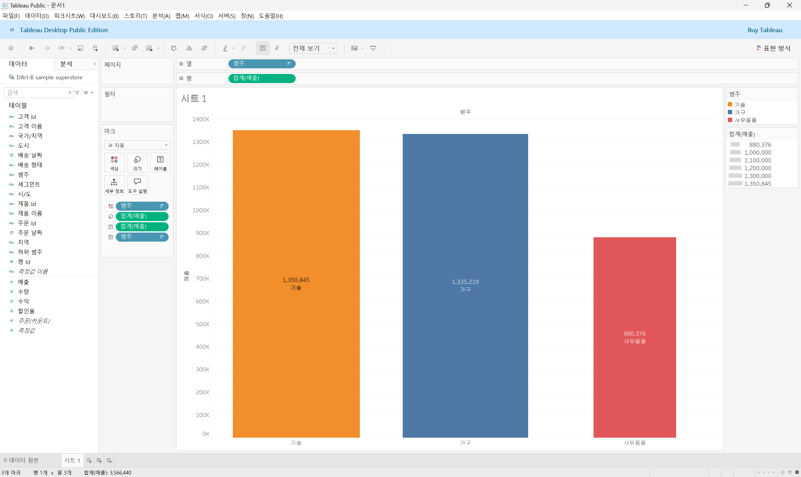
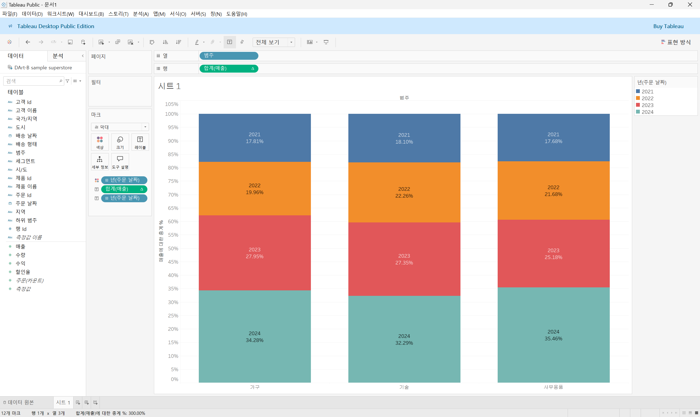
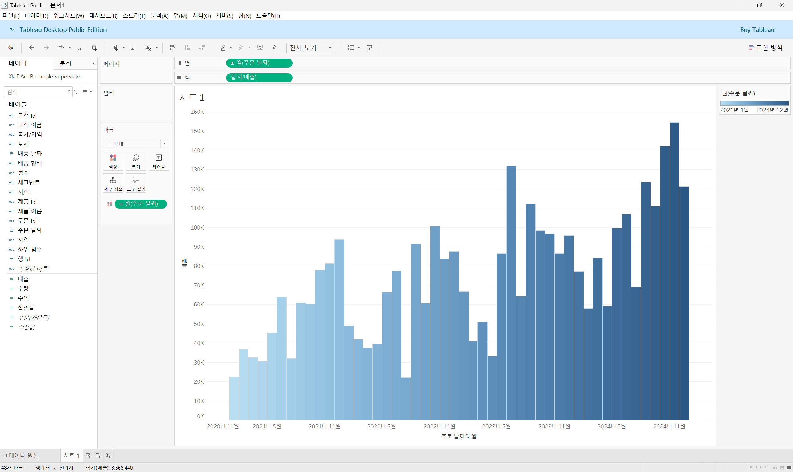
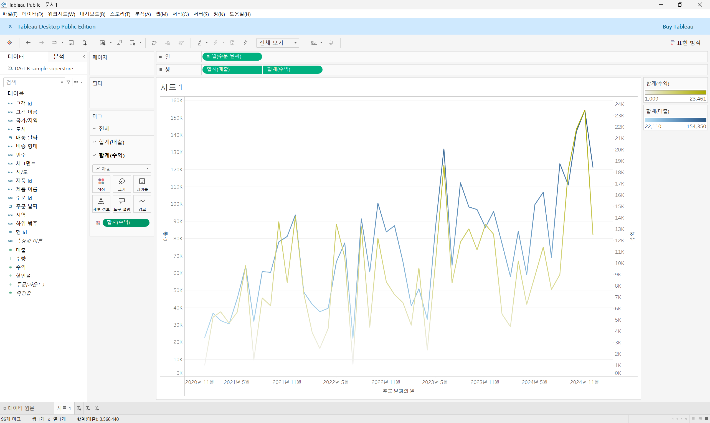
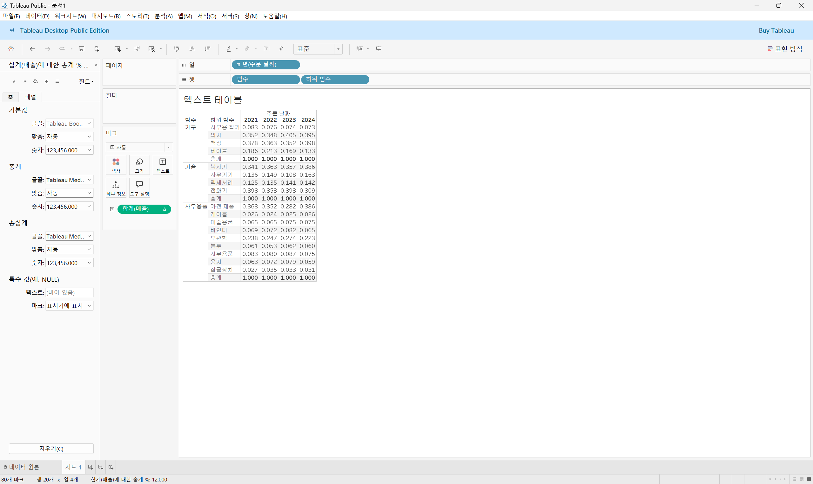
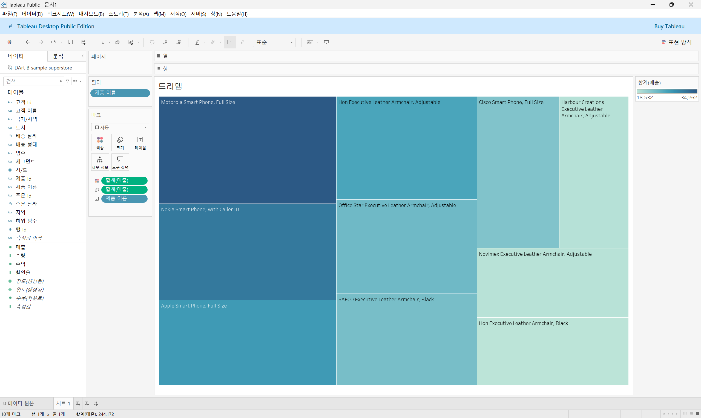
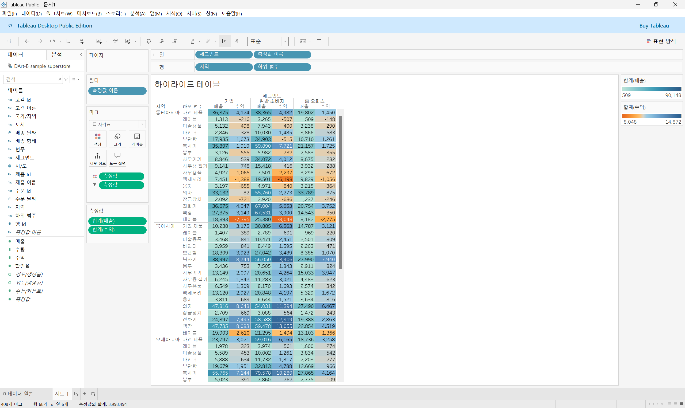
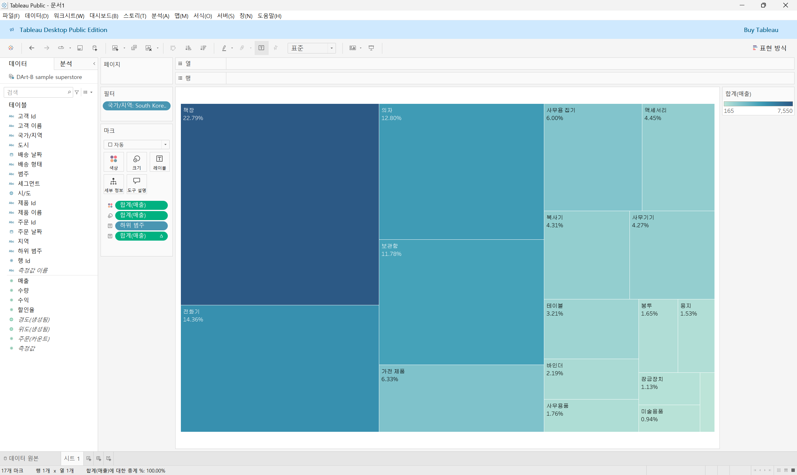
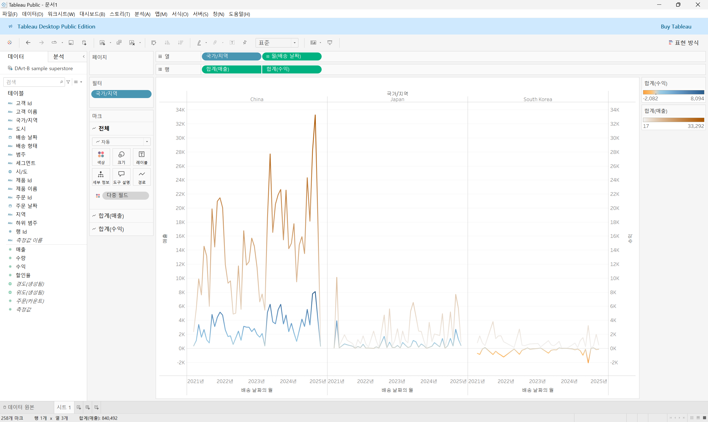

# Second Study Week

- 10강: [차원과 측정값](#10강-차원과-측정값)

- 11강: [시각화](#11강-시각화)

- 12강: [막대그래프](#12강-막대그래프)

- 13강: [누적막대그래프](#13강-누적막대그래프)

- 14강: [병렬막대그래프](#14강-병렬막대그래프)

- 15강: [누적병렬막대그래프](#15강-누적병렬막대그래프)

- 16강: [라인그래프](#16강-라인그래프)

- 17강: [맵작성](#17강-맵작성)

- 18강: [텍스트테이블](#18강-텍스트테이블)

- 19강: [트리맵과 하이라이트테이블](#19강-트리맵과-하이라이트테이블)

- 문제1 : [문제1](#문제1)

- 문제2 : [문제2](#문제2)

- 참고자료 : [참고자료](#참고-자료)


## Study Schedule

| 강의 범위     | 강의 이수 여부 | 링크                                                                                                        |
|--------------|---------|-----------------------------------------------------------------------------------------------------------|
| 1~9강        |  ✅      | [링크](https://youtu.be/3ovkUe-TP1w?si=CRjj99Qm300unSWt)       |
| 10~19강      | ✅      | [링크](https://www.youtube.com/watch?v=AXkaUrJs-Ko&list=PL87tgIIryGsa5vdz6MsaOEF8PK-YqK3fz&index=75)       |
| 20~29강      | 🍽️      | [링크](https://www.youtube.com/watch?v=AXkaUrJs-Ko&list=PL87tgIIryGsa5vdz6MsaOEF8PK-YqK3fz&index=65)       |
| 30~39강      | 🍽️      | [링크](https://www.youtube.com/watch?v=e6J0Ljd6h44&list=PL87tgIIryGsa5vdz6MsaOEF8PK-YqK3fz&index=55)       |
| 40~49강      | 🍽️      | [링크](https://www.youtube.com/watch?v=AXkaUrJs-Ko&list=PL87tgIIryGsa5vdz6MsaOEF8PK-YqK3fz&index=45)       |
| 50~59강      | 🍽️      | [링크](https://www.youtube.com/watch?v=AXkaUrJs-Ko&list=PL87tgIIryGsa5vdz6MsaOEF8PK-YqK3fz&index=35)       |
| 60~69강      | 🍽️      | [링크](https://www.youtube.com/watch?v=AXkaUrJs-Ko&list=PL87tgIIryGsa5vdz6MsaOEF8PK-YqK3fz&index=25)       |
| 70~79강      | 🍽️      | [링크](https://www.youtube.com/watch?v=AXkaUrJs-Ko&list=PL87tgIIryGsa5vdz6MsaOEF8PK-YqK3fz&index=15)       |
| 80~89강      | 🍽️      | [링크](https://www.youtube.com/watch?v=AXkaUrJs-Ko&list=PL87tgIIryGsa5vdz6MsaOEF8PK-YqK3fz&index=5)        |


<!-- 여기까진 그대로 둬 주세요-->
<!-- 이 안에 들어오는 텍스트는 주석입니다. -->

# Second Study Week

## 10강: 차원과 측정값

<!-- 차원과 측정값에 관해 배우게 된 점을 적어주세요 -->

차원 : 불연속형(개별적으로 구분되는 값) 필드.
측정값 : 연속형(단절이 없는 무한한 범위의 값) 필드.

> **🧞‍♀️ 차원과 측정값의 고유한 특성에 대해 설명해주세요.**

```
차원 : 정성적인 값을 가지고 있는 필드. 집계되거나 개선되지 않는 독립적인 필드. (ex. 이름, 카테고리)
측정값 : 정량적인 수치 값을 가짐. 집계될 수 있는 값. (ex. 매출, 수익, 수령)
```

*Quiz: 차원은 불연속형이고, 측정값은 연속형이다 (o)*


## 11강: 시각화

<!-- 시각화 관해 배우게 된 점을 적어주세요 -->

차원 : 독립적인 값 (주문일자) 대부분 불연속형, 시각화 진행 시 머리글로 표시됨.
측정 값 : 차원의 세부항목 (매출) 대부분 연속형, 표 형태로 시각화 진행 시 패널로 표시됨.

*Quiz: 차원은 대부분 불연속형이며 표 형태로 시각화했을 때 머리글로 표시되고, 측정값은 대부분 연속형이므로 표 형태로 시각화 진행했을 때 패널로 추가된다.(o)*

## 12강: 막대그래프

<!-- 막대그래프에 관해 배우게 된 점을 적어주세요 -->

막대 차트는 주로 큰 값을 기준으로 정렬 됨.

세로 막대 차트
가로 막대 차트 : 가로 막대그래프에서 행렬을 바꿔주는 그래프

색상 구분을 통한 효과적인 시각화 가능.
숫자를 함께 표시하는 것도 좋은 방법.



## 13강: 누적막대그래프

<!-- 누적막대그래프에 관해 배우게 된 점을 적어주세요 -->

카테고리별 년도 누적 매출 그래프 그리기

1. 열 선반에 있는 주문날짜 필드 선택
2. 마크 창의 세부 정보로 드래그
3. 마크 창에서 주문일자 필드를 색상으로 끌어옴

<!-- 테이블(아래로)와 테이블(옆으로)의 계산 방식을 습득해보세요. 이에 관련해 아래 참고자료도 있습니다 :) -->

카테고리 별 년도 매출 비율
1. 행 선반에 매출 필드
2. 역삼각형 클릭
3. ‘다음을 사용하여 계산’
4. 테이블(아래로) 선택



## 14강: 병렬막대그래프

<!-- 병렬막대그래프에 관해 배우게 된 점을 적어주세요 -->

태블로는 데이터를 가지고 올 때 자동으로 연속형과 불연속형을 설정한다.
병렬 그래프를 그릴 때 필드를 연속형으로 설정해야 각 막대의 수평위치를 고정하여 그룹을 형성할 수 있다.
필드를 연속형으로 변경 -> 시간의 흐름을 인지할 수 있다.


> *🧞‍♀️ 끊어진 색상으로 배치되어 표현되는 경우와 이어지는 그라데이션 색으로 표현되는 경우 두 가지가 있습니다. 위 사진의 경우 왜 색깔이 끊어지는 색상으로 표시되지 않고 그라데이션으로 표시되었나요? 데이터의 특성과 관련하여 이야기해 봅시다.*

```
데이터의 연속성 때문이다.
```



## 15강: 누적병렬막대그래프

<!-- 누적병렬막대그래프에 관해 배우게 된 점을 적어주세요 -->

시각화 하는 상황에 따라 필드를 연속형으로 변경하지 않아도 되는 경우가 있다.
색상을 활용해 병렬 누적 막대그래프를 효과적으로 시각화할 수 있다.


> *🧞‍♀️ 위 사진에서는 Profit과 Sales를 측정값으로 두었습니다.  개별 칼럼(태블로에서는 #필드라 명칭합니다)을 열/행에 두는 대신, '측정값'을 사용하고 측정값 선반에 필드를 올려둡니다. 이런 방식을 사용하는 이유가 무엇일지, 어떻게 사용할 수 있을지 고민해보세요*

```
다양한 측정값을 한 번에 효율적으로 나타낼 수 있음. 한 번에 나타내고자 할 때 사용.
```

<!-- 정답은 없습니다 -->

## 16강: 라인그래프

<!-- 라인그래프에 관해 배우게 된 점을 적어주세요 -->

두 그래프 비교 시 이중 축 활용.
이중축을 만들면 양쪽의 세로축이 서로 다른 값을 나타내기 때문에 각 값을 왜곡해서 해설할 수 있음.
값을 정확하게 보기 위해서 양쪽의 세로축이 같아야 함. -> 축 동기화 선택(필수 사항은 아님)

마크창에서 표현형식을 변경하면 각각의 값을 표현하고 싶은 방식으로 변경할 수 있다.



## 17강: 맵작성

<!-- 맵차트 관해 배우게 된 점을 적어주세요 -->

행 선반의 항목을 Ctrl 키 누른 채로 이동하면 행이 복사됨. -> 이중 축 사용 가능
맵에 여러 계층의 지리적 데이터를 추가하는 경우  마크 계층 활용.
마크 계층은 투명 오버레이 처럼 작동하며 각 계층은 고유한 마크와 캡션, 색상 등을 가질 수 있음.

```js
## 참고
Country/Region - 나라/지역
State/Province - 시/도
City - 시
County - 군
Postal Code - 우편번호
Area Code - 지역 코드
Airport - 공항
MSA/CBSA (Metropolitan Statistical Area) - 광역 통계 지역
Longitude - 경도
Latitude - 위도
```

## 18강: 텍스트테이블

<!-- 텍스트테이블에 관해 배우게 된 점을 적어주세요-->

분석 탭에서 요약의 총계를 클릭한 채로 시트에 올려놓으면 소계, 열 총합계, 행 총합계를 표시할 수 있는 뷰가 생성됨.

구성비율의 소수점 조정 -> 서식 변경 : 숫자 - 숫자 사용자 지정



## 19강: 트리맵과 하이라이트테이블

> *🧞‍♀️하이라이트 테이블 등에서 두개 이상의 측정값을 사용하는 경우, 함께 색을 표현하게 되면 단위가 달라 정확한 값을 표현할 수 없습니다. 이때 클릭해야 하는 항목은?*

```
별도의 범례 사용
```




## 문제1

```js
지민이는 superstore의 한국 수출 관리 업무를 맡고 있습니다. 국가/지역이 우리나라, 즉 'South Korea'인 데이터만을 필터링하여, 상품 하위범주 별로 각 하위범주가 매출의 비율 중 얼마만큼을 차지하는지를 트리맵으로 확인하고 싶습니다. 트리맵의 각 네모 안에 표시되는 텍스트에는 **해당 범주의 이름과 전체에서 해당 범주가 차지하는 비율**이 표시되었으면 합니다.

지민이를 도와주세요! (풀이를 찾아가는 과정을 기술해주세요)
```

```
1. 국가/지역 필드를 필터로 드래그 앤 드랍. "South Korea" 선택한다.
2. 매출의 비율을 트리맵으로 표현한다.
3. 매출을 레이블 마크로 드래그 앤 드랍 한다.
4. 퀵테이블에서 구성 비율 선택 후, 각 네모 안에 필드를 모두 표시하도록 텍스트 서식을 조정한다.
```



## 문제2

```js
주현이는 국가/지역별로 매출과 수익의 증감을 시간에 흐름에 따라 표현하고자 합니다. 특히 **한국/중국/일본**을 비교하고자 해당 3국을 남기고 필터링했고, 3개 국가를 매출과 수익이라는 두 가지 지표로 확인해보았습니다.

아래는 위 설명을 표현해본 예시입니다.
```


```js
레퍼런스와 꼭 같지 않아도 자유롭게 표현하고, 그 과정을 기술해주세요.
```

```
1. 국가/지역 필드를 필터로 드래그 앤 드랍, "South Korea, China, Japan"을 선택한다.
2. 열로 국가/지역, 배송 날짜 드래그 - 연속형 월 데이터 선택
3. 이중 축을 사용하여 나타낸다.
4. 축 동기화를 선택한다.
```



### 참고 자료

```js
테이블 계산에서 '다음을 사용하여 계산'에는 테이블 당 계산과 패널 당 계산이 있습니다. 이에 대해 이해하는 것이 꼭 필요하기 때문에, 외부 레퍼런스를 참고하여 이 단계에서 꼭! 학습 후, 넘어가주세요 :)
```


[참고 외부자료 링크는여기를클릭하십시다](https://velog.io/@eunsuh/Tableau-%EB%A0%88%EB%B2%A8UP-%EA%B0%95%EC%9D%98-%EC%A0%95%EB%A6%AC-1-%ED%85%8C%EC%9D%B4%EB%B8%94-%EA%B3%84%EC%82%B0)

