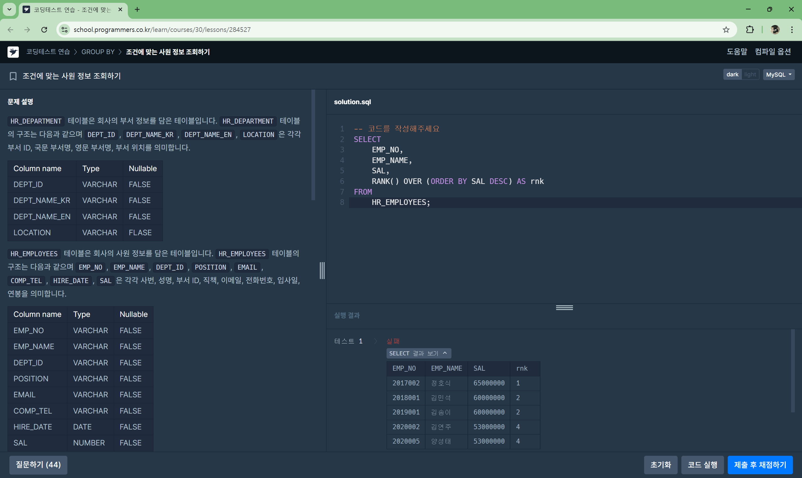
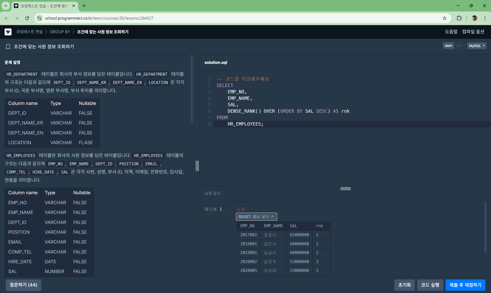
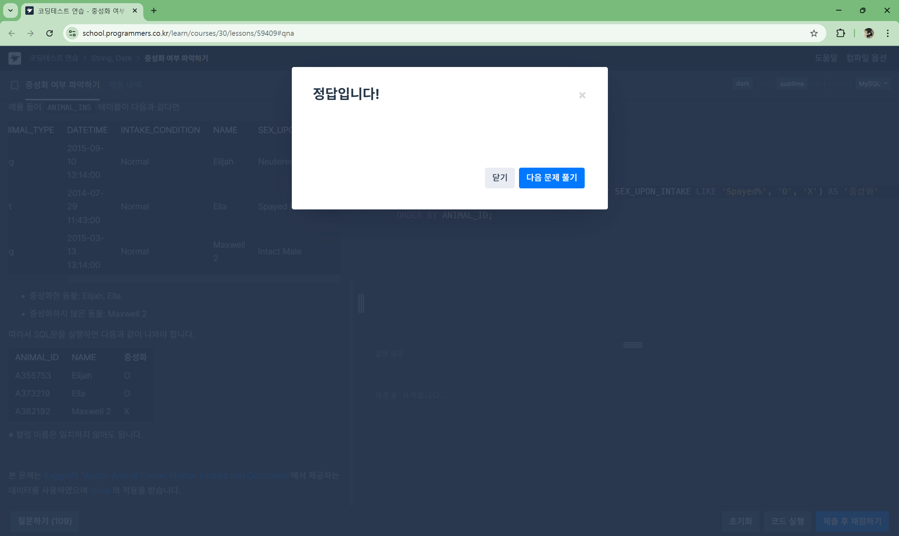
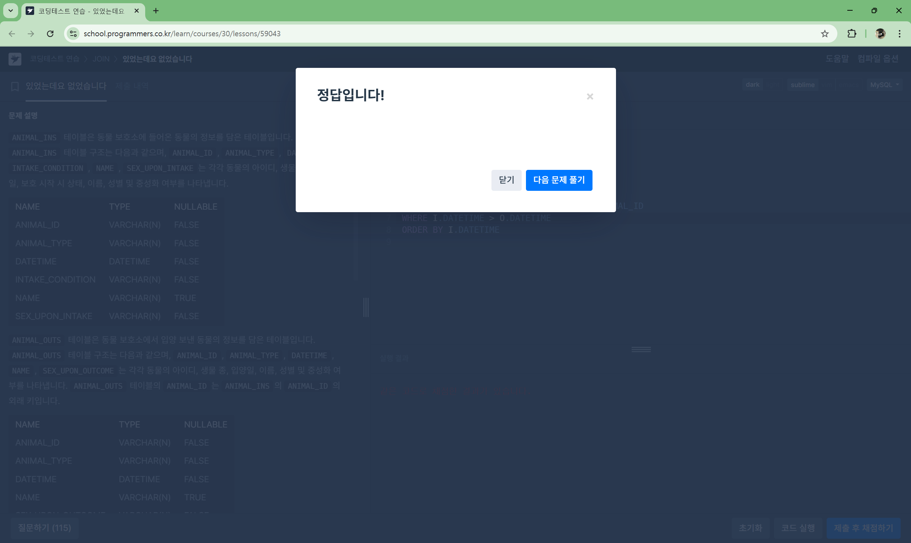
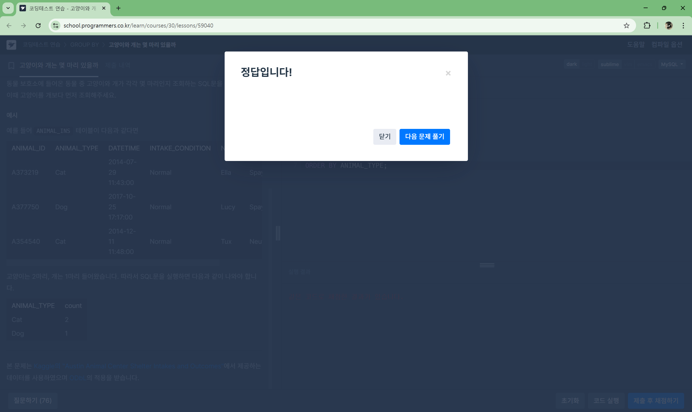
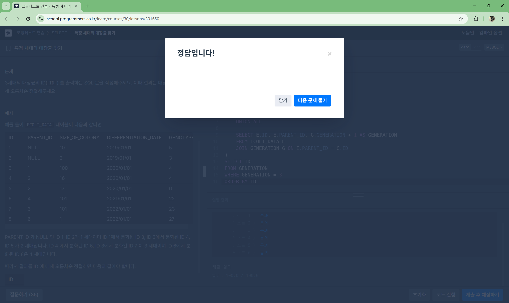

# Advanced - 6주차
## 1. 틀린 코드 이유 분석

#### 틀린 코드

```SQL
SELECT *
FROM (SELECT FOOD_TYPE, REST_ID, REST_NAME, MAX(FAVORITES) AS FAVORITES
FROM REST_INFO
GROUP BY FOOD_TYPE
ORDER BY FOOD_TYPE DESC
```
이 코드가 틀린 이유를 찾아내고, 정답 코드와 비교해 정리해주세요.

#### 정답 코드

```SQL
SELECT FOOD_TYPE, REST_ID, REST_NAME, FAVORITES
FROM REST_INFO
WHERE (FOOD_TYPE, FAVORITES) IN (
    SELECT FOOD_TYPE, MAX(FAVORITES)    
    FROM REST_INFO
    GROUP BY FOOD_TYPE
) 
ORDER BY FOOD_TYPE DESC;
```
#### 해답
```
1. GROUP BY
- 틀린 코드에선 FOOD_TYPE만 그룹화했지만 REST_ID와 REST_NAME도 조회 했기 때문에 오류가 발생할 수 있음
- 정답 코드에선 MAX(FAVORITES)만 그룹화한 후에 다시 원본 테이블에서 필터링 했음!

2. 서브쿼리
- 틀린 코드에선 REST_ID, REST_NAME이 명확하지 않음
- 정답 코드에선 FOOD_TYPE, FAVORITES 쌍으로 정확한 값을 필터링 했음!

3. ORDER BY
- 틀린 코드에선 서브쿼리 내부에 ORDER BY를 넣었으나, 서브쿼리 내부 ORDER BY는 의미가 없음
- 정답 코드에선 최종 결과에서 ORDER BY를 실행했음!
```


또한, 이 문제에서는 아래 **개선된 쿼리**로도 조회될 수 있습니다. 

**ROW_NUMBER 윈도우 함수**를 사용합니다.

## 2. 개선된 쿼리 학습

#### 개선된 쿼리

```SQL
WITH RankedRest AS (
    SELECT 
        FOOD_TYPE, REST_ID, REST_NAME, FAVORITES,
        ROW_NUMBER() OVER (PARTITION BY FOOD_TYPE ORDER BY FAVORITES DESC, REST_ID) AS rnk
    FROM REST_INFO
) -- ROW_NUMBER() 윈도우 함수를 사용해 순위 부여
SELECT 
    FOOD_TYPE, REST_ID, REST_NAME, FAVORITES
FROM RankedRest
WHERE rnk = 1 -- 각 FOOD_TYPE에서 FAVORITES가 가장 높은 레스토랑만 선택함
ORDER BY FOOD_TYPE DESC; -- 음식 종류 내림차순 정렬
```

이 코드를 단계별로 해석하고(주석 사용 등), 위 코드에 비해 갖는 이점을 설명하세요.
```
1. ROW_NUMBER()를 사용한 후 ORDER BY REST_ID를 추가하여 즐겨찾기 수가 같은 레스토랑이 중복되지 않도록 문제 해결 가능

2. ROW_NUMBER()를 통해 데이터의 순위를 먼저 정리한 후에 원하는 데이터만 추출하므로, 직관성이 높아짐

3. 대량 데이터 처리에서 윈도우 함수는 효율적이다!
```

## 3. [SUBQUERY] 조건에 맞는 사원 정보 조회하기[🔗](https://school.programmers.co.kr/learn/courses/30/lessons/284527)


기본 코드
```SQL
SELECT 
    EMP_NO, 
    EMP_NAME, 
    SAL,
    RANK() OVER (ORDER BY SAL DESC) AS rnk
FROM 
    HR_EMPLOYEES;
```

이때, RANK(), DENSE_RANK(), ROW_NUMBER() 함수를 사용하며 결과를 비교하고 해당 함수를 사용하는 경우를 서술해주세요. (함수 사용 예제는 직접 찾아보기)

#### RANK()
- 같은 값이면 같은 순위를 부여, 다음 순위는 건너뜀(ex. 1, 2, 2, 4...)
- 


#### DENSE_RANK()
- 같은 값이면 같은 순위를 부여, 다음 순위는 연속됨(ex. 1, 2, 2, 3...)
- 

#### ROW_NUMBER()
- 동일한 값이 있어도 무조건 1, 2, 3, 4 순서 부여
- 

# Advanced - 7주차
## [ISNULL] NULL처리하기 (SQL 고득점kit)[🔗](https://school.programmers.co.kr/learn/courses/30/lessons/59410)

**동물의 생물 종, 이름, 성별 및 중성화 여부를 아이디 순으로 조회하는 SQL문을 작성합니다.**

이때, 이름이 없는 동물의 이름은 ‘No name’으로 합니다.

### 문제1. IFNULL()으로 해결

```sql
SELECT
    ANIMAL_TYPE,
    IFNULL(NAME, 'No name') AS NAME,
    SEX_UPON_INTAKE
FROM ANIMAL_INS;
```


같은 문제를, CASE WHEN 문법을 사용하여 해결해주세요

### 문제2. CASE WHEN으로 해결
```sql
SELECT
    ANIMAL_TYPE,
    CASE
        WHEN NAME IS NULL THEN 'No name'
        ELSE NAME
    END AS NAME,
    SEX_UPON_INTAKE
FROM ANIMAL_INS;
```

## 중성화 여부 파악하기[🔗](https://school.programmers.co.kr/learn/courses/30/lessons/59409#qna)

### 문제 3. 문제를 풀어주세요 (힌트: IF, LIKE를 사용할 수 있습니다)

```sql
SELECT
    ANIMAL_ID,
    NAME,
    IF(SEX_UPON_INTAKE LIKE 'Neutered%' or SEX_UPON_INTAKE LIKE 'Spayed%', 'O', 'X') AS '중성화'
FROM ANIMAL_INS
ORDER BY ANIMAL_ID;
```


### 문제 4. 아래는 QnA에 올라온 질문입니다. 왜 풀이가 틀렸는지 답해주세요.[🔗](https://school.programmers.co.kr/questions/80270)

```
OR 조건을 사용할 때는 두 개의 조건을 모두 비교해야 하므로 'Neutered%'와 'Spayed%'가 각각 SEX_UPON_INTAKE와 비교되어야 한다.
```

# 린터 문제
## 1. [JOIN] 있었는데요 없었습니다[🔗](https://school.programmers.co.kr/learn/courses/30/lessons/59043)

```sql
SELECT
    I.ANIMAL_ID,
    I.NAME
FROM ANIMAL_INS I
JOIN ANIMAL_OUTS O ON I.ANIMAL_ID = O.ANIMAL_ID
WHERE I.DATETIME > O.DATETIME
ORDER BY I.DATETIME
```


## 2. [GROUP BY] 고양이와 개는 몇 마리 있을까[🔗](https://school.programmers.co.kr/learn/courses/30/lessons/59040)

```sql
SELECT
    ANIMAL_TYPE,
    COUNT(ANIMAL_TYPE) AS 'count'
FROM ANIMAL_INS
GROUP BY ANIMAL_TYPE
ORDER BY ANIMAL_TYPE;
```


## 3. [SELECT] 특성 세대의 대장균 찾기[🔗](https://school.programmers.co.kr/learn/courses/30/lessons/301650)

```SQL
WITH RECURSIVE GENERATION AS (
    SELECT ID, PARENT_ID, 1 AS GENERATION
    FROM ECOLI_DATA
    WHERE PARENT_ID IS NULL
    
    UNION ALL
    
    SELECT E.ID, E.PARENT_ID, G.GENERATION + 1 AS GENERATION
    FROM ECOLI_DATA E
    JOIN GENERATION G ON E.PARENT_ID = G.ID
)
SELECT ID
FROM GENERATION
WHERE GENERATION = 3
ORDER BY ID
```


## 4. [SUBQUERY] 폐쇄할 따릉이 정류소 찾기 2[🔗](https://solvesql.com/problems/find-unnecessary-station-2/)

```SQL
너무 어려워서 못해요ㅠㅠ
```