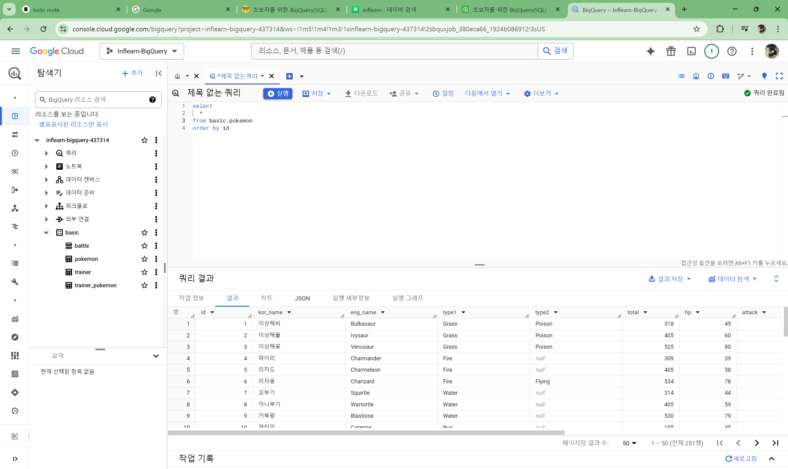

## BigQuery 기초 지식

### **1-1. BigQuery 기초 지식**

**데이터 저장 형태**

- 데이터는 보통 데이터베이스 테이블 등에 저장
    - Database : 데이터의 저장소
    - Table : 데이터가 저장된 공간
    - 저장된 데이터를 제품(앱, 웹)에서 사용

**OLTP(Online Transaction Processing)**

- 거래를 하기 위해 사용되는 데이터베이스
- 보류, 중간 상태가 없음 : 데이터가 무결하다
- 데이터의 추가(INSERT), 데이터의 변경(UPDATE)이 많이 발생

**테이블에 저장된 데이터의 형태**

- 행(Row)
    - 새로운 row는 가로로 한 줄을 의미
    - 하나의 row가 하나의 고유한 데이터
- 열(Column)
    - column은 원형 기둥이란 뜻. 세로로 연상
    - 각 데이터의 특정 속성 값

**OLAP(Online Analytical Processing)**

- 분석을 위한 기능 제공

**데이터 웨어하우스**

- 데이터를 한 곳에 모아서 저장
- 여러 곳에 저장된 데이터 예시
- Database, 웹(크롤링), 파일, API의 결과 등

### **1-2. BigQuery 환경 설정**

**BigQuery의 환경 구성 요소**

- 프로젝트(Project)
    - 하나의 큰 건물. 건물 안에는 여러 목적을 가진 창고가 존재
    - 하나의 프로젝트에 여러 데이터셋이 존재할 수 있음
- 데이터셋(Dataset)
    - 프로젝트에 있는 창고. 각 창고 공간에 데이터를 저장
    - 판매 데이터, 고객 데이터 등 별도의 데이터를 저장할 수 있음
    - 하나의 데이터셋에 다양한 테이블이 존재할 수 있음
- 테이블(Table)
    - 창고에 있는 선반
    - 테이블 안엔  상품의 세부 정보가 저장
    - 테이블 안엔 행과 열로 이루어진 데이터들이 저장

**쿼리 실행해보기**

