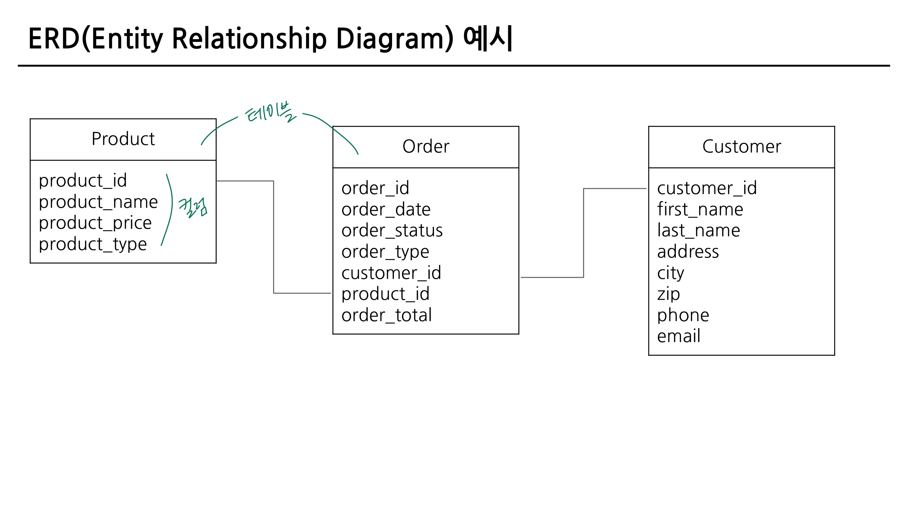
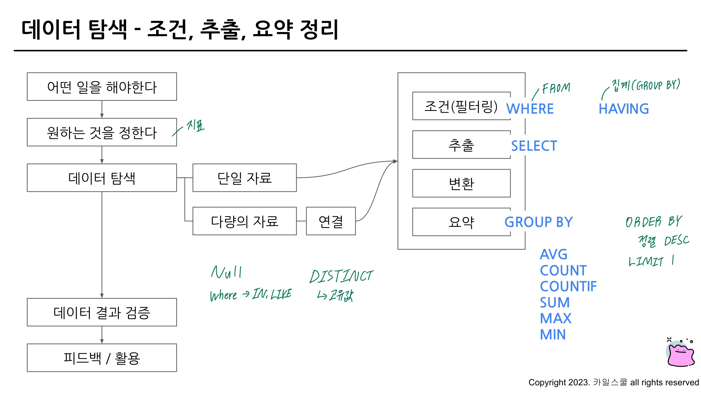

## 데이터 탐색 - 조건, 추출, 요약

### **2-1. 데이터 활용 Overview**

**데이터를 활용하는 과정**

1. 어떤 일을 해야 한다(문제 정의…MECE 중복이 없고 상호 배제적)
2. 원하는 것을 정한다
3. 데이터 탐색
    
    → 단일 자료 or 다량의 자료 - 연결
    
    → 조건(필터링) or 추출 or 변환 or 요약
    
4. 데이터 결과 검증 (예상과 실제가 동일한가?)
5. 피드백 / 활용

### **2-2. 저장된 데이터 확인하기(데이터베이스, 데이터 웨어하우스, ERD)**

- 데이터가 어떻게 저장되어 있는가?
- 어떤 데이터가 저장되어 있는가?
- 컬럼의 의미는 무엇인가?

⇒ 데이터를 제대로 이해해야 올바른 데이터를 추출할 수 있음 (구체적인 정의를 항상 확인하면서 쿼리를 작성해야 함)

**데이터를 추출할 때 어떻게 해야 할까요?**

데이터를 추출하기 전에 데이터 웨어하우스에 데이터가 어떻게 저장되어 있는지 확인

**데이터가 저장되는 형태를 알려면?**

- ERD(Entity Relationship Diagram) : 데이터 베이스 구조를 한눈에 알아보기 위해 사용
- 

- ERD가 없다면 모든 데이터베이스를 직접 보면서 탐색해보기
    - 어떤 테이블이 존재하는가?
    - 어떤 컬럼이 존재하는가? (Row 개수)
    - 다른 테이블과 연결할 때 어떤 컬럼을 사용하는가?
    - 컬럼의 값들은 어떤 의미를 가지는가?

### **2-3. 데이터 탐색(SELECT, FROM, WHERE)**

**SQL 쿼리 구조**

SQL 쿼리문은 아래와 같은 문법으로 작성

```sql
SELECT #테이블의 어떤 컬럼을 선택(출력)할 것인가?
	Col1 AS new_name, #별칭
	Col2,
	Col3
FROM Dataset.Table #어떤 테이블에서 데이터를 확인할 것인가?
WHERE #만약 원하는 조건이 있다면 어떤 조건인가?
	Col1 = 1 #조건문
	
-- 포켓몬 타입이 불인 포켓몬을 찾는 SQL 쿼리
SELECT
	* #* : 모든 컬럼을 출력하겠다
FROM basic.pokemon #FROM 데이터셋.테이블
WHERE
	type1="Fire"

#SELECT
# * EXCEPT(제외할 컬럼) -- 이런 형태도 가능
```

```sql
SELECT
	id
FROM 'inflearn-bigquery.basic.pokemon'
```

- inflearn-bigquery : 프로젝트 id
- Basic : dataset
- Pokemon : table
- ‘<프로젝트 id>.<데이터셋>.<테이블>‘
- 프로젝트가 단일이라면 프로젝트 id를 명시할 필요는 없을 수도 있음
- 프로젝트를 여러개 사용한다면 명시하는 것이 좋음 → 쿼리를 실행할 때 어떤 프로젝트인지 확인하는 과정이 존재
- 프로젝트 명시 → 불편 ; 프로젝트를 제외하고 사용해도 괜찮긴 함(여러 프로젝트를 쓸 때는 명시해야 한다)
- 프로젝트 id를 제외하고 작성할 때는 ’‘이 없어도 괜찮음
- 데이터를 활용하고 싶은 목적이 있어야, 어떠 컬럼을 선택할지 알 수 있게 됨

**포켓몬 타입이 불인 포켓몬을 찾는 SQL 쿼리**

```sql
SELECT 
  id AS pokemon_id,#AS는 별칭을 지어줄 때 사용한다
# id AS "pokemon_id" 컬럼 이름에 따옴표를 넣는 경우 : 자주하는 실수 => 따옴표 없이 기록
  kor_name,
  type1,
  total
FROM basic.pokemon
WHERE
  type1 = "Fire"
```

- 가독성 있는 쿼리
    - 쿼리를 잘 읽을 수 있으려면 잘 작성해야 함 ⇒ 협업할 때 특히 중요

```sql
SELECT
	* EXCEPT(eng_name)
FROM basic.pokemon
WHERE
	type1 = "Fire"
# ;을 이용해 하나의 쿼리가 끝났음을 표시
```

**SQL 문법 핵심 정리**

쿼리 엔진 실행 순서 FROM → WHERE → SELECT

- FROM
    - 데이터를 확인할 Table 명시
    - 이름이 너무 길다면 AS “별칭”으로 별칭 지정 가능(ex. FROM Table1 as T1)
- WHERE
    - FROM에 명시된 Table에 저장된 데이터를 필터링(조건 설정)
    - Table에 있는 컬럼을 조건 설정
- SELECT
    - Table에 저장되어 있는 컬럼 선택
    - 여러 컬럼 명시 가능
    - col1 AS “별칭”으로 컬럼의 이름도 별칭 지정 가능

**SELECT - FROM - WHERE 이 순서를 꼭 기억하기! (SELECT - WHERE - FROM은 불가능)**

### **2-4. SELECT 연습 문제**

1. trainer 테이블에 있는 모든 데이터를 보여주는 SQL 쿼리를 작성해주세요
    1. Trainer 테이블에 어떤 데이터가 있는지 확인해보자
    2. Trainer 테이블을 어디에 명시해야 할까? ⇒ FROM
    3. 필터링 조건이 있을까? ⇒ 모든 데이터 ⇒ 필터링을 할 필요가 없겠다
    4. 모든 데이터 ⇒ 모든 데이터 = 모든 컬럼일 수도 있겠다(추측) 쿼리 작성 ⇒ 애매하면 모든 데이터의 정의가 무엇인가?

```sql
SELECT
  *
FROM `inflearn-bigquery-437314.basic.trainer`
```

1. trainer 테이블에 있는 트레이너의 name을 출력하는 쿼리를 작성해주세요
    1. trainer 테이블 사용
    2. name 컬럼을 사용

```sql
SELECT
  name
FROM basic.trainer
```

1. trainer 테이블에 있는 트레이너의 name, age를 출력하는 쿼리를 작성해주세요
    1. trainer 테이블 사용
    2. 조건 설정 없음
    3. name, age 컬럼 사용

```sql
SELECT
  name,
  age
FROM basic.trainer
```

1. trainer의 테이블에서 id가 3인 트레이너의 name, age, hometown을 출력하는 쿼리를 작성해주세요
    1. trainer 테이블 사용
    2. 조건 설정 ⇒ id가 3인
    3. 컬럼 : name, age, hometown
        1. name, age, hometown ⇒ 영어로 명시되어 있는 경우면 편함
        2. 현업에서는 이름, 나이를 알려주세요 ⇒ 컬럼의 의미를 파악해서 작성해야 함 ⇒ 어떤 컬럼을 요구하는지, 어떤 컬럼을 봐야하는지?

```sql
SELECT
  name,
  age,
  hometown
FROM basic.trainer
WHERE
	id = 3
```

1. pokemon 테이블에서 “피카츄”의 공격력과 체력을 확인할 수 있는 쿼리를 작성해주세요
    1. pokemon 테이블
    2. 조건? ⇒ “피카츄” kor_name = “피카츄”
    3. 공격력, 체력 ⇒ 테이블에서 어떤 컬럼인지 확인해야 함 ⇒ attack, hp

```sql
SELECT
  attack,
  hp
FROM basic.pokemon
WHERE
	kor_name = "피카츄"
```

### **2-5. 집계(GROUP BY + HAVING + SUM/COUNT)**

**GROUP BY** : 집계 : 같은 값끼리 모아서 그룹화한다

- 특정 컬럼을 기준으로 모으면서 다른 컬럼에선 집계 가능(합, 평균, MAX, MIN 등)

**ORDER BY** : 정렬하기

- 순서 : DESC(내림차순), OSC(오름차순 - 보통 Default)
- ORDER BY는 쿼리의 맨 마지막(아래)에 두고, 쿼리의 맨 마지막에만 작성하면 됨(중간에 필요 없음)

**DISTINCT** : 고유값을 알고 싶은 경우

- 여러 값 중에 Unique한 것만 보고 싶은 경우 사용
- DISTINCT는 중복을 제거하는 것

**WHERE** : 조건을 설정하고 싶은 경우

- Table에 바로 조건을 설정하고 싶은 경우 사용
- Raw Data인 테이블 데이터에서 조건 설정

**HAVING** : 조건을 설정하고 싶은 경우

- GROUP BY한 후 조건을 설정하고 싶은 경우 사용

**LIMIT**: 출력 개수 제한하기

- 쿼리문의 결과 Row 수를 제한하고 싶은 경우 LIMIT 사용
- 쿼리문의 제일 마지막에 작성

**서브 쿼리**

- SELECT 문 안에 존재하는 SELECT 쿼리
- FROM 절에 또 다른 SELECT 문을 넣을 수 있음
- 괄호로 묶어서 사용
- 서브 쿼리를 작성하고, 서브 쿼리 바깥에서 WHERE 조건 설정하는 것
    
    = 서브 쿼리에서 HAVING으로 하는 것
    

*GROUP BY 연습 문제*

1. pokemon 테이블에 있는 포켓몬 수를 구하는 쿼리를 작성해주세요
    1. 사용할 테이블 : pokemon
    2. 조건 : X
    3. 집계할 때 사용할 컬럼 : X
    4. 집계할 때 사용할 계산 : 수를 구한다 ⇒ COUNT, 포켓몬

```sql
SELECT
	COUNT(id) AS cnt,
	# COUNT(*) AS cnt2
FROM basic.pokemon
```

1. 포켓몬의 수가 세대별로 얼마나 있는지 알 수 있는 쿼리를 작성해주세요
    1. 사용할 테이블 : pokemon
    2. 조건 : X
    3. 그룹화를 할 때 사용할 컬럼 : 세대
    4. 집계할 때 사용할 계산 : 얼마나 있는지 ⇒ 수를 구한다 ⇒ COUNT

```sql
SELECT
	generation,
	COUNT(id) AS cnt
FROM basic.pokemon
GROUP BY
	generation
```

1. 포켓몬의 수를 타입 별로 집계하고, 포켓몬의 수가 10 이상인 타입만 남기는 쿼리를 작성해주세요. 포켓몬의 수가 많은 순으로 정렬해주세요
    1. pokemon
    2. 조건 (WHERE) ⇒ 테이블 원본 ⇒ 없음
    3. 집계 후 조건 (HAVING) ⇒ 10 이상
    4. 포켓몬의 수가 많은 순으로 정렬(ORDER BY 포켓몬 수 DESC)
    5. 단계적으로 실행해보면서 가도 된다! 한번에 정답을 맞추려고 안해도 된다

```sql
SELECT
	type1,
	COUNT(id) AS cnt
FROM basic.pokemon
GROUP BY
	type1
HAVING cnt >= 10
ORDER BY cnt DESC
```

### 2-6. 연습 문제 1~17번

1. 포켓몬 중에 type2가 없는 포켓몬의 수를 작성하는 쿼리를 작성해주세요 (힌트) ~가 없다 : 컬럼 IS NULL
    1. 조건 : type2가 없는
    2. NULL은 뭘까?
        1. 아무것도 없는 값. 값이 존재하지 않을 때 NULL
        2. NULL 0이랑 다르고, “ “과도 다름 ⇒ 값이 없는 상태
        3. 연산자 : IS NULL
        4. 핵심 : NULL은 IS 연산자를 사용한다!
    3. 어떤 테이블? : pokemon
    4. 어떤 컬럼 : 따로 없음. 포켓몬의 수만 남기면 됨
    5. 어떻게 집계 : 포켓몬의 수 
    
    ```sql
    SELECT
      COUNT(id) AS cnt
    FROM basic.pokemon
    WHERE
      type2 IS NULL
     -- WHERE 절에서 여러 조건을 연결하고 싶은 경우 => AND 조건을 사용
     -- OR 조건 => ( ) OR ( )
    ```
    
2. type2가 없는 포켓몬의 type1과 type1의 포켓몬 수를 알려주는 쿼리를 작성해주세요. 단, type1의 포켓몬 수가 큰 순으로 정렬해주세요
    1. 테이블 : pokemon
    2. 조건 : type2가 없는 포켓몬
    3. 컬럼 : type1
    4. 집계 : 포켓몬 수 ⇒ COUNT
    5. 정렬 : type1의 포켓몬 수가 큰 순으로 정렬 ⇒ ORDER BY, 큰 순으로 : 큰 것부터 작은 것으로 ⇒ 내림차순(DESC) ⇒ ORDER BY 포켓몬 수 DESC
    
    ```sql
    SELECT
      type1,
      COuNT(id) AS pokemon_cnt
      -- 집계 함수는 GROUP BY와 같이 다님. 집계하는 기준(컬럼)이 없으면 COUNT만 쓸 수 있으나, 집계하는 기준이 있다면 그 기준 컬럼을 GROUP BY에 써줘야 한다
    FROM basic.pokemon
    WHERE
      type2 IS NULL
    GROUP BY
      type1
    ORDER BY
      pokemon_cnt DESC
    ```
    
3. type2 상관없이 type1의 포켓몬 수를 알 수 있는 쿼리를 작성해주세요
    1. 테이블 : pokemon
    2. 조건 : type2 상관없이 ⇒ 조건인가? 아닌가? ⇒ 조건이 아님
    3. 컬럼 : type1
    4. 집계 : 포켓몬 수 ⇒ COUNT
    
    ```sql
    SELECT
      type1,
      COuNT(id) AS pokemon_cnt
      -- DISTINCT는 언제 쓸까? => 고유한 값만 보고 싶을 때 사용한다. Unique한 값만 알고 싶은 경우 사용
      -- DISTINCT : DAU(Daily Active User)
      -- Active한 유저의 수를 하루 단위로 집계
    FROM basic.pokemon
    GROUP BY
      type1
    ```
    
4. 전설 여부에 따른 포켓몬 수를 알 수 있는 쿼리를 작성해주세요
    1. 테이블 : pokemon
    2. 조건 : 없음
    3. 컬럼 : 전설(is_legendary)
    4. 집계 :  포켓몬 수
    
    ```sql
    SELECT
      is_legendary,
      -- 컬럼의 이름 앞부분 일부를 입력하고 기다리면 자동 완성을 할 수 있는데, 이때 찾아서 엔터
      COUNT(id) AS pokemon_cnt
    FROM basic.pokemon
    GROUP BY
      is_legendary
    
    -- GROUP BY : is_legendary가 길다. GROUP BY에 컬럼이 많이 있을 수 있음(5개 + COUNT)
    -- GROUP BY 1 => SELECT의 첫 컬럼을 의미
    -- ORDER BY에도 1, 2 등을 사용할 수 있음
    -- 1, 2 => 쿼리를 빠르게 작성하고, 결과를 보는 과정. 완성된 쿼리문에서는 1, 2 같은 표현보단 명확하게 컬럼을 명시하는 게 좋습니다.(가독성 관점)
    ```
    
5. 동명이인이 있는 이름은 무엇일까요? (한번에 찾으려고 하지 않고 단계적으로 가도 괜찮아요)
    1. 테이블 : trainer
    2. 조건 : 같은 이름이 2개 이상(동명이인) ⇒ COUNT(name) ⇒ 2개 이상
    3. 컬럼 : 이름
    4. 집계 : COUNT
    
    ```sql
    SELECT
     name,
     COUNT(name) AS trainer_cnt
    FROM basic.trainer
    GROUP BY
     name
    -- 집계 후 조건 => HAVING, FROM 절의 테이블 조건 => WHERE
    HAVING
      trainer_cnt >= 2
    -- WHERE : 원본 데이터 FROM 절에 있는 데이터에 조건을 설정하고 싶은 경우
    -- HAVING : GROUP BY와 함께 집계 결과에 조건을 설정하고 싶은 경우
    -- 서브쿼리 : 쿼리문을 한번 감싸서 다른 쿼리문에서 사용할 수 있음
    -- HAVING을 쓰면 쿼리 줄 수가 줄어든다
    ```
    
6. trainer 테이블에서 “Iris” 트레이너의 정보를 알 수 있는 쿼리를 작성해주세요
    1. 테이블 : trainer
    2. 조건 : 트레이너의 이름 = “Iris”
    3. 컬럼 : 정보 ⇒ 모든 컬럼
    4. 집계 : X
    
    ```sql
    SELECT
     *
    FROM basic.trainer
    WHERE
      name = "Iris"
    ```
    
7. trainer 테이블에서 “Iris”, “Whitney”, “Cynthia” 트레이너의 정보를 알 수 있는 쿼리를 작성해주세요 (힌트) 컬럼 IN (“Iris”, “Whitney”, “Cynthia”)
    1. 테이블 : trainer
    2. 조건 : 이름 =  “Iris”, “Whitney”, “Cynthia” 중에 있으면 추출
    3. 컬럼 : 정보 → *
    4. 집계 : 없음
    
    ```sql
    SELECT
     *
    FROM basic.trainer
    WHERE
      (name = "Iris")
      OR (name = "Cynthia")
      OR (name = "Whitney")
    ```
    
    ```sql
    SELECT
     *
    FROM basic.trainer
    WHERE
      name IN ("Iris", "Cynthia", "Whitney")
    ```
    
8. 전체 포켓몬 수는 얼마나 되나요?
    1. 테이블 : pokemon
    2. 조건 : 없음
    3. 컬럼 : 없음
    4. 집계 : 포켓몬 수 ⇒ COUNT(name)
    
    ```sql
    SELECT
     COUNT(id) AS pokemon_cnt
     -- Unrecognized name: name at [2:8] => 컬럼 이름에 오타일 가능성이 있음
    FROM basic.pokemon
    ```
    
9. 세대(generation) 별로 포켓몬 수가 얼마나 되는지 알 수 있는 쿼리를 작성해주세요
    1. 테이블 : pokemon
    2. 조건 : 없음
    3. 컬럼 : 세대(generation)
    4. 집계 : 포켓몬 수 ⇒ COUNT
    
    ```sql
    SELECT
     generation,
     COUNT(id) AS pokemon_cnt
    FROM basic.pokemon
    GROUP BY
      generation
    ```
    
10. type2가 존재하는 포켓몬의 수는 얼마나 되나요?
    1. 테이블 : pokemon
    2. 조건 : type2가 존재하는! ⇒ type2 IS NOT NULL
    3. 컬럼 : X
    4. 집계 : 포켓몬의 수 ⇒ COUNT
    
    ```sql
    SELECT
     COUNT(id) AS pokemon_cnt
    FROM basic.pokemon
    WHERE
      type2 IS NOT NULL
    ```
    
11. type2가 있는 포켓몬 중에 제일 많은 type1은 무엇인가요?
    1. 테이블 : pokemon
    2. 조건 : type2가 있는
    3. 컬럼 : type1
    4. 집계 : 제일 많은 ⇒ COUNT
    
    ```sql
    SELECT
      type1,
      COUNT(id) AS pokemon_cnt
    FROM basic.pokemon
    WHERE
      type2 IS NOT NULL
    GROUP BY
      type1
    ORDER BY
      pokemon_cnt DESC
    LIMIT 1
    ```
    
12. 단일(하나의 타입만 있는) 타입 포켓몬 중 많은 type1은 무엇일까요?
    1. 테이블 : pokemon
    2. 조건 : 단일 타입 ⇒ 하나의 타입만 존재 ⇒ type2가 NULL(값이 없어야 한다)
    3. 컬럼 : type1
    4. 집계 : COUNT
    
    ```sql
    SELECT
      type1,
      COUNT(id) AS pokemon_cnt
    FROM basic.pokemon
    WHERE
      type2 IS NULL
    GROUP BY
      type1
    ORDER BY
      pokemon_cnt DESC
    LIMIT 1
    ```
    
13. 포켓몬의 이름에 “파”가 들어가는 포켓몬은 어떤 포켓몬이 있을까요? (힌트) 컬럼 LIKE “파%”
    1. 테이블 : pokemon
    2. 조건 : name에 “파”가 들어가는 포켓몬
    3. 컬럼 : 어떤 포켓몬이 있을까요? name
    4. 집계 : 없음
    
    ```sql
    SELECT
      kor_name
    FROM basic.pokemon
    WHERE
      kor_name LIKE "%파%"
    -- 컬럼 LIKE "특정단어%", %는 앞에도 붙을 수 있고, 뒤에도 붙을 수 있음.
    -- "%파" : 파로 끝나는 단어, "파%" : 파로 시작하는 단어, "%파%" : 파가 들어간 단어
    -- 문자열 컬럼에서 특정 단어가 포함되어 있는지 알고 싶은 경우엔 LIKE를 사용하면 편함
    ```
    
14. 뱃지가 6개 이상인 트레이너는 몇 명이 있나요?
    1. 테이블 : trainer
    2. 조건 : 뱃지가 6개 이상(badge_count ≥ 6)
    3. 컬럼 : 없음
    4. 집계 : 트레이너의 수(COUNT)
    
    ```sql
    SELECT
      COUNT(id) AS trianer_cnt
    FROM basic.trainer
    WHERE
      badge_count >= 6
    ```
    
15. 트레이너가 보유한 포켓몬(trainer_pokemon)이 제일 많은 트레이너는 누구일까요?
    1. 테이블 : trainer_pokemon
    2. 조건 : 없음
    3. 컬럼 : trainer_id
    4. 집계 : 포켓몬의 수 ⇒ COUNT
    
    ```sql
    SELECT
      trainer_id,
      COUNT(pokemon_id) AS pokemon_cnt,
      COUNT(DISTINCT pokemon_id) AS pokemon_cnt2
    FROM basic.trainer_pokemon
    GROUP BY
      trainer_id
    ```
    
16. 포켓몬을 많이 풀어준 트레이너는 누구일까요?
    1. 테이블 : trainer_pokemon
    2. 조건 : status = “Released” (풀어준)
    3. 컬럼 : trainer_id
    4. 집계 : 많이 풀어준 ⇒ COUNT
    5. 많이 풀어준 ⇒ ORDER BY + LIMIT
    
    ```sql
    SELECT
      trainer_id,
      COUNT(pokemon_id) AS pokemon_cnt,
    FROM basic.trainer_pokemon
    WHERE
      status = "Released"
    GROUP BY
      trainer_id
    ORDER BY
      pokemon_cnt DESC
    LIMIT 1
    ```
    
17. 트레이너 별로 풀어준 포켓몬의 비율이 20%가 넘는 포켓몬 트레이너는 누구일까요? (힌트) COUNTIF(조건)
    1. 테이블 : trainer_pokemon
    2. 조건 : 풀어준 포켓몬의 비율이 20%가 넘어야 한다
    3. 컬럼 : trainer_id
    4. 집계 : COUNTIF
    5. COUNTIF(조건) : COUNTIF(컬럼 = “3”)
    6. released_ratio ≥ 0.2
    
    ```sql
    SELECT
      trainer_id,
      COUNTIF(status = "Released") AS released_cnt, # 풀어준 포켓몬의 수
      COUNT(pokemon_id) AS pokemon_cnt,
      COUNTIF(status = "Released")/COUNT(pokemon_id) AS released_ratio
    FROM basic.trainer_pokemon
    GROUP BY
      trainer_id
    HAVING
      released_ratio >= 0.2
    ```
    

### 2-7. 정리



### **2-8. 새로운 집계 함수 소개(GROUP BY ALL, 2024-02-26에 나온 함수)**

```sql
SELECT
	FirstName AS first_name,
	LastName AS last_name,
	# 다른 컬럼,
	SUM(PointsScored) AS total_points
FROM PlayerStats
GROUP BY
	frist_name,
	last_name,
	# 다른 컬럼
```

```sql
SELECT
	FirstName AS first_name,
	LastName AS last_name,
	# 다른 컬럼,
	SUM(PointsScored) AS total_points
FROM PlayerStats
GROUP BY ALL
```