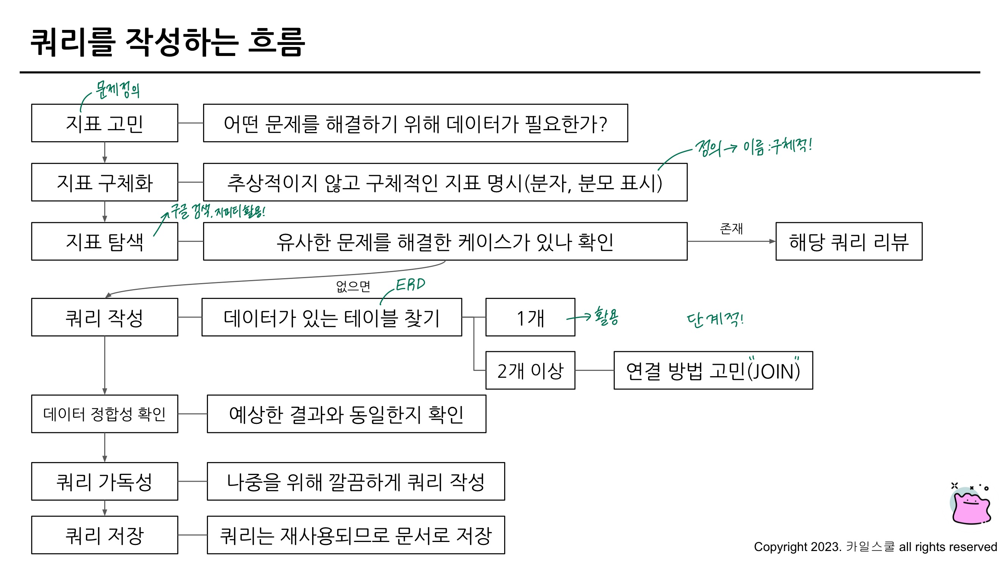
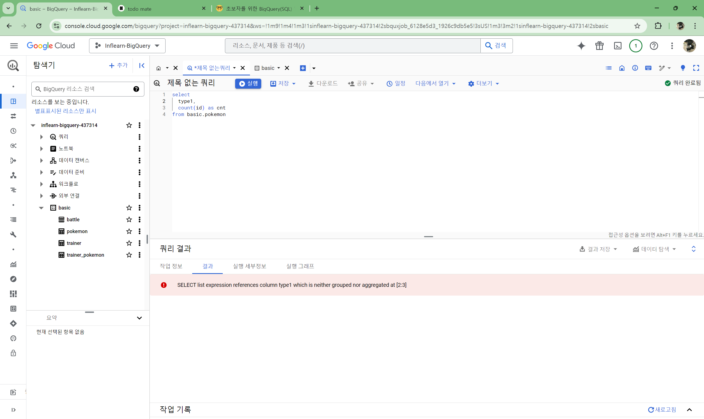
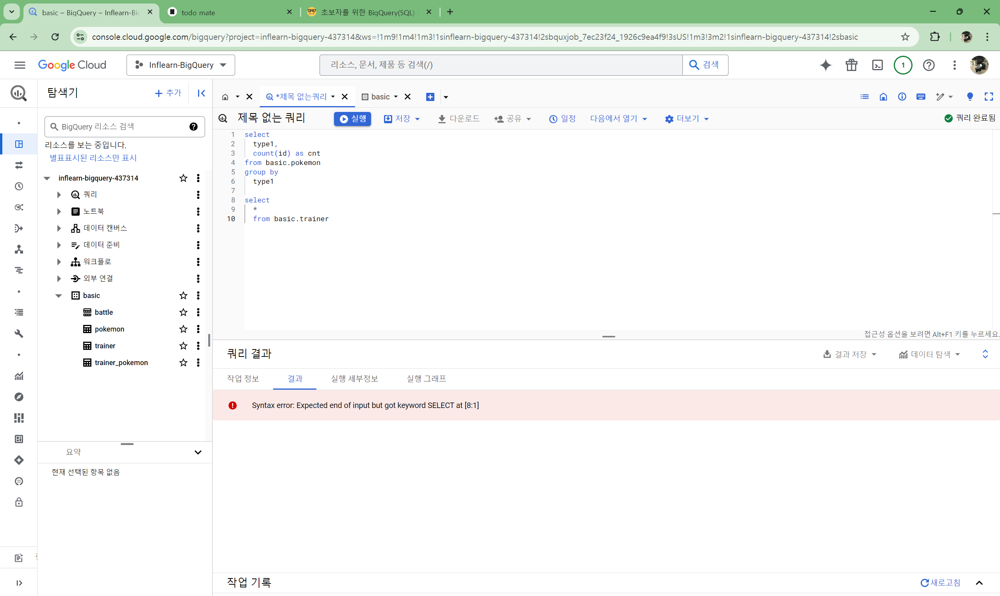
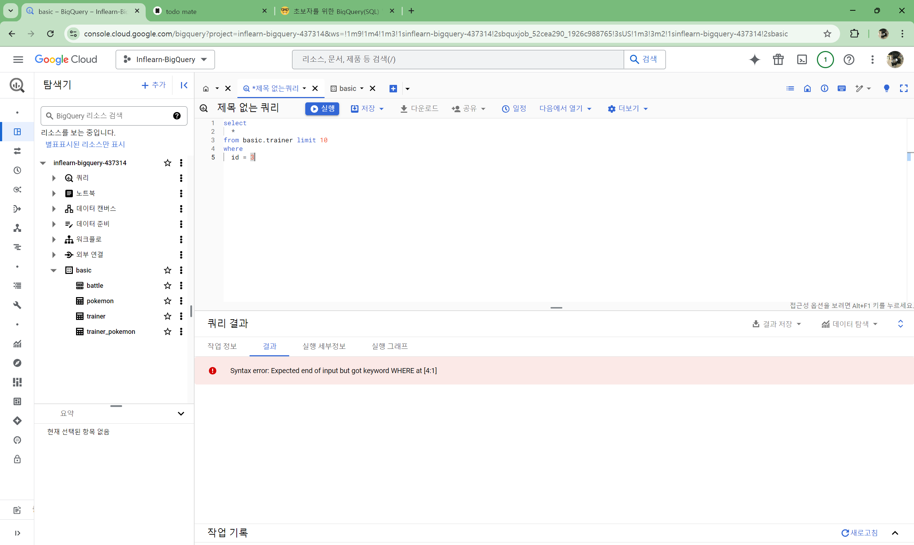
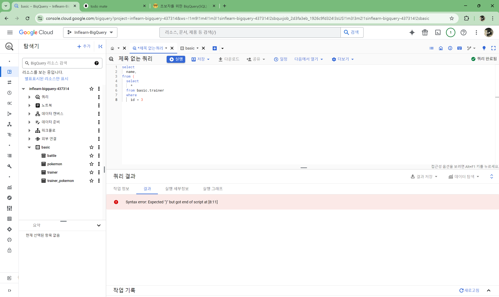
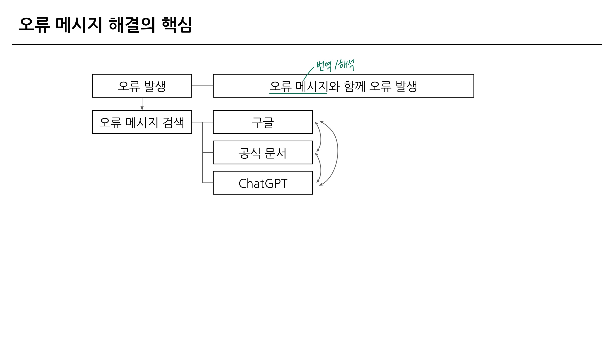

## SQL 쿼리 잘 작성하기, 쿼리 작성 템플릿 및 오류를 잘 디버깅하기

### 3-2. SQL 쿼리 작성하는 흐름

### 3-3. 쿼리 작성 템플릿과 생산성 도구

**쿼리 작성 템플릿**

- 쿼리를 작성하는 목표, 확인할 지표 :
- 쿼리 계산 방법 :
- 데이터의 기간 :
- 사용할 테이블 :
- Join KEY :
- 데이터 특징 :

**생산성 도구 : Espanso**

https://espanso.org/

### 3-4. 오류를 디버깅하는 방법

**오류(Error)**

 : 부정확하거나 잘못된 행동을 의미

**오류 메세지가 알려주고자 하는 것**

- 현재 작성한 방식으로 하면 답을 얻을 수 없어요 (길잡이 역할)
- 이 부분에 문제가 되어요 (문제 진단)

**대표적인 오류 카테고리 : Syntax Error (문법 오류)**

- Error Message를 보고 번역 또는 해석한 후, 해결 방법 찾아보기
    - ex1) SELECT list must not be empty at [10:1] : SELECT 목록은 [10:1]에서 비어 있으면 안 됩니다
    - ex2) Number of arguments does not match for aggregate function COUNT : 집계 함수 COUNT의 인자 수가 일치하지 않습니다
    - ex3) SELECT list expression references column type1 a which is neither grouped nor aggregated : SELECT 목록 식은 다음에서 그룹화되거나 집계되지 않은 열을 참조합니다
    
    
    
    → GROUP BY 에 적절한 컬럼을 명시하지 않았을 경우 발생하는 오류
    
    - ex4) Expected end of input but got keyword SELECT : 입력이 끝날 것으로 예상되었지만 SELECT 키워드가 입력되었습니다
    
   

    → SELECT 근처 확인하기, 하나의 쿼리엔 SELECT가 1개만 있어야 함, 혹은 커리가 끝나는 부분에 ; 붙이고 실행할 부분만 드래그 앤 드랍해서 실행하기
    
    - ex5) Expected end of input but got keyword WHERE at [5:1] : 입력이 끝날 것으로 예상되었지만 [5:1]에서 키워드 WHERE를 얻었습니다
    
    
    
    → LIMIT 위치를 옮기기
    
    - ex6) Expected “)” but got end of script at [8:11] : “)”가 예상되지만 [8:11]에 스크립트가 끝났습니다
    
    
    
    → 괄호를 작성하지 않은 경우
    
    