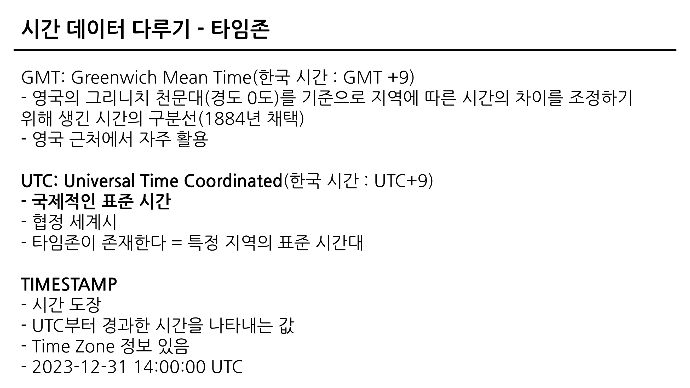
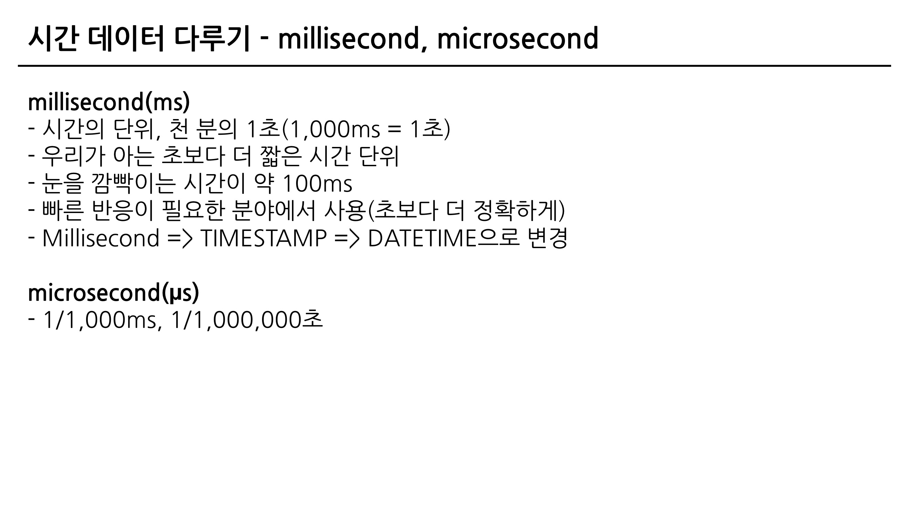
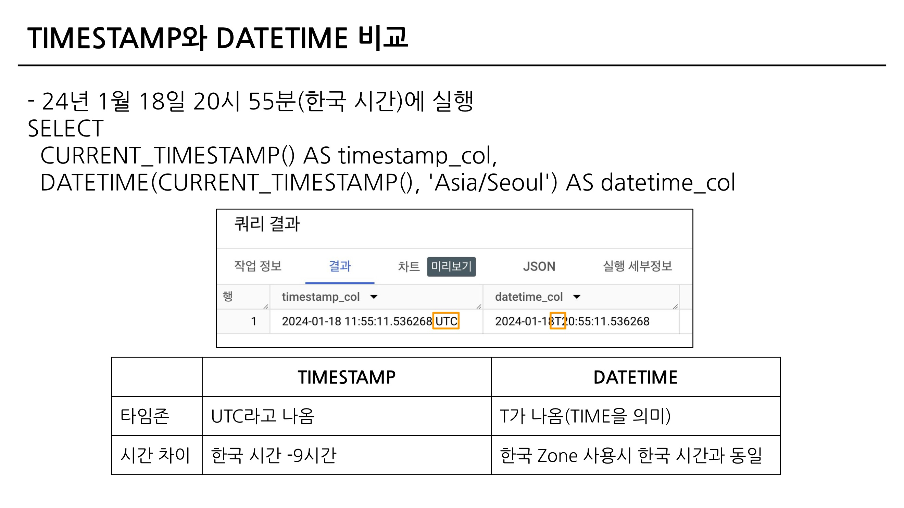

## 데이터 탐색 - 변환

### 4-2. 데이터 타입과 데이터 변환(CAST, SAFE_CAST)

**데이터 타입**

- 숫자
- 문자
- 시간, 날짜
- 부울(Bool) - 참/거짓

**자료 타입 변경하기**

- 자료 타입을 변경하는 함수 : CAST

```sql
SELECT
	CAST(1 AS STRING) # 숫자 1을 문자 1로 변경
```

- 더 안전하게 데이터 타입 변경하기 : SAFE_CAST

```sql
SELECT
	SAFE_CAST("카일스쿨" AS INT64)
# SAFE_가 붙은 함수는 변환이 실패할 경우 NULL 반환
```

**수학 함수**

- 나누기를 할 경우 x/y 대신 SAFE_DIVIDE 함수 사용하기

```sql
SAFE_DIVIDE(x, y)
# x, y 중 하나라도 0인 경우 그냥 나누면 zero error가 발생
```

### 4-3. 문자열 함수(CONCAT, SPLIT, REPLACE, TRIM, UPPER)

**문자열(STRING) 함수**

- 문자열 붙이기 ⇒ CONCAT

```sql
SELECT
	CONCAT("안녕", "하세요", "!") AS result;
-- FROM이 없는데 어떻게 동작하지?
-- CONCAT 인자로 STRING이나 숫자를 넣을 때는 데이터를 직접 넣어준 것 => FROM 없어도 실행
```

- 문자열 분리하기 ⇒ SPLIT

```sql
SELECT
	SPLIT("가, 나, 다, 라", ", ") AS result;
	-- SPLIT(문자열_원본, 나눌 기준이 되는 문자)
	# 결과 : "가", "나", "다", "라" (배열)
```

- 특정 단어 수정하기 ⇒ REPLACE (치환하다)

```sql
SELECT
	REPLACE("안녕하세요", "안녕", "실천") AS result;
	-- REPLACE(문자열 원본, 찾을 단어, 바꿀 단어)
```

- 문자열 자르기 ⇒ TRIM

```sql
SELECT
	TRIM("안녕하세요", "하세요" AS result
	-- TRIM(문자열 원본, 자를 단어)
```

- 영어 소문자를 대문자로 변경 ⇒ UPPER

```sql
SELECT
	UPPER("abc") AS result
	-- UPPER(문자열 원본)
```

### 4-4. 날짜 및 시간 데이터 이해하기(1)(타임존, UTC, Millisecond, TIMESTAMP/DATETIME)

**날짜 및 시간 데이터의 핵심**

1. 날짜 및 시간 데이터 타입 파악하기 : DATE, DATETIME, TIMESTAMP
2. 날짜 및 시간 데이터 관련 알면 좋은 내용 : UTC, Millisecond
3. 날짜 및 시간 데이터 타입 변환하기
4. 시간 함수(두 시간의 차이, 특정 부분 추출하기)

**시간 데이터 다루기**

- DATE
    - DATE만 표시하는 데이터
    - 2023-12-31
- DATETIME
    - DATE와 TIME까지 표시하는 데이터
    - 2023-12-31 14:00:00
- TIME
    - 날짜와 무관하게 시간만 표시하는 데이터
    - 23:59:59.00





```sql
SELECT
	TIMESTAMP_MILLIS(1704176819711) AS milli_to_timestamp_value,
	TIMESTAMP_MICROS(1704176819711000) AS micro_to_timestamp_value,
	DATETIME(TIMESTAMP_MICROS(1704176819711000)) AS datetime_value;
```



### 4-4. 날짜 및 시간 데이터 이해하기(2)

- CURRENT_DATETIME([time_zone])
    - 현재 DATETIME 출력
- EXTRACT
    - DATETIME에서 특정 부분만 추출하고 싶은 경우
    
    ```sql
    SELECT
    	EXTRACT(DATE FROM DATETIME "2024-01-02 14:00.00") AS date,
    	EXTRACT(YEAR FROM DATETIME "2024-01-02 14:00.00") AS year,
    	EXTRACT(MONTH FROM DATETIME "2024-01-02 14:00.00") AS month
    ```
    
    - 요일을 추출하고 싶은 경우
    - EXTRACT(DAYOFWEEK FROM datetime_col)
- DATETIME_TRUNC
    - DATE와 HOUR만 남기고 싶은 경우 ⇒ 시간 자르기
    
    ```sql
    SELECT
    	DATETIME "2024-03-02 14:42:13" AS original_data,
    	DATETIME_TRUNC(DATETIME "2024-03-02 14:42:13", DAY) AS day_trunc,
    	DATETIME_TRUNC(DATETIME "2024-03-02 14:42:13", YEAR) AS year_trunc,
    	DATETIME_TRUNC(DATETIME "2024-03-02 14:42:13", MONTH) AS month_trunc,
    	DATETIME_TRUNC(DATETIME "2024-03-02 14:42:13", HOUR) AS hour_trunc;
    ```
    
- PARSE_DATETIME
    - 문자열로 저장된 DATETIME을 DATETIME 타입으로 바꾸고 싶은 경우
    - 문자열 ⇒ DATETIME
    
    ```sql
    SELECT
    	PARSE_DATETIME('%Y-%m-%d%H:%M:%S','2024-01-1112:35:35') AS parse_datetime;
    ```
    
- FORMAT_DATETIME
    - DATETIME 타입 데이터를 특정 형태의 문자열 데이터로 변환하고 싶은 경우
    - DATETIME ⇒ 문자열
    
    ```sql
    SELECT
    	FORMAT_DATETIME("%c", DATETIME "2024-01-1112:35:35") AS formatted;
    ```
    
- LAST_DAY
    - 마지막 날을 알고 싶은 경우 : 자동으로 월의 마지막 값을 계산해서 특정 연산을 할 경우
    - LAST_DAY(DATETIME) : 월의 마지막 값을 반환
- DATETIME_DIFF
    - 두 DATETIME의 차이를 알고 싶은 경우
    - DATETIME_DIFF(첫 DATETIME, 두번째 DATETIME, 궁금한 차이)
    
    ```sql
    SELECT
    	DATETIME_DIFF(first_datetime, second_datetime, DAY) AS day_diff1,
    	DATETIME_DIFF(second_datetime, first_datetime, DAY) AS day_diff2,
    	DATETIME_DIFF(first_datetime, second_datetime, MONTH) AS month_diff,
    	DATETIME_DIFF(first_datetime, second_datetime, WEEK) AS week_diff,
    FROM (
    	SELECT
    		DATETIME "2024-04-0210:20:00" AS first_datetime,
    		DATETIME "2021-01-0115:30:00" AS second_datetime,
    	)
    ```
    

- **정리! 날짜 및 시간 데이터 타입**
    - DATE
    - DATETIME : DATE + TIME. 타임존 정보 X
    - TIMESTAMP : 특정 시점에 도장찍은 값. 타임존 정보 O
    - UTC : 국제적인 표준 시간. 한국은 UTC+9
    - Millisecond : 1/1000ch
    - Microsecond : 1/1000ms

### 4-5. 시간 데이터 연습 문제 1~2번

1. 트레이너가 포켓몬을 포획한 날짜(catch_date)를 기준으로, 2023년 1월에 포획한 포켓몬의 수를 계산해주세요.
    1. 쿼리를 작성하는 목표, 확인할 지표 : 포켓몬의 수
    2. 쿼리 계산 방법 : COUNT
    3. 데이터의 기간 : 2023년 1월!
    4. 사용할 테이블 : trainer_pokemon
    5. Join KEY : X
    6. 데이터 특징 : 직접 봐야함!
        1. catch_date : DATE 타입
        2. catch_datetime : UTC, TIMESTAMP 타입 ⇒ 컬럼의 이름은 datetime인데 TIMESTAMP 타입으로 저장되어 있다!

```sql
#0 데이터 검증을 위한 커리
SELECT
  COUNT(*)
FROM (
SELECT
  id,
  catch_date,
  DATE(DATETIME(catch_datetime, "Asia/Seoul")) AS catch_datetime_kr_date
FROM basic.trainer_pokemon
)
WHERE
  catch_date != catch_datetime_kr_date
  # != : 같지 않다. 같지 않은 경우는 141건, 같은 경우는 238건
  -- 컬럼의 설명을 꼭 확인하고 SQL을 작성해야 한다!
```

```sql
SELECT
  COUNT(DISTINCT id) AS cnt
FROM basic.trainer_pokemon
WHERE
  EXTRACT(YEAR FROM DATETIME(catch_datetime, "Asia/Seoul")) = 2023 # catch_datetime은 TIMESTAMP로 저장되어 있으므로, DATETIME으로 변경해야 
  AND EXTRACT(MONTH FROM DATETIME(catch_datetime, "Asia/Seoul")) = 1
-- 문제 출제 의도 : 요청한 사람 또는 문제를 그대로 볼 경우에 틀릴 수가 있다. 회사에서도 비슷한 상황일 수 있음.
-- 컬럼을 꼭 파악하고(정의 확인) 쿼리를 작성하자!
```

1. 배틀이 일어난 시간(battle_datetime)을 기준으로, 오전 6시에서 오후 6시 사이에 일어난 배틀의 수를 계산해주세요.
    1. 쿼리를 작성하는 목표, 확인할 지표 : 오전 6시 ~ 오후 6시 배틀의 수
    2. 쿼리 계산 방법 : COUNT
    3. 데이터의 기간 : 일자는 상관없고, 오전 6시 ~ 오후 6시
    4. 사용할 테이블 : battle
    5. Join KEY : X
    6. 데이터 특징 :
        1. battle_date : battle_datetime 기반으로 만들어진 DATE
        2. battle_datetime : DATETIME
        3. battle_timestamp : TIMESTAMP

```sql
# 0. battle_datetime, battle_timestamp 검증
SELECT
  COUNTIF(battle_datetime = DATETIME(battle_timestamp, "Asia/Seoul")) AS battle_datetime_same_battle_timestamp_kr,
  COUNTIF(battle_datetime != DATETIME(battle_timestamp, "Asia/Seoul")) AS battle_datetime_not_same_battle_timestamp_kr
FROM basic.battle
```

```sql
-- 첫번째 풀이
SELECT
  COUNT(DISTINCT id) AS battle_cnt
FROM basic.battle
WHERE
  EXTRACT(HOUR FROM battle_datetime) >= 6
  AND EXTRACT (HOUR FROM battle_datetime) < 18
```

```sql
-- 두번째 풀이
SELECT
  COUNT(DISTINCT id) AS battle_cnt
FROM basic.battle
WHERE
  EXTRACT(HOUR FROM battle_datetime) BETWEEN 6 and 18
  # BETWEEN a and b => a와 b 사이에 있는 것을 변환
```

```sql
-- 2-1. 시간대별로 몇 건이 있는가?
SELECT
  hour,
  COUNT(DISTINCT id) AS battle_cnt
FROM (
  SELECT
    *,
    EXTRACT(HOUR FROM battle_datetime) AS hour
  FROM basic.battle
)
GROUP BY
  hour
ORDER BY
  hour
```

### 4-5. 시간 데이터 연습 문제 3~5번

1. 각 트레이너별로 그들이 포켓몬을 포획한 첫 날(catch_date)을 찾고, 그 날짜를 ‘DD/MM/YYYY’ 형식으로 출력해주세요. (2024-01-01 ⇒ 01/01/2024)
    1. 쿼리를 작성하는 목표, 확인할 지표 : 날짜를 특정 형태로 변경! + 포획한 첫 날
    2. 쿼리 계산 방법 : DATE ⇒ 문자열, FORMAT_DATETIME + MIN
    3. 데이터의 기간 : X
    4. 사용할 테이블 : trainer_pokemon
    5. Join KEY : X
    6. 데이터 특징 : catch_date는 UTC 기준의 데이터, 한국 기준으로 하려면 catch_datetime을 사용해야 한다!

```sql
SELECT
  trainer_id,
  FORMAT_DATE("%d/%m/%Y", min_catch_date) AS new_min_catch_date
  -- 'DD/MM/YYYY'
FROM (
  SELECT
    -- 포획한 첫 날 + 날짜를 변경
    trainer_id,
    MIN(DATE(catch_datetime, "Asia/Seoul")) AS min_catch_date
  FROM basic.trainer_pokemon
  GROUP BY
    trainer_id
  ORDER BY
    trainer_id
)
-- ORDER BY : SELECT 제일 바깥에서 1번만 하면 됨
-- ORDER BY => 모든 ROW를 확인해서 재정렬 => 연산이 많이 소요 => 시간이 오래 걸린다
-- ORDER BY 위치는 SELECT의 가장 바깥에서 실행
```

1. 배틀이 일어난 날짜(battle_date)를 기준으로, 요일별로 배틀이 얼마나 자주 일어났는지 계산해주세요.
    1. 쿼리를 작성하는 목표, 확인할 지표 : 요일별로 배틀이 얼마나 자주 일어났는가? 배틀의 건!
    2. 쿼리 계산 방법 : 요일별로 COUNT
    3. 데이터의 기간 : X
    4. 사용할 테이블 : battle
    5. Join KEY : X
    6. 데이터 특징 : battle_date가 정상적임
        1. 요일을 어떻게 추출할 것인가? : EXTRACT

```sql
SELECT
  day_of_week,
  COUNT(DISTINCT id) AS battle_cnt
FROM (
  SELECT
    *,
    EXTRACT(DAYOFWEEK FROM battle_date) AS day_of_week
  FROM basic.battle
)
GROUP BY
  day_of_week
ORDER BY
  day_of_week
```

1. 트레이너가 포켓몬을 처음으로 포획한 날짜와 마지막으로 포획한 날짜의 간격이 큰 순으로 정렬하는 쿼리를 작성해주세요.
    1. 쿼리를 작성하는 목표, 확인할 지표 : 처음과 마지막의 diff 큰 순으로 정렬!
    2. 쿼리 계산 방법 : 처음 포획한 날짜(MIN) + 마지막으로 포획한 날짜(??) → 차이를 구하고(DATETIME_DIFF) → 차이가 큰 순으로 정렬(ORDER BY)
    3. 데이터의 기간 : X
    4. 사용할 테이블 : trainer_pokemon
    5. Join KEY : X
    6. 데이터 특징 : catch_date는 UTC 기반으로 만들어진 일자. catch_datetime을 사용해야 한다

```sql
SELECT
  *,
  DATETIME_DIFF(max_catch_datetime, min_catch_datetime, DAY) AS diff
  -- 날짜 하나를 찍고, 네이버 지도 등에서 D Day 계산기 => 내가 예상한 답과 같은지 확
FROM (
SELECT
  trainer_id,
  MIN(DATETIME(catch_datetime, "Asia/Seoul")) AS min_catch_datetime,
  MAX(DATETIME(catch_datetime, "Asia/Seoul")) AS max_catch_datetime
FROM basic.trainer_pokemon
GROUP BY
  trainer_id
)
ORDER BY
  diff DESC
```

### 4-6. 조건문(CASE WHEN, IF)

**조건문**

- 만약 특정 조건이 충족되면, 어떤 행동을 하자
- 특정 조건이 참일때 A, 아니면 B
    - 조건에 따른 분기 처리가 필요한 경우
- 조건에 따라 다른 값을 표시하고 싶을 때 사용

**조건문을 사용하는 방법**

1. CASE WHEN : 여러 조건이 있을 경우 사용. 조건의 순서에 주의
2. IF : 단일 조건일 경우 사

**조건문 함수가 사용되는 이유**

- 특정 카테고리를 하나로 합치는 전처리가 필요할 수 있음

1. CASE WHEN
- 여러 조건이 있을 경우 유용

```sql
-- "Rock&Ground"라는 타입을 새로 만들면 어떨까?
SELECT
  new_type1,
  COUNT (DISTINCT id) AS cnt
FROM(
  SELECT
    *,
    CASE
      WHEN (type1 IN ("Rock", "Ground")) OR (type2 IN ("Rock", "Ground"))
      THEN "Rock&Ground"
    ELSE type1
    END AS new_type1
  FROM basic.pokemon
)
GROUP BY
  new_type1
```

- 조건1, 조건2에 둘 다 해당하면 앞선 순서를 따름 *순서 주의!

1. IF
- 단일 조건일 경우 유용
- IF(조건문, True일 때의 값, False일 때의 값) AS 새로운_컬럼_이름

### 4-7. 조건문 연습 문제

1. 포켓몬의 ‘Speed’가 70 이상이면 ‘빠름’, 그렇지 않으면 ‘느림’으로 표시하는 새로운 컬럼 ‘Speed_Category’를 만들어 주세요

```sql
SELECT
  -- *, # 모든 컬럼을 보여줘!
  id,
  kor_name,
  speed,
  IF(speed >= 70, "빠름", "느림") AS Speed_Category
FROM basic.pokemon
```

1. 포켓몬의 ‘type1’에 따라 ‘Water’, ‘Fire’, ‘Electric’ 타입은 각각 ‘물’, ‘불’, ‘전기’로, 그 외의 타입은 ‘기타’로 분류하는 새로운 컬럼 ‘type_Korean’을 만들어 주세요

```sql
SELECT
  id,
  kor_name,
  type1,
  CASE
    WHEN type1 = "Water" THEN "물"
    WHEN type1 = "Fire" THEN "불"
    WHEN type1 = "Electric" THEN "전기"
    ELSE "기타"
  END AS type1_Korean
FROM basic.pokemon
```

1. 각 포켓몬의 총점(total)을 기준으로, 300 이하면 ‘Low’, 301에서 500 사이면 ‘Medium’, 501 이상이면 ‘High’로 분류해주세요

```sql
SELECT
  id,
  kor_name,
  total,
  CASE
    WHEN total >= 501 THEN "High"
    WHEN total BETWEEN 301 AND 500 THEN "Medium"
    ELSE "Low"
  END AS total_grade
FROM basic.pokemon
```

1. 각 트레이너의 배지 개수(badge_count)를 기준으로 5개 이하면 ‘Beginner’, 6개에서 8개 사이면 ‘Intermediate’, 그 이상이면 ‘Advanced’로 분류해주세요.

```sql
SELECT
  id,
  name,
  badge_count,
  CASE
    WHEN badge_count >= 9 THEN "Advanced"
    WHEN badge_count BETWEEN 6 AND 8 THEN "Intermediate"
    ELSE "Beginner"
  END AS trainer_level
FROM basic.trainer
```

1. 트레이너가 포켓몬을 포획한 날짜(catch_date)가 ‘2023-01-01’ 이후이면 ‘Recent’, 그렇지 않으면 ‘Old’로 분류해주세요.

```sql
SELECT
  id,
  trainer_id,
  pokemon_id,
  catch_datetime,
  IF(DATE(catch_datetime, "Asia/Seoul") >= "2023-01-01", "Recent", "Old") AS recent_or_old
	-- 모든 조건이 A로 변환한다
	-- "Recent" AS recent_value # 모든 컬럼에 동일한 값을 추가하고 싶을 때는 이렇게 문자를 바로 작성해도 된다
FROM basic.trainer_pokemon
```

1. 배틀에서 승자(winner_id)가 player1_id와 같으면 ‘Player 1 Wins’, player2_id와 같으면 ‘Player 2 Wins’, 그렇지 않으면 ‘Draw’로 결과가 나오게 해주세요

```sql
SELECT
  id,
  winner_id,
  player1_id,
  player2_d,
  CASE
    WHEN winner_id = player1_id THEN "Player 1 Wins"
    WHEN winner_id = player2_d THEN "Player 2 Wins"
  ELSE "Draw"
  END AS battle_result
FROM basic.battle
```

### 4-8. 정리

데이터 타입

- 숫자
    - 사칙연산, SAFE_DIVIDE
- 문자
    - CONCAT, SPLIT, REPLACE, TRIM, UPPER
- 시간, 날짜
    - EXTRACT(HOUR FROM datetime), DATETIME_TRUNC, PARSE_DATETIME
- 부울(Bool)
    - 데이터 타입 변경하기
    - 조건문 : 특정 조건이면 변경하기
        - CASE WHEN → 여러 조건
        - IF → 단일 조건

### 4-9. BigQuery 공식 문서 확인하는 법

- 개발 공식 문서
    - 찾는 방법 : “기술명 + documentation”으로 검색 (ex. BigQuery documentation)
- 문자열(STRING) 함수 문법 찾는 방법
    - 공식 문서에서 찾기(CTRL+F)를 사용해 문법쪽 확인