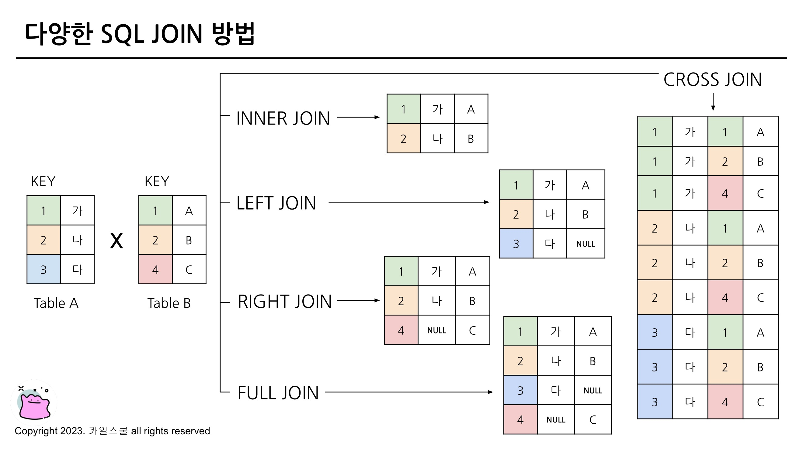
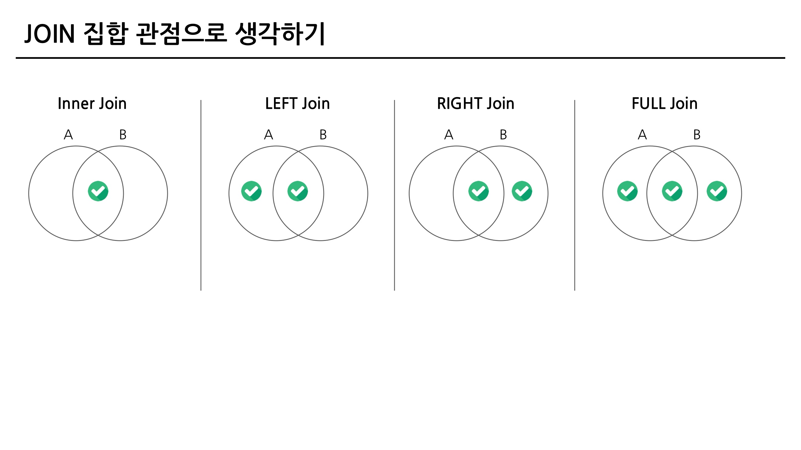
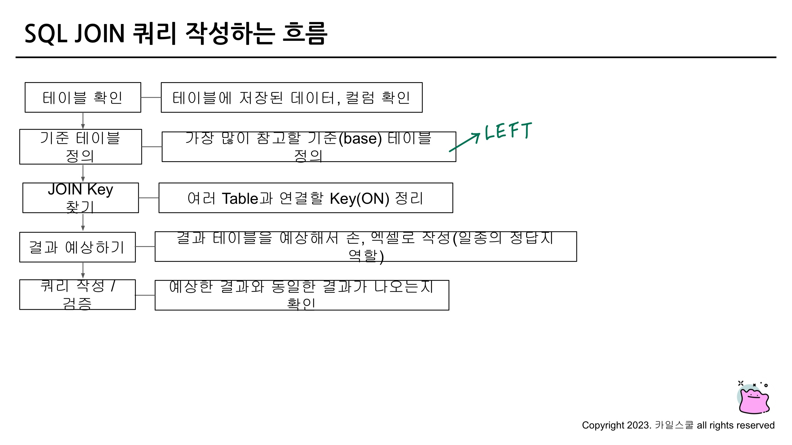
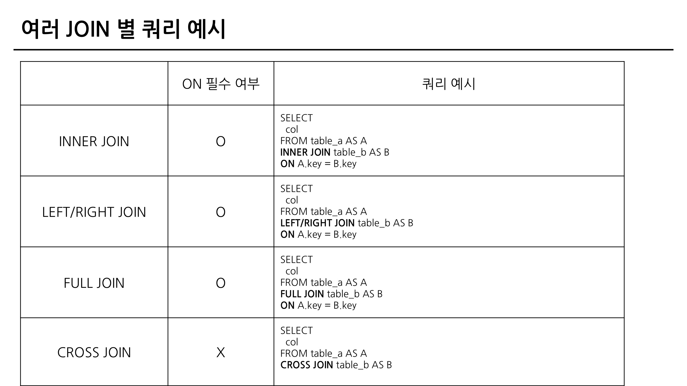

## 다량의 자료를 연결 : JOIN

### 5-2. JOIN 이해하기

**JOIN**

- 서로 다른 데이터 테이블을 연결하는 것
- 공통적으로 존재하는 컬럼(=Key)이 있다면, JOIN 할 수 있음

**JOIN을 해야하는 이유 - 데이터 저장되는 형태에 대한 이해**

- 관계형 데이터베이스(RDBMS) 설계시 정규화 과정을 거침
    - 정규화는 중복을 최소화하게 데이터를 구조화
    - 따라서 데이터를 다양한 Table에 저장해서 필요할 때 JOIN해서 상ㅇ
- 데이터 분석하는 관점에선 미리 JOIN되어 있는 것이 좋을 수 있지만, 개발 관점에선 분리되어 있는 것이 좋음

### 5-3. 다양한 JOIN 방법(LEFT, RIGHT, INNER, CROSS JOIN)





### 5-4. JOIN 쿼리 작성하기





BigQuery에서 JOIN하기

```sql
# LEFT : trainer_pokemon
# RIGHT : trainer
# RIGHT : pokemon

SELECT
  tp.*,
  t.* EXCEPT(id), # trainer_id => tp에 있으니 그걸 활용
  p.* EXCEPT(id) # pokemon_id => tp에 있으니 그걸 활용
FROM basic.trainer_pokemon AS tp
LEFT JOIN basic.trainer AS t
ON tp.trainer_id = t.id
LEFT JOIN basic.pokemon AS p
ON tp.pokemon_id = p.id
```

### 5-5. JOIN을 처음 공부할 때 헷갈렸던 부분

1. **여러 JOIN 중 어떤 것을 사용해야 할까?**
    1. 하려고 하는 작업의 목적에 따라 JOIN을 선택해보기
        1. 교집합 : INNER
        2. 모두 다 조합 : CROSS
        3. 그게 아니라면 LEFT 또는 RIGHT : LEFT를 추천, 하나를 계속 활용하는 것을 추천
2. **어떤 Table을 왼쪽에 두고, 어떤 Table이 오른쪽에 가야할까?**
    1. LEFT JOIN의 경우 기준이 되는 Table을 왼쪽에 두기
    2. 기준에는 기준값(데이터 요소 빠짐없이 존재)이 존재하고, 우측에 데이터를 계속 추가
3. **여러 Table을 연결할 수 있는걸까?**
    1. JOIN의 개수에 한계는 없음
    2. 너무 많이 JOIN하고 있는지 확인
4. **컬럼은 모두 다 선택해야 할까?**
    1. 컬럼 선택은 데이터를 추출해서 무엇을 하고자?하냐에 따라 다름
    2. 사용하지 않을 컬럼은 선택하지 않는 것이 BigQuery에서 비용을 줄일 수 있음
    3. id 같은 값은 Unique한지 확인하기 위해 자주 사용되므로 id는 자주 사용하는 편
5. **NULL이 대체 뭐죠?**
    1. NULL : 값이 없음, 알 수 없음
    2. 0이나 공백과 다르게 값이 아예 없는 것
    3. JOIN에선 연결할 값이 없는 경우 나타남

### 5-6. JOIN 연습 문제 1~2번

1. 트레이너가 보유한 포켓몬들은 얼마나 있는지 알 수 있는 쿼리를 작성해주세요
    1. 보유했다의 정의는 status가 Active, Training인 경우를 의미
    2. Released는 방출했다는 것을 의미

```sql
-- JOIN을 할 테이블을 일단 줄이고(Row 수를 줄인다) 그 후에 JOIN을 한다
-- 연산량 관점에서 먼저 줄이고 JOIN이 효율적
SELECT
  p.kor_name,
  COUNT(tp.id) AS pokemon_cnt
FROM(
  SELECT
    id,
    trainer_id,
    pokemon_id,
    status
  FROM basic.trainer_pokemon
  WHERE
    status IN ("Active", "Training")
) AS tp
LEFT JOIN basic.pokemon AS p
ON tp.pokemon_id = p.id
GROUP BY
  kor_name
ORDER BY
  pokemon_cnt DESC
```

1. 각 트레이너가 가진 포켓몬 중에서 'Grass' 타입의 포켓몬 수를 계산해주세요 (단, 편의를 위해 type1 기준으로 계산해주세요)

```sql
SELECT
  p.type1,
  COUNT(tp.pokemon_id) AS pokemon_cnt
FROM (
  SELECT
    id,
    trainer_id,
    pokemon_id,
    status
  FROM basic.trainer_pokemon
  WHERE
    status IN ("Active", "Training")
) AS tp
LEFT JOIN basic.pokemon AS p
ON tp.pokemon_id = p.id
WHERE
  type1 = "Grass"
GROUP BY
  type1
ORDER BY
  2 DESC # 2 대신에 pokemon_cnt도 가능
```

### 5-6. JOIN 연습 문제 3~5번

1. 트레이너의 고향(hometown)과 포켓몬을 포획한 위치(location)를 비교하여, 자신의 
고향에서 포켓몬을 포획한 트레이너의 수를 계산해주세요.

```sql
SELECT
  COUNT(DISTINCT tp.trainer_id) AS trainer_uniq
FROM basic.trainer AS t
LEFT JOIN basic.trainer_pokemon AS tp
ON t.id = tp.trainer_id
WHERE
  tp.location IS NOT NULL
  AND t.hometown = tp.location
```

1. Master 등급인 트레이너들은 어떤 타입의 포켓몬을 제일 많이 보유하고 있을까요?

```sql
SELECT
  type1,
  COUNT(tp.id) AS cnt
FROM(
  SELECT
    id,
    trainer_id,
    pokemon_id,
    status
  FROM basic.trainer_pokemon
  WHERE
    status IN ("Active", "Training")
) AS tp
LEFT JOIN basic.pokemon AS p
ON tp.pokemon_id = p.id
LEFT JOIN basic.trainer AS t
ON tp.trainer_id = t.id
# LEFT JOIN을 연속해서 2번 사용할 수 있다(N번)
WHERE
  t.achievement_level = "Master"
GROUP BY
  type1
ORDER BY
  2 DESC
LIMIT 1
```

1. Incheon 출신 트레이너들은 1세대, 2세대 포켓몬을 각각 얼마나 보유하고 있나요?

```sql
SELECT
  generation,
  COUNT(tp.id) AS pokemon_cnt
FROM(
  SELECT
    id,
    trainer_id,
    pokemon_id,
    status
  FROM basic.trainer_pokemon
  WHERE
    status IN ("Active", "Training")
) AS tp
LEFT JOIN basic.trainer AS t
ON tp.trainer_id = t.id
LEFT JOIN basic.pokemon AS p
ON tp.pokemon_id = p.id
WHERE
  t.hometown = "Incheon"
  -- 3세대가 생겨도 1, 2 세대만 나오게 해줘! => WHERE 조건에 generation IN (1, 2)
GROUP BY
  generation
```

### 5-7. 정리

- JOIN : 여러 TABLE을 연결해야 할 때 사용하는 문법
- Key : 공통적으로 가지고 있는 컬럼