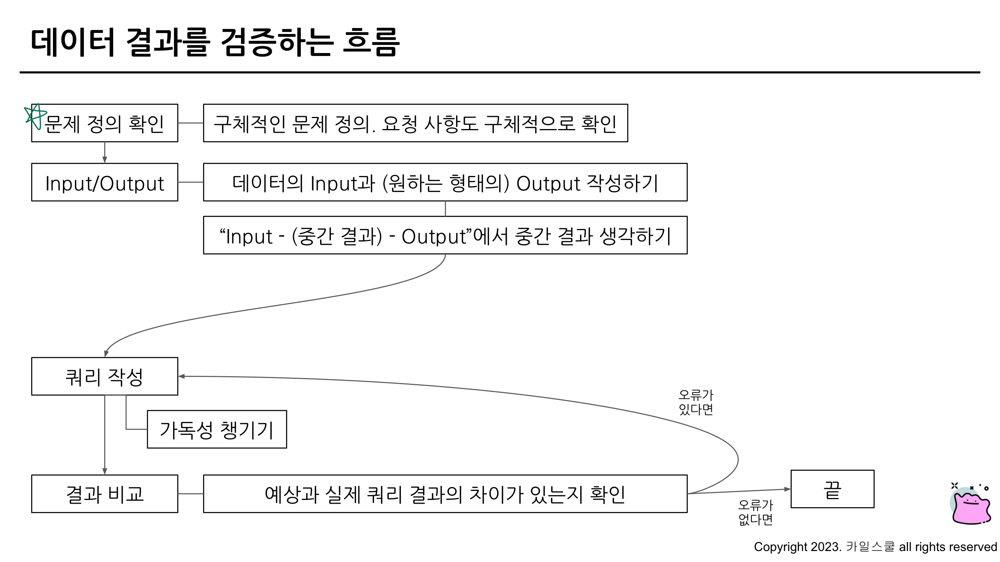

## 데이터 결과 검증, 가독성 있는 쿼리 작성하기

### 6-2. 가독성을 챙기기 위한 SQL 스타일 가이드

1. **예약어는 대문자로 작성**
    1. SQL에서 문법적인 용도로 사용하고 있는 문자들은 대문자로 작성
2. **컬럼 이름은 snake_case로 작성**
    1. 컬럼 이름은 CamelCase(대문자를 쓰는)가 아닌 snake_case(_를 쓰는)로 작성
3. **명시적 vs 암시적인 이름**
    1. Alias로 별칭을 지을 때는 명시적인 이름을 적용
    2. AS를 생략해서 별칭을 설정할 수도 있는데, AS를 쓰는 것도 명시적인 표현
4. **왼쪽 정렬**
    1. 기본적으로 왼쪽 정렬을 기준으로 작성
5. **예약어나 컬럼은 한 줄에 하나씩 권장**
    1. 컬럼은 바로 주석처리할 수 있는 장점이 있기에 한 줄에 하나씩 작성
6. **쉼표는 컬럼 바로 뒤에**
    1. BigQuery는 마지막 쉼표를 무시해서 뒤에 작성해도 무방

### 6-3. 가독성을 챙기기 위한 WITH문 & 파티션

**WITH 구문**

- SQL 쿼리를 작성하다 생기는 일 ⇒ 점점 복잡해짐(가독성 하락)
- WITH 문을 사용해 쿼리를 정의해서 재사용 가능
- CTE(Common Table Expression)라고 표현
- SELECT 구문에 이름을 정해주는 것과 유사
- 쿼리 내에서 반복적으로 사용할 수 있음

**PARTITION**

- Table엔 Partition이란 것이 존재할 수 있음

**PARTITION을 사용하면 좋은 점**

1. **쿼리 성능 향상**
    1. 전체 데이터를 스캔하는 것보다 파티션을 설정한 곳만 스캔하는 것이 더 빠름
2. **데이터 관리 용이성**
    1. 특정 일자의 데이터를 모두 변경하거나 삭제해야 하면 파티션을 설정해서 삭제할 수 있음
3. **비용**
    1. 파티션에 해당되는 데이터만 스캔해서 비용을 줄일 수 있음

### 6-4. 데이터 결과 검증 정의

**데이터 결과 검증(Data Result Validation)의 정의**

- SQL 쿼리 후 얻은 결과가 예상과 일치하는지 확인하는 과정
- 목적 : 분석 결과의 정확성, 신뢰성 확보
- 문제를 잘 정의하고, 미리 작성해보기
- 도메인 특수성(이런 규칙 등) 잘 파악하기
- SQL 쿼리 템플릿과 맥락이 유사



**데이터 결과 검증할 때 자주 활용하는 SQL 쿼리**

대표적으로 활용하는 SQL 문법

1.  COUNT(*) : 행 수를 확인. 의도한 데이터의 행 개수가 맞는가?
2.  NOT NULL : 특정 컬럼에 NULL이 존재하는가? 필수 필드가 비어있지 않는가?
3.  DISTINCT : 데이터의 고유값을 확인해 중복 여부 확인
4.  IF문, CASE WHEN : 의도와 같다면 TRUE, 아니면 FALSE
데

데이터 결과 검증을 할 때 활용하는 방식

1. 특정 user_id로 필터링을 걸어서 확인
2. 샘플 데이터 생성하기

### 6-5. 데이터 결과 검증 예시

여러분은 포켓몬 트레이너들의 배틀 성적을 분석하는 작업을 맡게 되었습니다. 각 트레이너가 진행한 배틀의 승리 비율을 계산해야 하며, 배틀에 참여한 횟수가 9회 이상인 경우만 계산합니다

1. **전체 데이터 파악**
2. **특정 user_id 선정**
3. **승률 직접 COUNT : 결과 예상**
4. **쿼리 작성**

통합 데이터 생성(player1, 2 구분을 하지 않아도 되는 테이블 ⇒ trainer_id 생성)

```sql
SELECT
  *
FROM (
  SELECT
    id AS battle_id,
    player1_id AS trainer_id,
    winner_id
  FROM basic.battle
  UNION ALL
  SELECT
    id AS battle_id,
    player2_d AS trainer_id,
    winner_id
  FROM basic.battle
)
ORDER BY battle_id
```

trainer_id = 7의 총 배틀 횟수를 구하는 쿼리

```sql
WITH battle_basic AS (
  SELECT
    id AS battle_id,
    player1_id AS trainer_id,
    winner_id
  FROM basic.battle
  UNION ALL
  SELECT
    id AS battle_id,
    player2_d AS trainer_id,
    winner_id
  FROM basic.battle
)

SELECT
  trainer_id,
  COUNT(*) AS total_battles,
  COUNT(DISTINCT battle_id) AS Unique_battles
FROM battle_basic
WHERE trainer_id = 7
GROUP BY
  trainer_id
```

trainer_id와 winner_id를 조합해서 WIN, LOSE, DRAW를 만들어보면 어떨까?

```sql
WITH battle_basic AS (
  SELECT
    id AS battle_id,
    player1_id AS trainer_id,
    winner_id
  FROM basic.battle
  UNION ALL
  SELECT
    id AS battle_id,
    player2_d AS trainer_id,
    winner_id
  FROM basic.battle
)

SELECT
  *,
  CASE
    WHEN trainer_id = winner_id THEN "WIN"
    WHEN winner_id IS NULL THEN "DRAW"
    ELSE "LOSE"
  END AS battle_result
FROM battle_basic
WHERE trainer_id = 7
```

5. **실제와 비교**

COUNTIF를 이용해 값 구하기

```sql
WITH battle_basic AS (
  SELECT
    id AS battle_id,
    player1_id AS trainer_id,
    winner_id
  FROM basic.battle
  UNION ALL
  SELECT
    id AS battle_id,
    player2_d AS trainer_id,
    winner_id
  FROM basic.battle
), battle_with_result AS(
  SELECT
    *,
    CASE
      WHEN trainer_id = winner_id THEN "WIN"
      WHEN winner_id IS NULL THEN "DRAW"
      ELSE "LOSE"
    END AS battle_result
  FROM battle_basic
  WHERE trainer_id = 7
)

SELECT
  trainer_id,
  COUNTIF(battle_result = "WIN") AS win_count,
  COUNT(battle_id) AS total_battle_count,
  COUNTIF(battle_result = "WIN")/COUNT(DISTINCT battle_id) AS win_ratio
FROM battle_with_result
GROUP BY
  trainer_id
```

6. **맞다면 특정 유저 조건 제외**

WHERE의 triner_id 제거 후, 총 배틀 횟수가 9 이상만 조건

```sql
WITH battle_basic AS (
  SELECT
    id AS battle_id,
    player1_id AS trainer_id,
    winner_id
  FROM basic.battle
  UNION ALL
  SELECT
    id AS battle_id,
    player2_d AS trainer_id,
    winner_id
  FROM basic.battle
), battle_with_result AS(
  SELECT
    *,
    CASE
      WHEN trainer_id = winner_id THEN "WIN"
      WHEN winner_id IS NULL THEN "DRAW"
      ELSE "LOSE"
    END AS battle_result
  FROM battle_basic
  # WHERE trainer_id = 7
)

SELECT
  trainer_id,
  COUNTIF(battle_result = "WIN") AS win_count,
  COUNT(battle_id) AS total_battle_count,
  COUNTIF(battle_result = "WIN")/COUNT(DISTINCT battle_id) AS win_ratio
FROM battle_with_result
GROUP BY
  trainer_id
HAVING
  total_battle_count >= 9
```