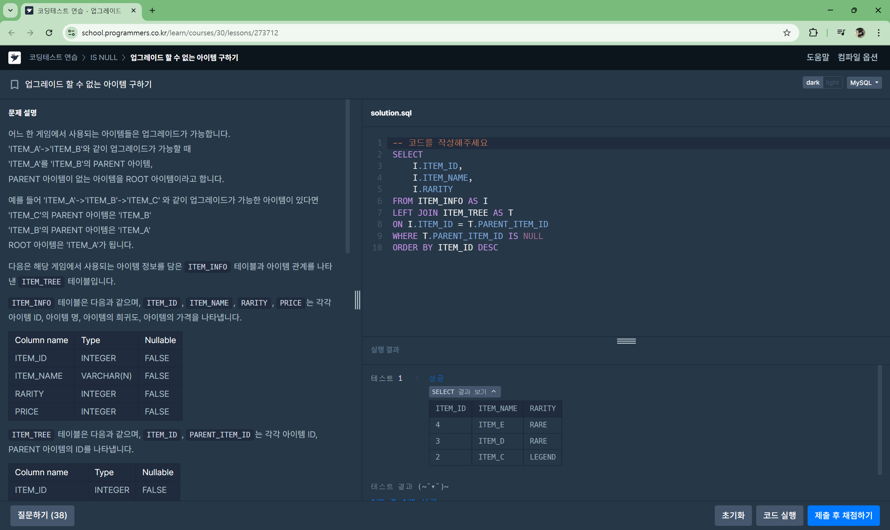
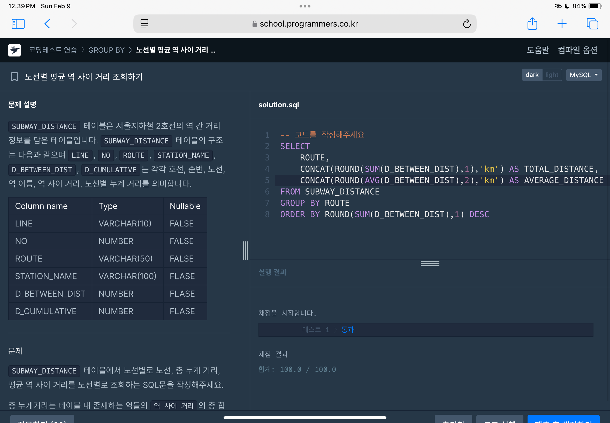
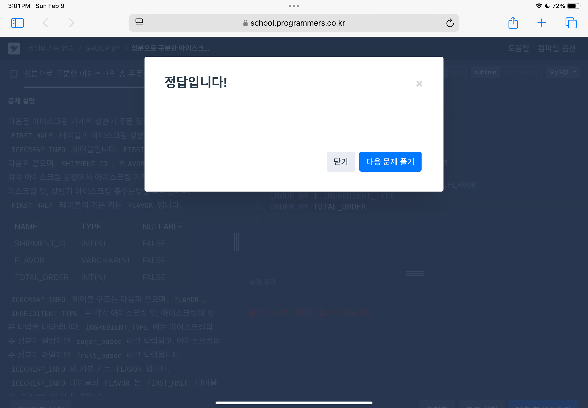
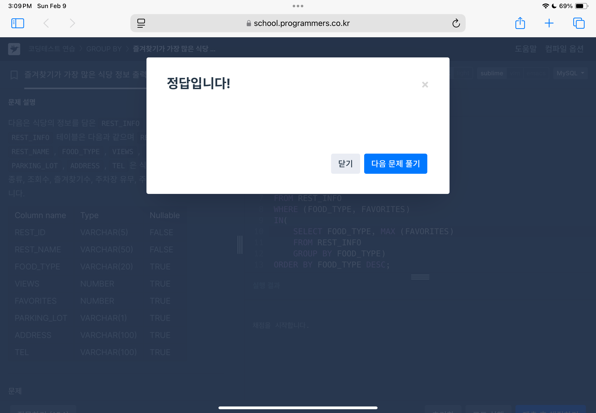
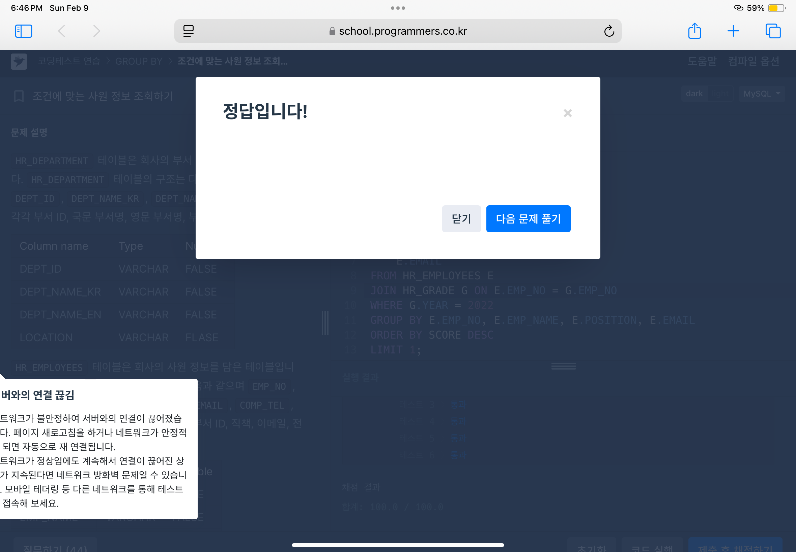
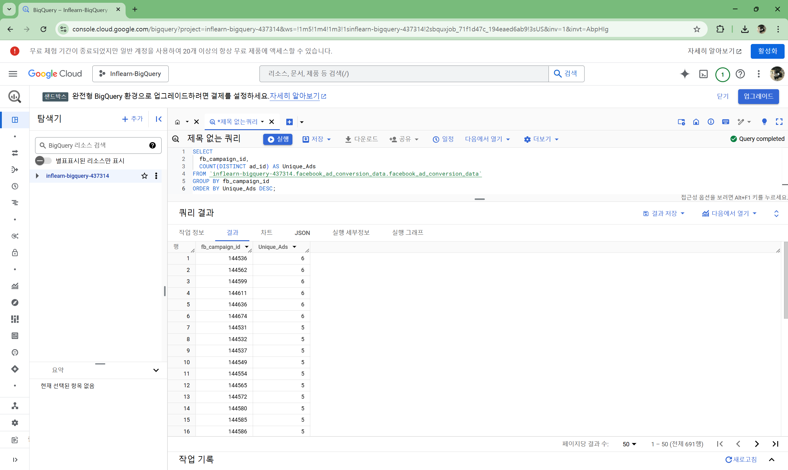
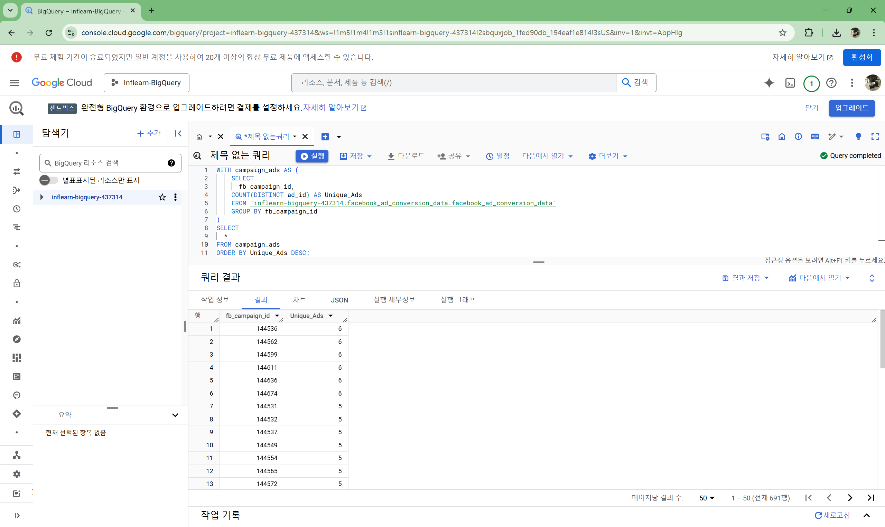

## 1. ROOT 아이템 구하기[🔗](https://school.programmers.co.kr/learn/courses/30/lessons/273710)




## 2. 노선별 평균 역 사이 거리 조회하기[🔗](https://school.programmers.co.kr/learn/courses/30/lessons/284531)

```sql
SELECT
    ROUTE,
    CONCAT(ROUND(SUM(D_BETWEEN_DIST),1),'km') AS TOTAL_DISTANCE,
    CONCAT(ROUND(AVG(D_BETWEEN_DIST),2),'km') AS AVERAGE_DISTANCE
FROM SUBWAY_DISTANCE
GROUP BY ROUTE
ORDER BY ROUND(SUM(D_BETWEEN_DIST),1) DESC
```



## 3. 헤비 유저가 소유한 장소[🔗](https://school.programmers.co.kr/learn/courses/30/lessons/77487)

```SQL
SELECT
    ID,
    NAME,
    HOST_ID
FROM PLACES
WHERE HOST_ID
IN (
    SELECT
        HOST_ID
    FROM PLACES
    GROUP BY HOST_ID
    HAVING COUNT (HOST_ID) >= 2)
ORDER BY ID
```


## 4. 성분으로 구분한 아이스크림 총 주문량[🔗](https://school.programmers.co.kr/learn/courses/30/lessons/133026)

```SQL
SELECT
    I.INGREDIENT_TYPE,
    SUM(F.TOTAL_ORDER) AS TOTAL_ORDER
FROM FIRST_HALF F
JOIN ICECREAM_INFO I ON I.FLAVOR = F.FLAVOR
GROUP BY I.INGREDIENT_TYPE
ORDER BY TOTAL_ORDER
```



## 5. 즐겨찾기가 가장 많은 식당 정보 출력하기[🔗](https://school.programmers.co.kr/learn/courses/30/lessons/131123)

```SQL
SELECT
    FOOD_TYPE,
    REST_ID,
    REST_NAME,
    FAVORITES
FROM REST_INFO
WHERE (FOOD_TYPE, FAVORITES)
IN(
    SELECT FOOD_TYPE, MAX (FAVORITES)
    FROM REST_INFO
    GROUP BY FOOD_TYPE)
ORDER BY FOOD_TYPE DESC;
```



## 6. 조건에 맞는 사원 정보 조회하기[🔗](https://school.programmers.co.kr/learn/courses/30/lessons/284527)

```SQL
SELECT
    SUM(G.SCORE) AS SCORE,
    E.EMP_NO,
    E.EMP_NAME,
    E.POSITION,
    E.EMAIL
FROM HR_EMPLOYEES E
JOIN HR_GRADE G ON E.EMP_NO = G.EMP_NO
WHERE G.YEAR = 2022
GROUP BY E.EMP_NO, E.EMP_NAME, E.POSITION, E.EMAIL
ORDER BY SCORE DESC
LIMIT 1;
```



## 익익 문제 1 

## 익익 문제 2

## 익익 문제 3

## 익익 문제 4

## 익익 문제 4-1
