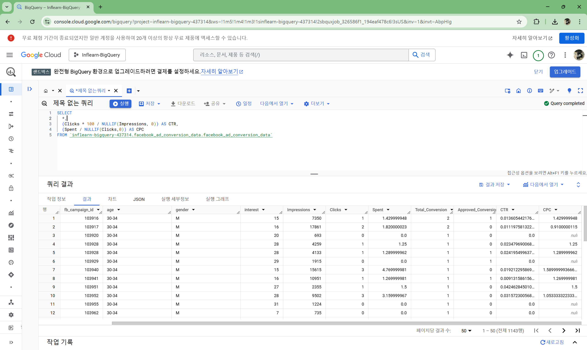
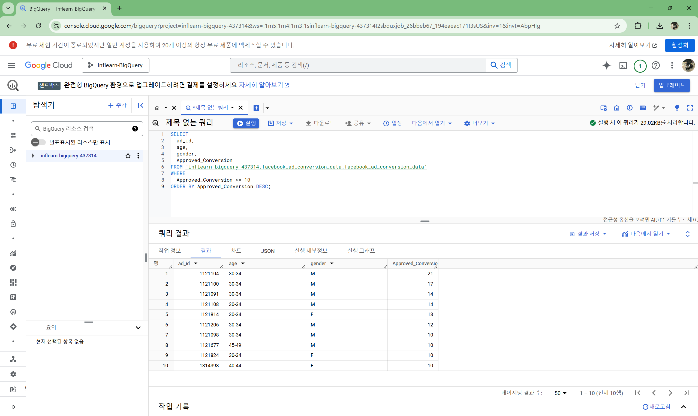

## 1. ROOT 아이템 구하기[🔗](https://school.programmers.co.kr/learn/courses/30/lessons/273710)


## 2. 노선별 평균 역 사이 거리 조회하기[🔗](https://school.programmers.co.kr/learn/courses/30/lessons/284531)

```sql
SELECT
    ROUTE,
    CONCAT(ROUND(SUM(D_BETWEEN_DIST),1),'km') AS TOTAL_DISTANCE,
    CONCAT(ROUND(AVG(D_BETWEEN_DIST),2),'km') AS AVERAGE_DISTANCE
FROM SUBWAY_DISTANCE
GROUP BY ROUTE
ORDER BY ROUND(SUM(D_BETWEEN_DIST),1) DESC
```


## 3. 헤비 유저가 소유한 장소[🔗](https://school.programmers.co.kr/learn/courses/30/lessons/77487)

```SQL
SELECT
    ID,
    NAME,
    HOST_ID
FROM PLACES
WHERE HOST_ID
IN (
    SELECT
        HOST_ID
    FROM PLACES
    GROUP BY HOST_ID
    HAVING COUNT (HOST_ID) >= 2)
ORDER BY ID
```


## 4. 성분으로 구분한 아이스크림 총 주문량[🔗](https://school.programmers.co.kr/learn/courses/30/lessons/133026)

```SQL
SELECT
    I.INGREDIENT_TYPE,
    SUM(F.TOTAL_ORDER) AS TOTAL_ORDER
FROM FIRST_HALF F
JOIN ICECREAM_INFO I ON I.FLAVOR = F.FLAVOR
GROUP BY I.INGREDIENT_TYPE
ORDER BY TOTAL_ORDER
```


## 5. 즐겨찾기가 가장 많은 식당 정보 출력하기[🔗](https://school.programmers.co.kr/learn/courses/30/lessons/131123)

```SQL
SELECT
    FOOD_TYPE,
    REST_ID,
    REST_NAME,
    FAVORITES
FROM REST_INFO
WHERE (FOOD_TYPE, FAVORITES)
IN(
    SELECT FOOD_TYPE, MAX (FAVORITES)
    FROM REST_INFO
    GROUP BY FOOD_TYPE)
ORDER BY FOOD_TYPE DESC;
```


## 6. 조건에 맞는 사원 정보 조회하기[🔗](https://school.programmers.co.kr/learn/courses/30/lessons/284527)

```SQL
SELECT
    SUM(G.SCORE) AS SCORE,
    E.EMP_NO,
    E.EMP_NAME,
    E.POSITION,
    E.EMAIL
FROM HR_EMPLOYEES E
JOIN HR_GRADE G ON E.EMP_NO = G.EMP_NO
WHERE G.YEAR = 2022
GROUP BY E.EMP_NO, E.EMP_NAME, E.POSITION, E.EMAIL
ORDER BY SCORE DESC
LIMIT 1;
```


## 익익 문제
```
Data: The data used in this project is from an anonymous organization’s social media ad
campaign.
1.) ad_id: an unique ID for each ad.
2.) xyzcampaignid: an ID associated with each ad campaign of XYZ company.
3.) fbcampaignid: an ID associated with how Facebook tracks each campaign.
4.) age: age of the person to whom the ad is shown.
5.) gender: gender of the person to whim the add is shown
6.) interest: a code specifying the category to which the person’s interest belongs (interests are as mentioned in the person’s Facebook public profile).
7.) Impressions: the number of times the ad was shown.
8.) Clicks: number of clicks on for that ad.
9.) Spent: Amount paid by company xyz to Facebook, to show that ad.
10.) Total conversion: Total number of people who enquired about the product after seeing the ad.
11.) Approved conversion: Total number of people who bought the product after seeing the ad.
```

## 익익 문제 1. CTR과 CPC 계산

```MD
CTR (Click Through Rate)와 CPC (Cost Per Click)를 계산하는 문제입니다.
**문제:** 각 광고(`ad_id`)에 대해 다음 값을 계산한 뒤 기존 데이터에 추가해서 보여주세요. 계산값이 안 나오면 ‘NULL’로 처리해주세요.
- **CTR**: `(Clicks / Impressions) * 100`
- **CPC**: `Spent / Clicks`
```

```SQL
SELECT
  *,
  (Clicks * 100 / NULLIF(Impressions, 0)) AS CTR,
  (Spent / NULLIF(Clicks,0)) AS CPC
FROM `inflearn-bigquery-437314.facebook_ad_conversion_data.facebook_ad_conversion_data`
```



## 익익 문제 2. 연령대별 평균 CTR 계산

```MD
**문제:** 연령대(`age`)별 평균 CTR을 계산하고 오름차순으로 정렬하세요.

CTR 공식은 `(Clicks / Impressions) * 100`이며, 같은 연령대에 속하는 모든 광고의 CTR 평균을 구합니다.

결과 컬럼: `age`, `average_CTR`
```

```SQL
SELECT
  age,
  AVG(Clicks * 100) AS average_CTR
FROM `inflearn-bigquery-437314.facebook_ad_conversion_data.facebook_ad_conversion_data`
GROUP BY age
ORDER BY age;
```


## 익익 문제 3. 최소 10번 이상 Approved_Conversion을 기록한 광고 찾기

```MD
**문제:** `Approved_Conversion` 수가 10번 이상인 광고의 정보를 조회하고 내림차순으로 정렬하세요.

**결과 컬럼:**

- `ad_id`, `age`, `gender`, `Approved_Conversion`
```

```SQL
SELECT
  ad_id,
  age,
  gender,
  Approved_Conversion
FROM `inflearn-bigquery-437314.facebook_ad_conversion_data.facebook_ad_conversion_data`
WHERE
  Approved_Conversion >= 10
ORDER BY Approved_Conversion DESC;
```



## 익익 문제 4. 캠페인별 광고의 개수 찾기

```MD
**문제:** 각 Facebook 캠페인(`fbcampaignid`)에서 사용된 광고(`ad_id`)의 개수를 계산하고 내림차순으로 정렬해주세요..

**결과 컬럼:**

- `fbcampaignid`, `Unique_Ads`
```

```SQL
SELECT
  fb_campaign_id,
  COUNT(DISTINCT ad_id) AS Unique_Ads
FROM `inflearn-bigquery-437314.facebook_ad_conversion_data.facebook_ad_conversion_data`
GROUP BY fb_campaign_id
ORDER BY Unique_Ads DESC;
```


## 익익 문제 4-1. 캠페인별 광고의 개수 찾기

```MD
문제: 서브쿼리를 이용해서 각 ‘Unique_Ads’의 수를 세어주는 쿼리를 작성해봅시다~
```

```SQL
WITH campaign_ads AS(
  SELECT
    fb_campaign_id,
  COUNT(DISTINCT ad_id) AS Unique_Ads
  FROM `inflearn-bigquery-437314.facebook_ad_conversion_data.facebook_ad_conversion_data`
  GROUP BY fb_campaign_id
)

SELECT
  *
FROM campaign_ads
ORDER BY Unique_Ads DESC;
```

