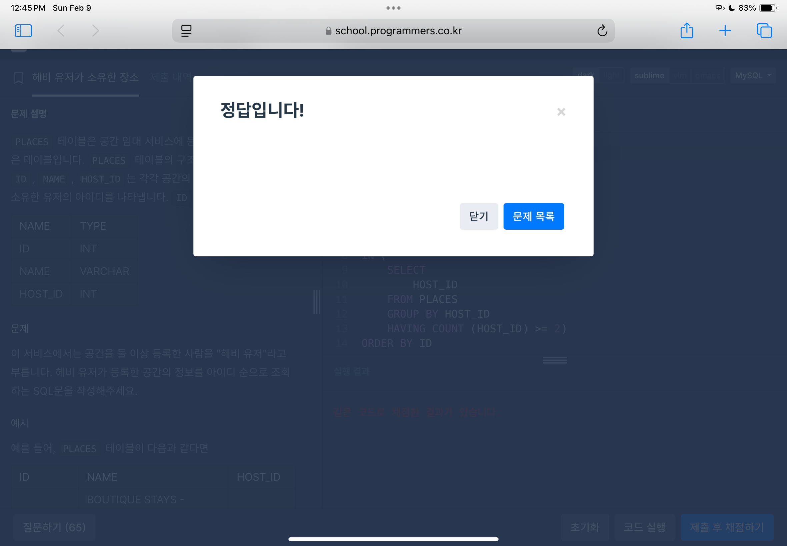
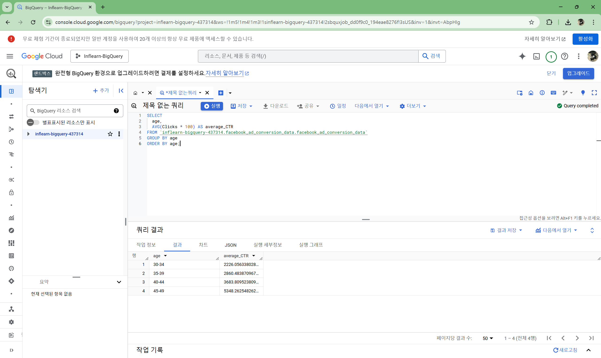

## 1. ROOT 아이템 구하기[🔗](https://school.programmers.co.kr/learn/courses/30/lessons/273710)


## 2. 노선별 평균 역 사이 거리 조회하기[🔗](https://school.programmers.co.kr/learn/courses/30/lessons/284531)

```sql
SELECT
    ROUTE,
    CONCAT(ROUND(SUM(D_BETWEEN_DIST),1),'km') AS TOTAL_DISTANCE,
    
```


## 3. 헤비 유저가 소유한 장소[🔗](https://school.programmers.co.kr/learn/courses/30/lessons/77487)



## 4. 성분으로 구분한 아이스크림 총 주문량[🔗](https://school.programmers.co.kr/learn/courses/30/lessons/133026)


## 5. 즐겨찾기가 가장 많은 식당 정보 출력하기[🔗](https://school.programmers.co.kr/learn/courses/30/lessons/131123)


## 6. 조건에 맞는 사원 정보 조회하기[🔗](https://school.programmers.co.kr/learn/courses/30/lessons/284527)


## 익익 문제 1 

## 익익 문제 2

## 익익 문제 3

## 익익 문제 4

## 익익 문제 4-1
