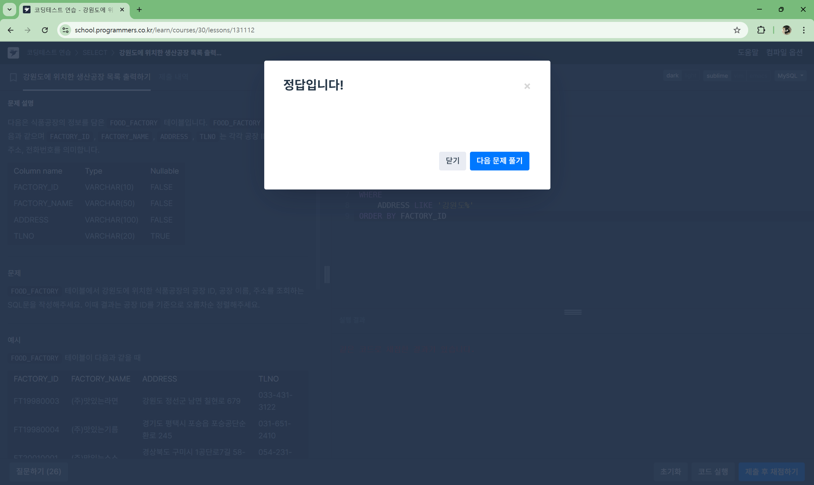
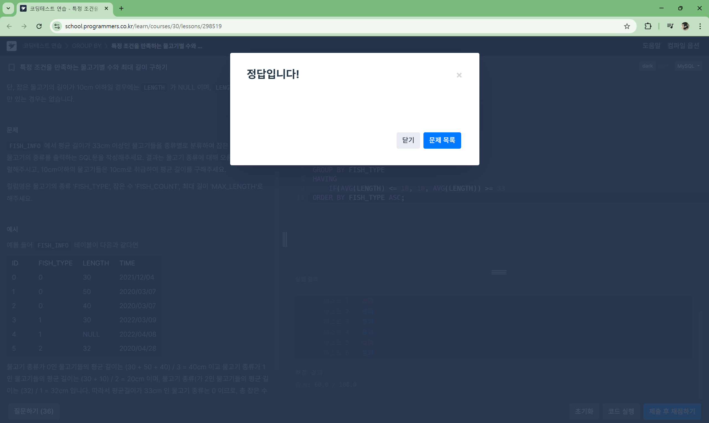
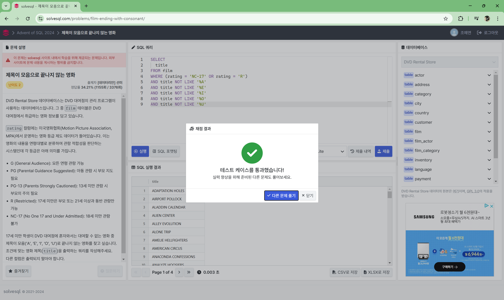
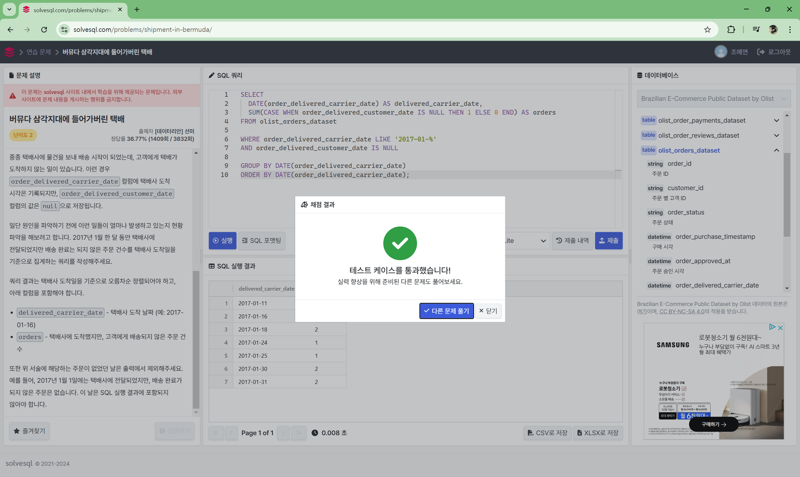

# Advanced - 8주차
## 1. PIVOT과  UNPIVOT
### 1) pivot과 unpivot에 관해 자유로운 리소스를 이용해 학습하고 요약해주세요.

### 2) 다음 문제를 풀어주세요

## 2. 성능 최적화 기법
### 1) 아래 칼럼을 읽고 요약해주세요.

### 2) 문제를 풀어주세요.
```
여러분은 `customer_orders`라는 테이블을 관리하는 데이터베이스 관리자로 일하고 있습니다. 이 테이블에는 고객의 주문 정보가 저장되어 있으며, 각 고객이 주문한 제품과 수량, 가격 정보가 포함되어 있습니다. 또한, 고객들이 특정 제품을 재구매한 비율을 계산하려고 합니다.
```
#### 테이블 구조:
1. **customers** 테이블
    - `customer_id` (고객 ID, PRIMARY KEY)
    - `name` (고객 이름)
2. **orders** 테이블
    - `order_id` (주문 ID, PRIMARY KEY)
    - `customer_id` (고객 ID, FOREIGN KEY)
    - `order_date` (주문 날짜)
3. **order_details** 테이블
    - `order_id` (주문 ID, FOREIGN KEY)
    - `product_id` (제품 ID)
    - `quantity` (수량)
    - `unit_price` (단가)

#### 요구 사항:

1. **`avg_order_value`**: 고객별 평균 주문 금액을 계산하여 `customers` 테이블에 업데이트하세요.
    - `avg_order_value`는 각 고객이 한 번의 주문에서 지출한 평균 금액입니다.
2. **`total_spent`**: 고객별 총 지출 금액을 계산하여 `customers` 테이블에 업데이트하세요.
    - `total_spent`는 고객이 지금까지 지출한 총 금액입니다.
3. **`num_orders`**: 고객이 총 몇 번의 주문을 했는지 계산하여 `customers` 테이블에 업데이트하세요.
    - `num_orders`는 고객이 주문한 총 개수입니다.
4. **`repurchase_rate`**: 고객의 재구매 비율을 계산하여 `customers` 테이블에 업데이트하세요.
    - `repurchase_rate`는 각 고객이 2번 이상 주문한 제품 비율을 의미합니다. (즉, 재구매한 제품이 전체 구매 제품 중 몇 퍼센트를 차지하는지)

#### 예시:

- 고객 A는 3번 주문을 했고, 그 중 2개의 제품을 재구매했습니다.
    - 평균 주문 금액: 100,000원
    - 총 지출 금액: 300,000원
    - 주문 횟수: 3번
    - 재구매 비율: 66.67%

### 추가 질문:

1. 정답 쿼리에서 `repurchase_rate`를 구할 때 사용한 `HAVING COUNT(order_details.product_id) > 1`의 의미는 무엇인가요?
2. 이 문제에서 사용될 수 있는 성능을 최적화하기 위한 방법은 무엇일까요?

# 이젤 문제
## 1. [SELECT] 강원도에 위치한 생산공장 목록 출력하기 [🔗](https://school.programmers.co.kr/learn/courses/30/lessons/131112)

```sql
SELECT
    FACTORY_ID,
    FACTORY_NAME,
    ADDRESS
FROM FOOD_FACTORY
WHERE
    ADDRESS LIKE '강원도%'
ORDER BY FACTORY_ID
```


## 2. [GROUP BY] 특정 조건을 만족하는 물고기별 수와 최대 길이 구하기 [🔗](https://school.programmers.co.kr/learn/courses/30/lessons/298519)

```sql
SELECT
    COUNT(FISH_TYPE) AS FISH_COUNT,
    MAX(LENGTH) AS MAX_LENGTH,
    FISH_TYPE
FROM FISH_INFO
GROUP BY FISH_TYPE
HAVING
    IF(AVG(LENGTH) <= 10, 10, AVG(LENGTH)) >= 33
ORDER BY FISH_TYPE ASC;
```


## 3. 제목이 모음으로 끝나지 않는 영화 [🔗](https://solvesql.com/problems/film-ending-with-consonant/)

```sql
SELECT
  title
FROM film
WHERE (rating = 'NC-17' OR rating = 'R')
AND title NOT LIKE '%A'
AND title NOT LIKE '%E'
AND title NOT LIKE '%I'
AND title NOT LIKE '%O'
AND title NOT LIKE '%U'
```


## 4. 버뮤다 삼각지대에 들어가버린 택배 [🔗](https://solvesql.com/problems/shipment-in-bermuda/)

```sql
SELECT
  DATE(order_delivered_carrier_date) AS delivered_carrier_date,
  SUM(CASE WHEN order_delivered_customer_date IS NULL THEN 1 ELSE 0 END) AS orders
FROM olist_orders_dataset

WHERE order_delivered_carrier_date LIKE '2017-01-%'
AND order_delivered_customer_date IS NULL

GROUP BY DATE(order_delivered_carrier_date)
ORDER BY DATE(order_delivered_carrier_date);
```
