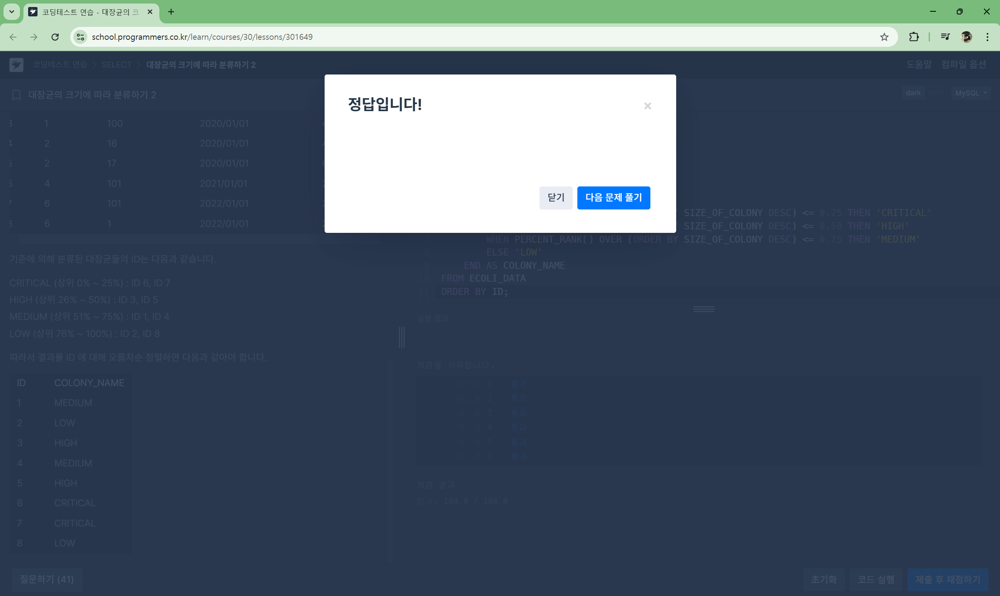
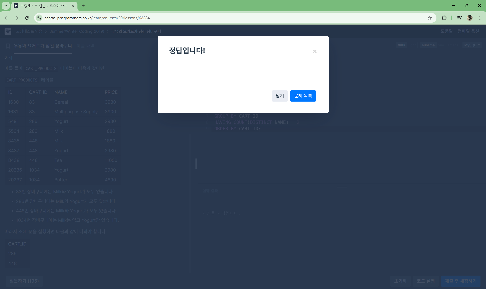
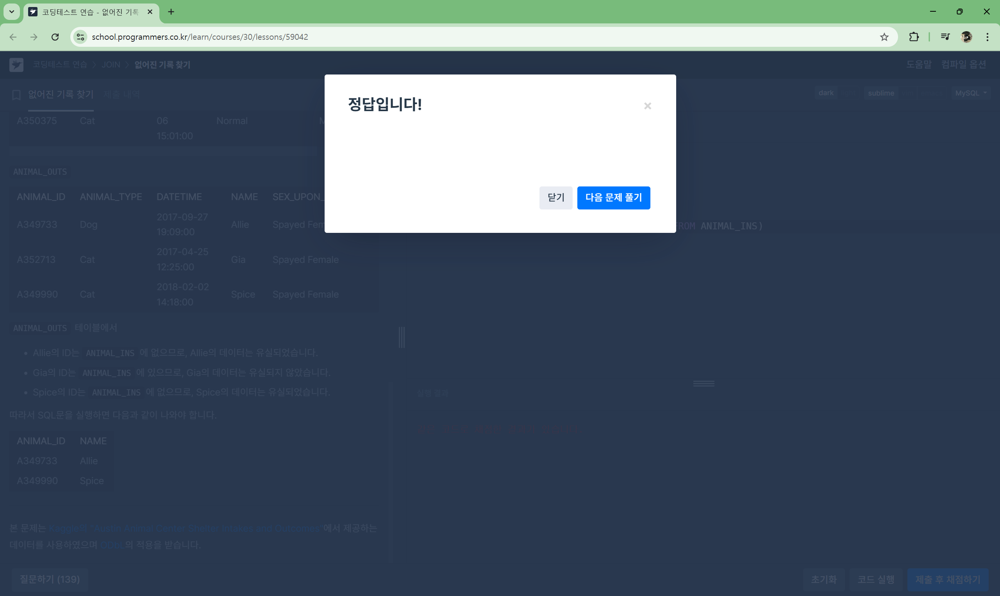

# 예리나 문제
## 1. [SELECT] 대장균의 크기에 따라 분류하기 1 [🔗](https://school.programmers.co.kr/learn/courses/30/lessons/299307)

```sql
SELECT
    ID,
    CASE
        WHEN SIZE_OF_COLONY <= 100 THEN 'LOW'
        WHEN SIZE_OF_COLONY <= 1000 THEN 'MEDIUM'
        ELSE 'HIGH'
    END AS SIZE
FROM ECOLI_DATA
ORDER BY ID;
```


## 2. [SELECT] 대장균의 크기에 따라 분류하기 2[🔗](https://school.programmers.co.kr/learn/courses/30/lessons/301649)

```sql
SELECT
    ID,
    CASE
        WHEN PERCENT_RANK() OVER (ORDER BY SIZE_OF_COLONY DESC) <= 0.25 THEN 'CRITICAL'
        WHEN PERCENT_RANK() OVER (ORDER BY SIZE_OF_COLONY DESC) <= 0.50 THEN 'HIGH'
        WHEN PERCENT_RANK() OVER (ORDER BY SIZE_OF_COLONY DESC) <= 0.75 THEN 'MEDIUM'
        ELSE 'LOW'
    END AS COLONY_NAME
FROM ECOLI_DATA
ORDER BY ID;
```


## 3. 우유와 요거트가 담긴 장바구니 [🔗](https://school.programmers.co.kr/learn/courses/30/lessons/62284)

```sql
SELECT
    CART_ID
FROM CART_PRODUCTS
WHERE
    NAME IN ('Milk', 'Yogurt')
GROUP BY CART_ID
HAVING COUNT(DISTINCT NAME) = 2
ORDER BY CART_ID;
```


## 4. [JOIN] 없어진 기록 찾기 [🔗](https://school.programmers.co.kr/learn/courses/30/lessons/59042)

```sql
SELECT
    ANIMAL_ID,
    NAME
FROM ANIMAL_OUTS
WHERE ANIMAL_ID NOT IN (SELECT ANIMAL_ID FROM ANIMAL_INS)
```


## 5. [JOIN] 상품을 구매한 회원 비율 구하기 [🔗](https://school.programmers.co.kr/learn/courses/30/lessons/131534)