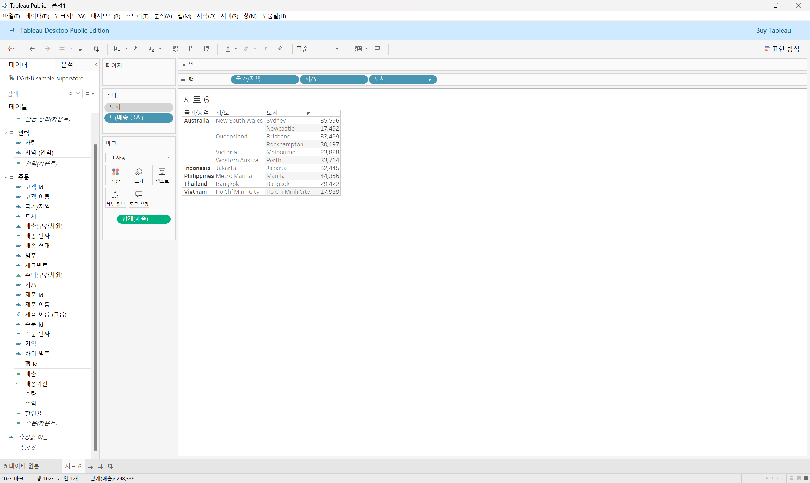
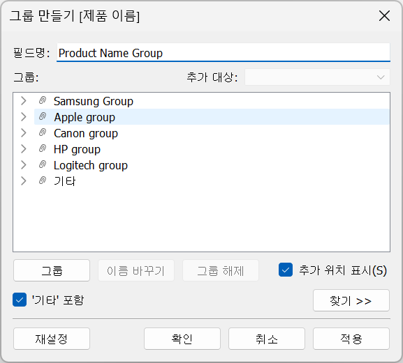
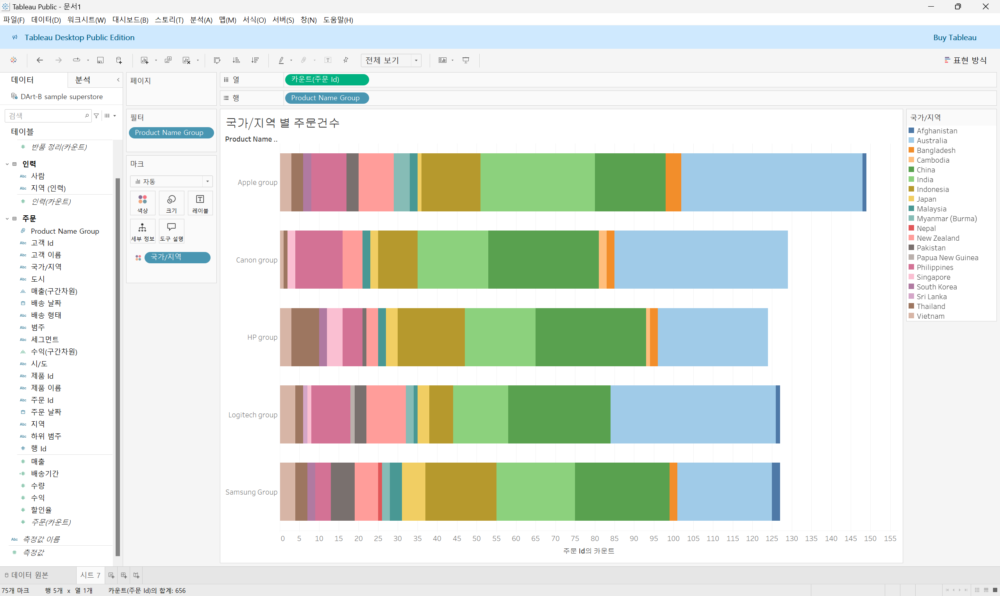

# Third Study Week

- 20강: [파이와 도넛차트](#20강-파이와-도넛차트)

- 21강: [워드와 버블차트](#21강-워드와-버블차트)

- 22강: [이중축과 결합축](#22강-이중축과-결합축)

- 23강: [분산형 차트](#23강-분산형-차트)

- 24강: [히스토그램](#24강-히스토그램)

- 25강: [박스플롯](#25강-박스플롯)

- 26강: [영역차트](#26강-영역차트)

- 27강: [간트차트](#27강-간트차트)

- 28강: [필터](#28강-필터)

- 29강: [그룹](#29강-그룹)


- 문제1 : [문제1](#문제1)

- 문제2 : [문제2](#문제2)

- 참고자료 : [참고자료](#참고-자료)


## Study Schedule

| 강의 범위     | 강의 이수 여부 | 링크                                                                                                        |
|--------------|---------|-----------------------------------------------------------------------------------------------------------|
| 1~9강        |  ✅      | [링크](https://youtu.be/3ovkUe-TP1w?si=CRjj99Qm300unSWt)       |
| 10~19강      | ✅      | [링크](https://www.youtube.com/watch?v=AXkaUrJs-Ko&list=PL87tgIIryGsa5vdz6MsaOEF8PK-YqK3fz&index=75)       |
| 20~29강      | ✅      | [링크](https://www.youtube.com/watch?v=Qcl4l6p-gHM)      |
| 30~39강      | 🍽️      | [링크](https://www.youtube.com/watch?v=e6J0Ljd6h44&list=PL87tgIIryGsa5vdz6MsaOEF8PK-YqK3fz&index=55)       |
| 40~49강      | 🍽️      | [링크](https://www.youtube.com/watch?v=AXkaUrJs-Ko&list=PL87tgIIryGsa5vdz6MsaOEF8PK-YqK3fz&index=45)       |
| 50~59강      | 🍽️      | [링크](https://www.youtube.com/watch?v=AXkaUrJs-Ko&list=PL87tgIIryGsa5vdz6MsaOEF8PK-YqK3fz&index=35)       |
| 60~69강      | 🍽️      | [링크](https://www.youtube.com/watch?v=AXkaUrJs-Ko&list=PL87tgIIryGsa5vdz6MsaOEF8PK-YqK3fz&index=25)       |
| 70~79강      | 🍽️      | [링크](https://www.youtube.com/watch?v=AXkaUrJs-Ko&list=PL87tgIIryGsa5vdz6MsaOEF8PK-YqK3fz&index=15)       |
| 80~89강      | 🍽️      | [링크](https://www.youtube.com/watch?v=AXkaUrJs-Ko&list=PL87tgIIryGsa5vdz6MsaOEF8PK-YqK3fz&index=5)        |


<!-- 여기까진 그대로 둬 주세요-->
<!-- 이 안에 들어오는 텍스트는 주석입니다. -->

# Third Study Week

## 20강: 파이와 도넛차트
<!-- 파이와 도넛차트에 관해 배우게 된 점을 적어주세요 -->

파이차트 : 전체에 대한 비율을 표시할 때 주로 사용


> **🧞‍♀️ 도넛차트를 생성하는 법을 기록해주세요.**
1. 세그먼트와 매출을 각각 더블클릭
2. 표현방식을 파이차트로 바꾸기
3. 상단 툴바의표준을 전체보기로 바꾸기
4. 매출을 레이블에 가져와 수치 표현
5. 내림차순 정렬
6. 레이블 필드 마우스 오른쪽 클릭 - 퀵 테이블 계산 - 구성 비율
##### 이중 축을 활용한 도넛 차트 만들기
1. 열 선반에 빈 공간 더블 클릭(필드 만들기) - 0 입력(임의의 축)
2. 필드 control 키 누른 채 옆으로 드래그(두 개의 원 생성)
3. 두 번째 마크에 포함된 값 제거
4. 레이블에 매출 넣기
5. 사이즈 조정
6. 상단의 두 번째 필드를 클릭 혹은 역삼각형 표시를 클릭 - 이중 축 선택
##### 시각적
1. 색상 변경
2. 서식 - 격자무늬 - 시트에 행 구분선과 열 구분선 모두 없음으로
3. 시트에서 축 선택, 마우스 우 클릭 머리 끝의 표시 해제
4. 색상 - 흰색으로 테두리 선

## 21강: 워드와 버블차트
<!-- 워드와 버블차트에 관해 배우게 된 점을 적어주세요 -->

##### 버블차트
1. 컨트롤 키를 누른 채 국가지역과 매출 클릭 - 표현방식 - 버블차트
2. 매출을 색상 마크에 넣기
3. 상단 툴바의 표준을 전체보기로 바꾸기


##### 워드 클라우드
1. 국가지역에서 우클릭한 채 드래그하여 크기 마크에 넣기
2. 카운트 국가 지역을 선택
3. 지역을 다시 레이블 마크에 넣기
4. 마크에서 텍스트로 변경(히트맵으로 표현된 차트를 워드 클라우드로 변경)
5. 매출을 색상 마크에 넣기(크기와 색상으로 등장 빈도와 매출 값의 크기 표현)
6. 상단 툴바의 표준을 전체보기로 바꾸기


## 22강: 이중축과 결합축
<!-- 이중축과 결합축에 관해 배우게 된 점을 적어주세요 -->

##### 이중축
하나의 뷰어 안에서 축을 이중으로 사용하는 차트\
마크를 각각의 축에 개별적으로 적용할 수 있음\
독립적으로 마크를 수정할 수 있음
1. 주문 일자 필드를 마우스 오른쪽 클릭한 채로 열 선반으로 드래그
2. 연속형 분기 선택
3. 매출과 수익 필드를 각각 더블 클릭
4. 합치고자 하는 필드인 수익 필드에 마우스 우클릭 혹은 역삼각형 표시 클릭 - 이중축 선택
5. 축 선택 - 우클릭 - 축동기화
6. 축 하나는 머리글 표시 해제(옆에 범례가 있기 때문에)


##### 결합축
하나의 축을 공유하는 차트
축을 공유하는 측정값을 필요에 따라 추가할 수 있음
1. 테이블에서 수익 필드를 매출의 라인 그래프 왼쪽 축으로 드래그


## 23강: 분산형 차트
<!-- 분산형 차트에 관해 배우게 된 점을 적어주세요 -->

```js
강의 영상과 달리, 우리 파일에는 '제조 업체' 필드가 없습니다. 필요한 경우, 계산된 필드를 이용해 'SPLIT([제품 이름], ' ', 1)'를 '제조 업체'로 정의하시고 세부 정보에 놓아주세요.
```

파라미터 간의 상관관계를 파악하는데 유용한 그래프
1. 매출 필드를 열 선반에, 수익 필드를 행 선반에 드래그
2. 제품 이름을 세부 정보에 드래그
3. 데이터 패널에 제품 범주 필드를 색상 마크에 드래그(모양 버튼을 통해 아이콘 변경 가능)
4. 표준을 전체 보기로 바꾸기
5. 분석 탭 전환
6. 모델의 추세선을 시트에 드래그하여 선형에 드랍
7. 전체 추세 파악을 위해 추세선 우클릭 - 모든 추세선 편집 - 요소에서 범주 체크 해제
##### 이중축 활용
1. 열 선반에서 매출 필드를 복사
2. 두 필드 중 한 필드는 추세선 범주 차원 활성화
3. 이중축 선택
4. 추가로 생성된 머리글은 선택 해제


## 24강: 히스토그램
<!-- 히스토그램에 관해 배우게 된 점을 적어주세요 -->

분포 형태를 표시하는 차트\
모양은 막대그래프와 비슷하지만 불연속형이 아닌 연속형 측정값을 범위 혹은 구간 차원으로 그룹화한다는 점에서 차이\
차원 필드 없이 측정값만으로 그래프를 그릴 때 주로 사용하는 표현 방식\
(*구간 차원 : 일정한 크기의 포켓을 만들어 그 안에 값을 담아 표현시키기 위한 도구)
##### 구간 차원 생성
1. 테이블의 매출 필드에서 마우스 우 클릭 - 만들기에서 구간 차원 클릭\
(*구간 차원 크기 : 구간별로 담을 포켓의 크기)
2. 매출의 구간차원을 열 선반으로 드래그
3. 우클릭 - 연속형으로 변경
4. 매출 필드를 행 선반으로 드래그
5. 매출 필드 우클릭 - 측정값을 카운트로 변경\
(*중복 값을 제외하고 카운트하고자 할 경우 카운트(고유)선택)


##### 구간 차원을 생성하지 않고 히스토그램 만들기
1. 수익 필드를 열 선반에 드래그
2. 표현 방식 - 히스토그램
3. 데이터 패널에서 수익(구간 차원) 우클릭 - 편집 - 구간 차원 크기를 값 입력으로 전환
4. 범주 필드를 색상 마크로 드래그
5. 축 우클릭  - 축 편집 - 눈금에서 로그 활성화\
(*양수 : 양수 값만 눈금에 표시\
*대칭 : 양수, 0, 음수 값을 포함하는 데이터를 로그 배율 축에 표시)


##### 히스토그램과 막대그래프의 차이
히스토그램 : 연속형 측정값을 통해 수치 데이터의 빈도를 표시하는 양적 데이터, 막대와 막대 사이가 붙어있음\
막대그래프 : 불연속형 여러 범주의 데이터를 비교하기 위해 사용, 막대와 막대 사이에 공백이 존재하는 형태

## 25강: 박스플롯
<!-- 박스플롯에 관해 배우게 된 점을 적어주세요 -->


'상자 수염 그림'\
다섯 개의 구간 범위를 그림으로 표현해 분포와 이상치 등을 한눈에 볼 수 있다는 장점이 있어 데이터 전처리와 분포 분석을 통한 인사이트 도출 시 많이 사용되는 그래프

##### 지역 및 고객 세그먼트별 매출을 표시하는 박스 플롯
1. 세그먼트 필드를 열로, 매출 필드를 행으로 드래그
2. 위치의 지역 필드는 열의 세그먼트 옆으로 나열
3. 표현 방식 - 박스 플롯
4. 마크로 빠진 지역 필드는 다시 열 선반의 세그먼트 옆으로 드래그
5. 고객의 이름을 마크의 세부정보로 드래그
6. 세그먼트별 구분을 위해 테이블의 세그먼트를 색상으로 드래그
7. 축 조정을 위해 축 우클릭 - 축 편집 - 눈금을 로그로 설정
8. 상단 툴바의 표준을 전체 보기로 설정


## 26강: 영역차트
<!-- 영역차트에 관해 배우게 된 점을 적어주세요 -->

라인과 축 사이의 공간이 색상으로 채워진 라인 차트\
영역을 색상으로 채우는 차트이기에 주로 연속형 데이터의 누계를 표현하는 데 사용
1. 주문 날짜를 열 선반으로 우클릭한 채 드래그 - 초록색 연속형 분기 선택
2. 매출 필드를 행 선반으로 드래그
3. 세그먼트를 색상에 드래그
4. 표현 방식 - 영역 차트 연속형
5. 매출을 마크의 레이블로 드래그
6. 매출을 세부 내용으로 드래그 - 우클릭 - 퀵 테이블 계산 - 구성 비율 선택 - 다음을 사용하여 계산 - 테이블(아래로)
7. 툴바의 표준을 전체 보기로 변경


## 27강: 간트차트
<!-- 간트차트에 관해 배우게 된 점을 적어주세요 -->

주로 시간 경과에 따른 기간을 시각화하는데 사용
1. 배송 날짜 필드를 우클릭한 채 열 선반으로 드래그 - 불연속형의 월 선택
2. 제품 범주를 행 선반으로 드래그
3. 상단 툴바의 분석에서 계산된 필드 만들기 클릭
4. Datediff 함수 입력
5. 'day' 입력, 주문 날짜, 배송 날짜 드래그
6. 배송기간 필드를 마크 창의 크기로 드래그
7. 배송기간 필드 우클릭 - 측정값 평균
8. 마크에서 자동을 간트 차트로 변경
9. 하위 범주 행으로 드래그
10. 표준 보기를 전체 보기로 바꾸기
11. 고객 이름을 필터로 드래그 - 아무 고객이나 클릭
12. 필터에서 고객 이름을 우클릭 - 필터 표시
13. 단일값 드롭다운 선택
14. 배송 형태 색상으로 드래그


## 28강: 필터
<!-- 필터에 관해 배우게 된 점을 적어주세요 -->

필터링은 뷰뿐만 아니라 쿼리 속도나 데이터 용량 측면에서도 필터 핸들링에 따라 성능 차이가 많이 남\
태블로는 추출, 데이터원본, 컨텍스트, 차원, 측정 값, 필터 순으로 동작

##### 추출 필터
1. 편집 - 추가 - 주문날짜 - 년 - 2021 선택

##### 데이터 원본 필터
작업을 위한 데이터 중 일부만 워크 스페이스에 불러올 때 사용

##### 컨텍스트 필터
필터 중 상위 필터\
태블로는 각 필터가 다른 필터에 관계 없이 모든 행에 액세스하도록 작동하는데 여러가지 필터를 설정했을 때 컨텍스트 필터로 지정해 주게 되면 다른 필터가 컨텍스트 필터에 종속되어 작동한다
1. 범주, 제품 이름, 매출 더블 클릭
2. 제품 이름을 필터로 드래그
3. 메뉴 탭의 상위 클릭
4. 매출 필드의 합계를 기준으로 상위 10개 설정
5. 범주를 필터로 드래그 - 기술만 선택
6. 필터의 범주를 우클릭 - 컨텍스트에 추가(재정렬 불가능)
7. 내림차순


##### 차원 필터
일반, 와일드카드, 조건, 상위 기능

## 29강: 그룹
<!-- 그룹에 관해 배우게 된 점을 적어주세요 -->

그룹을 이용해 수동으로 필드에 있는 항목들을 묶을 수 있으며, 기존 데이터 원본에 없는 사용자 지정 그룹 필드를 만들 수 있음

##### 항복별로 묶을 필드를 선택해 만드는 방법
1. 제품 이름 필드 우클릭 - 만들기 - 그룹
2. 그룹 나누기
3. 제품 이름(그룹) 필드를 마크의 색상으로 드래그
4. 제품 이름 필드를 열선반으로 드래그
5. 열 선반의 제품 이름 필드 우클릭 - 필터 - 기타 선택 해제


## 문제 1.

```js
유정이는 superstore 데이터셋에서 '주문' 테이블을 보고 있습니다.
1) 국가/지역 - 시/도- 도시 의 계층을 생성했습니다. 계층 이름은 '위치'로 설정하겠습니다.
2) 날짜의 데이터 타입을 '날짜'로 바꾸었습니다.

코로나 시기의 도시별 매출 top10을 확인하고자
1) 배송 날짜가 코로나시기인 2021년, 2022년에 해당하는 데이터를 필터링했고
2) 위치 계층을 행으로 설정해 펼쳐두었습니다.
이때, 매출의 합계가 TOP 10인 도시들만을 보았습니다.
```


```
겉보기에는 전체 10개로, 잘 나온 결과처럼 보입니다. 그러나 유정이는 치명적인 실수를 저질렀습니다.
오늘 배운 '컨텍스트 필터'의 내용을 고려하여 올바른 풀이 및 결과를 구해주세요.
```

<!-- DArt-B superstore가 아닌 개인 superstore 파일을 사용했다면 값이 다르게 표시될 수 있습니다.-->


도시에 대해 컨덱스트 필터를 추가해야 한다

## 문제 2.

```js
태영이는 관심이 있는 제품사들이 있습니다. '제품 이름' 필드에서 '삼성'으로 시작하는 제품들을 'Samsung group'으로, 'Apple'으로 시작하는 제품들을 'Apple group'으로, 'Canon'으로 시작하는 제품들을 'Canon group'으로, 'HP'로 시작하는 제품들을 'HP group', 'Logitech'으로 시작하는 제품들을 'Logitech group'으로 그룹화해서 보려고 합니다. 나머지는 기타로 설정해주세요. 이 그룹화를 명명하는 필드는 'Product Name Group'으로 설정해주세요.

(이때, 드래그보다는 멤버 찾기 > 시작 문자 설정하여 모두 찾아 한번에 그룹화해 확인해보세요.)
```




```js
해당 그룹별로 어떤 국가/지역이 주문을 많이 차지하는지를 보고자 합니다. 매출액보다는 주문량을 보고 싶으므로, 주문Id의 카운트로 계산하겠습니다.

기타를 제외하고 지정한 5개의 그룹 하위 목들만을 이용해 아래와 같이 지역별 누적 막대그래프를 그려봐주세요.
```


