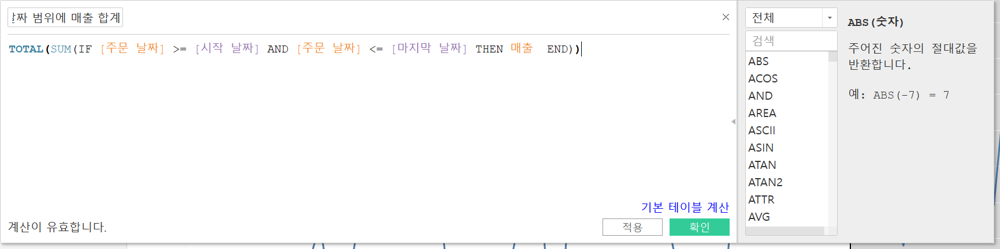

# Fifth Study Week

- 39강: [LOD](#39강-lod)

- 40강: [EXCLUDE](#40-lod-exclude)

- 41강: [INCLUDE](#41-lod-include)

- 42강 : [매개변수](#42-매개변수)

- 43강 : [매개변수 실습](#43-매개변수-실습) 


- 44강: [매개변수 실습](#44-매개변수-실습)

- 45강: [마크카드](#45-워크시트-마크카드)

- 46강: [서식계층](#46-서식-계층)

- 47강: [워크시트](#47-워크시트-서식)

- [문제1](#문제-1)

- [문제2](#문제-2)

## Study Schedule

| 강의 범위     | 강의 이수 여부 | 링크                                                                                                        |
|--------------|---------|-----------------------------------------------------------------------------------------------------------|
| 1~9강        |  ✅      | [링크](https://www.youtube.com/watch?v=AXkaUrJs-Ko&list=PL87tgIIryGsa5vdz6MsaOEF8PK-YqK3fz&index=84)       |
| 10~19강      | ✅      | [링크](https://www.youtube.com/watch?v=AXkaUrJs-Ko&list=PL87tgIIryGsa5vdz6MsaOEF8PK-YqK3fz&index=75)       |
| 20~29강      | ✅      | [링크](https://www.youtube.com/watch?v=AXkaUrJs-Ko&list=PL87tgIIryGsa5vdz6MsaOEF8PK-YqK3fz&index=65)       |
| 30~38강      | ✅      | [링크](https://www.youtube.com/watch?v=e6J0Ljd6h44&list=PL87tgIIryGsa5vdz6MsaOEF8PK-YqK3fz&index=55)       |
| 39~47강      | ✅      | [링크](https://www.youtube.com/watch?v=AXkaUrJs-Ko&list=PL87tgIIryGsa5vdz6MsaOEF8PK-YqK3fz&index=45)       |
| 48~59강      | 🍽️      | [링크](https://www.youtube.com/watch?v=AXkaUrJs-Ko&list=PL87tgIIryGsa5vdz6MsaOEF8PK-YqK3fz&index=35)       |
| 60~69강      | 🍽️      | [링크](https://www.youtube.com/watch?v=AXkaUrJs-Ko&list=PL87tgIIryGsa5vdz6MsaOEF8PK-YqK3fz&index=25)       |
| 70~79강      | 🍽️      | [링크](https://www.youtube.com/watch?v=AXkaUrJs-Ko&list=PL87tgIIryGsa5vdz6MsaOEF8PK-YqK3fz&index=15)       |
| 80~89강      | 🍽️      | [링크](https://www.youtube.com/watch?v=AXkaUrJs-Ko&list=PL87tgIIryGsa5vdz6MsaOEF8PK-YqK3fz&index=5)        |


<!-- 여기까진 그대로 둬 주세요-->

> **🧞‍♀️ 오늘의 스터디는 지니와 함께합니다.**


## 39강. LOD

<!-- INCLUDE, EXCLUDE, FIXED 등 본 강의에서 알게 된 LOD 표현식에 대해 알게 된 점을 적어주세요. -->

##### LOD : "Level of Detail", 뷰의 세부 수준을 나타냄, 계산할 수준을 세부적으로 제어 가능하게 함.

##### FIXED LOD
- 현재 뷰에 있는 차원과 상관없이 계산된 필드에서 원하는 차원을 따라 계산

###### FIXED에서 설정한 차원이 뷰에 포함되어 있을 때
- 
- 

###### FIXED에서 설정한 차원이 뷰에 포함되어 있지 않을 때
- 제품 범주 차원에 따라 매출 표시하기
- 
- 

- 하위 범주를 뷰에서 제외해도 계산할 때 해당 하위 범주들을 포함해 계산하기
- 
- 
- 

## 40. LOD EXCLUDE

<!-- INCLUDE, EXCLUDE, FIXED 등 본 강의에서 알게 된 LOD 표현식에 대해 알게 된 점을 적고, 아래 두 질문에 답해보세요 :) -->

##### EXCLUDE LOD
- 현재 뷰에서 특정 차원을 제외하여 계산할 때 사용


> **🧞‍♀️ FIXED와 EXCLUDE을 사용하는 경우의 차이가 무엇인가요?**

```
1. "하위 범주"를 "제조업체" 수준으로 나타내면 FIXED를 사용한 값은 변경되지 않지만 EXCLUDE를 사용한 값은 변경됨. EXCLUDE는 "하위 범주" 차원을 무시하고 매출의 합계를 표시하긴 하지만 "제조업체" 차원이 "하위 범주"보다 세부 수준이 더 낮아서 제조업체 기준으로 관련된 매출을 표시함.

2. "하위 범주" 필드로 필터를 걸어보면 차이가 나타남. 필터 카드에서 "하위 범주"데이터 중 하나를 선택 해제하면 EXCLUDE를 사용한 값은 변경되지만 FIXED를 사용한 값은 변경되지 않고 고정되어 있음.(40-3 참고)

FIXED 현재 뷰와 관계 없이 특정 차원을 사용해 계산하기 때문에 필터의 영향을 받지 않지만 EXCLUDE는 뷰에 있는 차원을 따라 계산하기 때문에 관련 차원을 필터로 걸어보면 필터가 영향을 받는다.
```

> **🧞‍♀️ 왜 ATTR 함수를 사용하나요?**

```
각 제품들의 매출과 액세서리의 매출 차이를 계산하는 필드를 만들기 위해
```


## 41. LOD INCLUDE

<!-- INCLUDE, EXCLUDE, FIXED 등 본 강의에서 알게 된 LOD 표현식에 대해 알게 된 점을 적고, 아래 두 질문에 답해보세요 :) -->

##### INCLUDE LOD
- 현재 뷰에서 특정 차원을 추가하여 계산
- EXCLUDE LOD처럼 차원 필터를 통해 해당 값을 변경할 수 있음
- 
- 

##### 데이터를 표시할 때 여러 LOD 표현식 방법을 통해 동일한 결과를 만들 수 있음
- INCLUDE LOD 대신 FIXED LOD 사용 가능
- 
- 

> **🧞‍♀️ 그렇다면 어떤 경우에 각 표현식을 사용하나요? 예시와 함께 적어보아요**


```
뷰에 표시되는 값이 차원인 경우 : FIXED LOD 표현식만 사용 가능 

FIXED LOD는 차원과 측정값을 반환할 수 있지만,
INCLUDE와 EXCLUDE LOD 표현식들은 측정값만 반환하기 때문

반환 값이 차원 필터의 영향을 받게 되는 경우 : INCLUDE 또는 EXCLUDE LOD 표현식 사용

FIXED LOD 표현식은 차원 필터에 영향을 받지 않지만, INCLUDE와 EXCLUDE LOD 표현식들은 차원 필터에 영향을 받기 때문
```

## 42. 매개변수

<!-- 매개변수에 대해 알게 된 점을 적어주세요 -->

##### 매개 변수
- 고정된 상수값이 아닌 동적인 값으로 변경하기 위해서 활용하는 기능
- 계산식, 필터, 참조선과 함께 사용

##### 매개 변수 만드는 방법
1. 필터 : 값을 입력하는 공간에서 드롭 다운 메뉴 중 "새 매개 변수 만들기" 선택
2. 필드 위에 우클릭 : 원하는 필드 위에 마우스 우클릭해 "만들기" > "매개 변수" 선택
3. 데이터 패널
- 
- 

> **🧞‍♀️ 집합에도 매개변수를 적용할 수 있나요? 시도해봅시다**

- 
- 

## 43. 매개변수 실습
<!-- 영상 묶음에 포함되지 않아 찾기 어려우실까 링크를 아래에 첨부하겠습니다. 수강 후 삭제해주세요-->

##### 계산식을 활용한 매개 변수 실습
- 
###### 매개변수를 작동시킬 계산된 필드 만들기
- 
###### 매개 변수에 따른 제목 변경이 되도록 설정
- 
- 
###### 측정값으로 매개 변수 만들기
- 
- 
- 
- 
###### 각각의 측정값 단위 표시
- 
- 

## 44. 매개변수 실습

<!-- 매개변수에 대해 알게 된 점을 적어주세요 -->

##### 매개 변수를 활용한 참조선 실습
- 
###### 계산된 필드 만들기
- 
- 
###### 날짜 범위에 따른 매출 합계 나타내기
- 
- 
- 
- 
- 

## 45. 워크시트 마크카드

<!-- 마크카드에 대해 알게 된 점을 적어주세요 -->

- 
- 
- "색상"의 후광 옵션은 맵 차트에만 사용
- 


## 46. 서식 계층

<!-- 서식계층에 대해 알게 된 점을 적어주세요 -->

##### 서식 계층구조
- 상위 계층의 서식을 설정했을 때, 상위 계층보다 아래 계층인 경우에 서식을 변경하게 되면 해당 아래 계층에 설정한 서식이 적용됨
- 

> **🧞‍♀️ 서식계층을 일반적인 것에서 구체적인 것 순서로 기입해보세요**


```
워크 시트 서식
행 / 열 서식
특정 필드
필드 레이블
도구설명 / 제목 / 마크
```


## 47. 워크시트 서식

<!-- 워크시트 서식에 대해 알게 된 점을 적어주세요!-->

- 
- 음영 서식은 다른 서식 옵션들과 달리 "행/열 색상 교차"라는 설정이 있음

## 문제 리스트


## 문제 1.

```
가장 많이 주문한 사람들은 물건 배송을 빨리 받았을까요?
조건을 준수하여 아래 이미지를 만들어봅시다.
1) 국가/지역별(이하 '나라'로 통칭), 범주별로 배송일자가 다를 수 있으니 먼저, 나라별/범주별로 평균 배송일자를 설정한 뒤,
2) 각 나라에서 가장 많이 주문한 사람의 이름을 첫 번째 열,
3) 그 사람이 주문한 제품 이름을 2번째 열,
4) 각 상품이 배송까지 걸린 날 수를 표현하고
5) 그리고 만약 배송이 각 나라/범주별 평균보다 빨랐다면 '빠름', 같다면 '평균', 느리다면 '느림' 으로 print 해주세요. 
```


<!-- 여기까지 오는 과정 중 알게 된 점을 기입하고, 결과는 시트 명을 본인 이름으로 바꾸어 표시해주세요.-->


- 
- 
- 

## 문제 2.

```
채원이는 태블로를 쓰실 수 없는 상사분께 보고하기 위한 대시보드를 만들고 싶어요. 

제품 중분류별로 구분하되 매개변수로써 수익, 매출, 수량을 입력하면 저절로 각각 지표에 해당하는 그래프로 바뀌도록 설계하고자 해요.

 어떤 값이 각 지표의 평균보다 낮은 값을 갖고 있다면 색깔을 주황색으로, 그것보다 높다면 파란색으로 표시하고 싶어요. 그 평균값은 각 지표별로 달라야 해요.
```


<!-- 예시 사진은 지워주세요-->