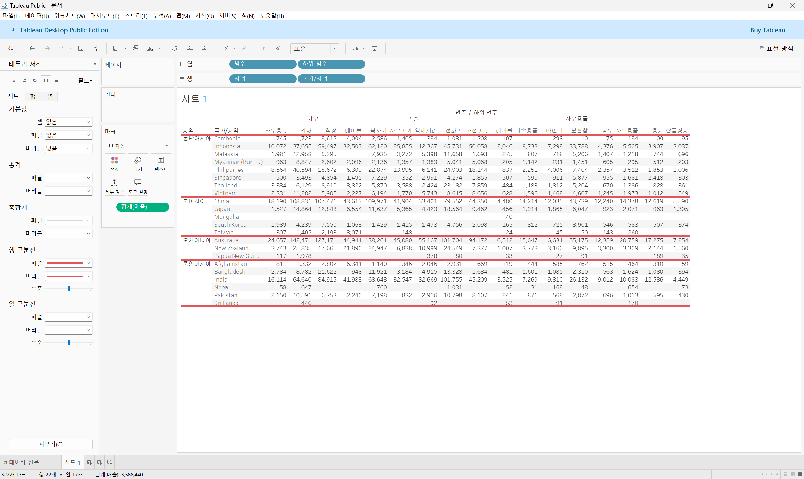
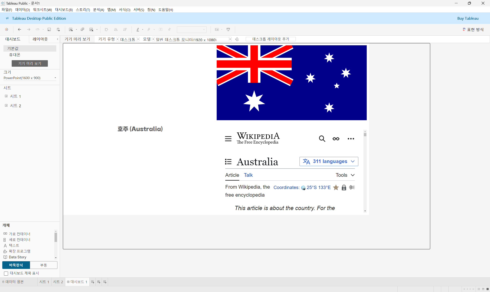
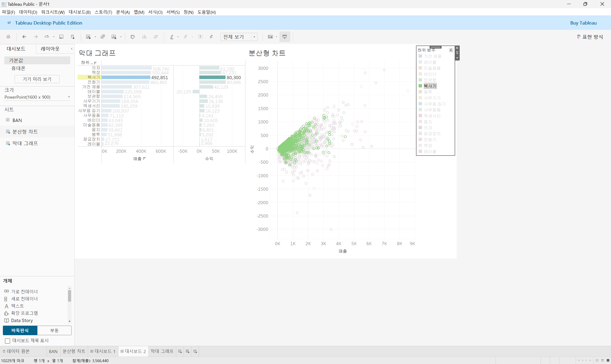

# Sixth Study Week

## Study Schedule
 

| 회차 | 강의 범위   | 강의 이수 여부 | 링크                                                                                                     |
|------|-------------|----------------|--------------------------------------------------------------------------------------------------------|
| 1    | 1~7강       | ✅              | [링크](https://www.youtube.com/watch?v=AXkaUrJs-Ko&list=PL87tgIIryGsa5vdz6MsaOEF8PK-YqK3fz&index=84)    |
| 2    | 8~17강      | ✅              | [링크](https://www.youtube.com/watch?v=AXkaUrJs-Ko&list=PL87tgIIryGsa5vdz6MsaOEF8PK-YqK3fz&index=75)    |
| 3    | 18~27강     | ✅              | [링크](https://www.youtube.com/watch?v=AXkaUrJs-Ko&list=PL87tgIIryGsa5vdz6MsaOEF8PK-YqK3fz&index=65)    |
| 4    | 28~37강     | ✅              | [링크](https://www.youtube.com/watch?v=e6J0Ljd6h44&list=PL87tgIIryGsa5vdz6MsaOEF8PK-YqK3fz&index=55)    |
| 5    | 38~47강     | ✅              | [링크](https://www.youtube.com/watch?v=AXkaUrJs-Ko&list=PL87tgIIryGsa5vdz6MsaOEF8PK-YqK3fz&index=45)    |
| 6    | 48~57강     | ✅              | [링크](https://www.youtube.com/watch?v=AXkaUrJs-Ko&list=PL87tgIIryGsa5vdz6MsaOEF8PK-YqK3fz&index=35)    |
| 7    | 58~67강     | 🍽️             | [링크](https://www.youtube.com/watch?v=AXkaUrJs-Ko&list=PL87tgIIryGsa5vdz6MsaOEF8PK-YqK3fz&index=25)    |
| 8    | 68~77강     | 🍽️             | [링크](https://www.youtube.com/watch?v=AXkaUrJs-Ko&list=PL87tgIIryGsa5vdz6MsaOEF8PK-YqK3fz&index=15)    |
| 9    | 78~85강     | 🍽️             | [링크](https://www.youtube.com/watch?v=AXkaUrJs-Ko&list=PL87tgIIryGsa5vdz6MsaOEF8PK-YqK3fz&index=5)     |
---

 
<!-- 여기까진 그대로 둬 주세요-->

> **🧞‍♀️ 오늘은 강의보다 실습과 대시보드 직접 만들기가 더 중요하니, 기록보다는 사고하며 강의를 들어주세요.**

## 48. 워크시트 서식(2)

<!-- 워크시트에 관해 본 강의에서 알게 된 점을 적어주세요 -->

##### 테두리
- 뷰에서 테이블, 패널, 셀 및 머리글을 둘러싸는 라인의 서식 설정
- 

##### 라인
- 뷰에서 표시된 데이터의 축에 대한 라인의 모양 설정
- 

## 49강. 대시보드패널

<!-- 대시보드패널 강의에서 알게 된 점을 적어주세요. -->

- 

## 50. 대시보드 구성방식

<!-- 알게 된 점을 적고, 아래 질문에 답해보세요 :) -->

> **🧞‍♀️ 부동과 바둑판식 방식을 차이를 중점으로 기술해보세요**

- 바둑판식 : 격자무늬 구조에 따라 개체들을 구성
    - 격자무늬 구조의 특정 위치에만 추가할 수 있음
    - 개체를 추가하면 다른 개체들의 크기가 변경됨
    - 대시보드의 크기가 자주 변경되는 경우에 개체를 추가하면 바둑판식 사용 추천 : 바둑판식으로 개체들을 추가하면 대시보드 크기를 변경해도 개체가 유사한 형식을 유지할 수 있음
- 부동 : 개체를 자유롭게 배치할 수 있으며 사용자가 원하는 대로 개체를 Drag and Drop 하여 배치할 수 있음
    - 개체를 추가하거나 움직이더라도 다른 개체의 크기나 모양에는 영향을 주지 않음
    - 대시보드 크기가 자주 변경되지 않는 경우에 사용하는 것이 좋음 :  부동식으로 추가하면 해당 개체의 위치 또는 형식이 다를 수도 있음
    - 대시보드의 크기가 자주 변경되지 않고 그래프 내에 빈 공간이 많은 경우에는 부동 개체를 사용하여 해당 빈 공간을 채울 수 있음

## 51. 대시보드 컨테이너

##### 컨테이너
- 대시보드 개체들과 워크시트들을 그룹화하고 구성할 수 있는 공간
- 가로 컨테이너
    - 내부의 개체들을 수평 공간으로 배열할 때 사용
- 세로 컨테이너
    - 내부의 개체들을 수직 공간으로 배열할 때 사용

** 빈페이지 개체를 공백 채우기로 배치 : 용기 크기를 포맷할 때 도움이 됨

## 52. 레이아웃 패널

- 부동 옵션 선택을 해제하면 해당 개체가 이전의 위치로 돌아가지 않음
- 백그라운드 : 선택하는 컨테이너의 색상 변경
- 바깥쪽 여백 : 컨테이너의 모서리와 테두리 사이의공간 변경
- 안쪽 여백 : 선택된 개체 모서리와 테두리 사이의 공간 변경

## 53. 필터 동작

<!-- 필터 동작에 대해 알게 된 점을 적어주세요 -->

##### 필터 추가하는 방법
1. 차트 클릭 - 드롭다운 메뉴 중 "필터" 옵션 선택 - 대시보드에 표시하고자 하는 필터 선택
2. 대시보드 필터 동작 : 대시보트 탭 - 동작 - "이 시트" 선택 - "동작 추가" 클릭 - "필터" 선택
    - 원본 시트 : 동작을 적용할 수 있는 워크시트 선택
    - 대상 시트 : 동작을 실행하면 변경할 워크시트
    - 동작 실행 조건
        - 마우스 오버 : 차트의 마크 위에 마우스를 놓으면 나머지 데이터가 해당 마크의 데이터로 변경됨
        - 선택 : 차트의 마크를 클릭하면 나머지 데이터가 선택한 마크의 데이터로 변경됨
        - 메뉴 : 마크를 클릭할 때 마크의 도구 설명에 텍스트가 나타나고 옵션을 선택할 때 나머지 데이터를 변경하는 것을 의미

## 54. 대시보드 하이라이터 동작

<!-- 하이라이터에 대해 알게 된 점을 적어주세요 -->

- 하이라이터 동작 : 전체 데이터 중에서 선택한 조건을 따라 데이터를 하이라이트로 구분
- 하이라이트 동작이 작동하려면 선택 기준으로 사용하는 필드가 변경할 그래프에 포함되어 있어야 함
- 데이터를 범주별로 정렬되지 않도록 하기 위해선 적어도 마크의 도구 설명에 데이터를 포함해야 함
- 

## 55. 대시보드 URL

<!-- URL에 대해 알게 된 점을 적어주세요 -->

- URL 동작 추가
    - 이름(메뉴에 클릭할 수 있는 텍스트) : "삽입" - 원하는 필드 선택
    - URL : URL 사이트 입력 후 "삽입" - 원하는 필드 선택 ; 각 필드에 따라 사이트 달라짐

## 56. 대시보드 시트에 이동 동작

<!-- 대시보드 시트에 이동에 대해 알게 된 점을 적어주세요!-->

1. 시트로 이동 동작 추가
    - 원본 시트 선택 / 동작 실행 조건 : 메뉴
    - 대상 시트 선택
2. 필터 동작 추가
    - 원본 시트 선택 / 동작 실행 조건 : 선택
    - 대상 시트 선택 / 선택을 해제할 경우의 결과 : 모든 값 표시
3. 원본 시트로 돌아가는 단추 만들기
    - 탐색 개체 배치
    - 개체 옵션 "편집 단추" 선택
    - 이동할 위치 : 원본 시트

## 57. 매개변수 변경 동작

<!-- 매개변수 변경 동작에 대해 알게 된 점을 적어주세요!-->

매개변수 동작 추가
    - 원본 시트 선택 / 동작 실행 조건 : 메뉴
    - 대상 매개 변수 선택
    - 원본 필드 선택
    - 선택을 해제할 경우의 결과 : 다음 값으로 설정 (원본 데이터의 가장 이른/늦은 데이터 입력)

## 문제

오늘은 별도의 문제가 없습니다. 

여러 대시보드를 참고하시어, superstore 데이터를 사용해 나만의 대시보드를 제작해주세요.

**단, 워크시트 3개 이상의 그래프를 표시해야 하며 각 시트 간 상호작용성 필터 or 하이라이트 동작은 꼭 추가되어야 합니다**

어떤 부분에 가중을 두었는지, 어떤 사용자 편의성을 고려하였는지에 대한 설명이 필요합니다.

