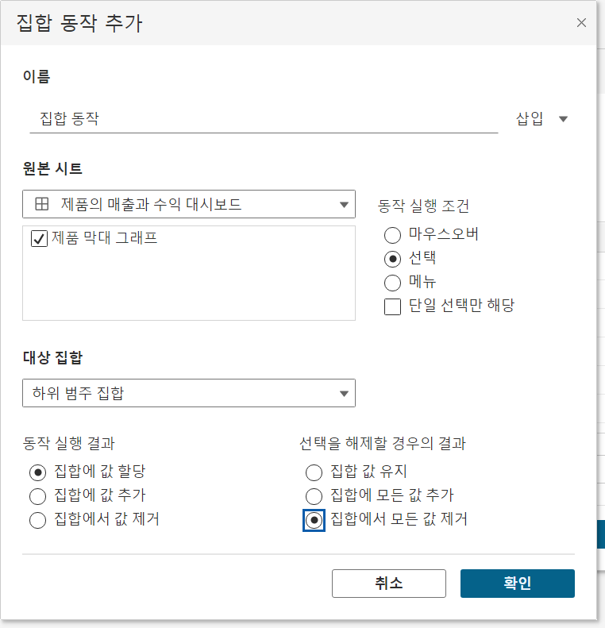
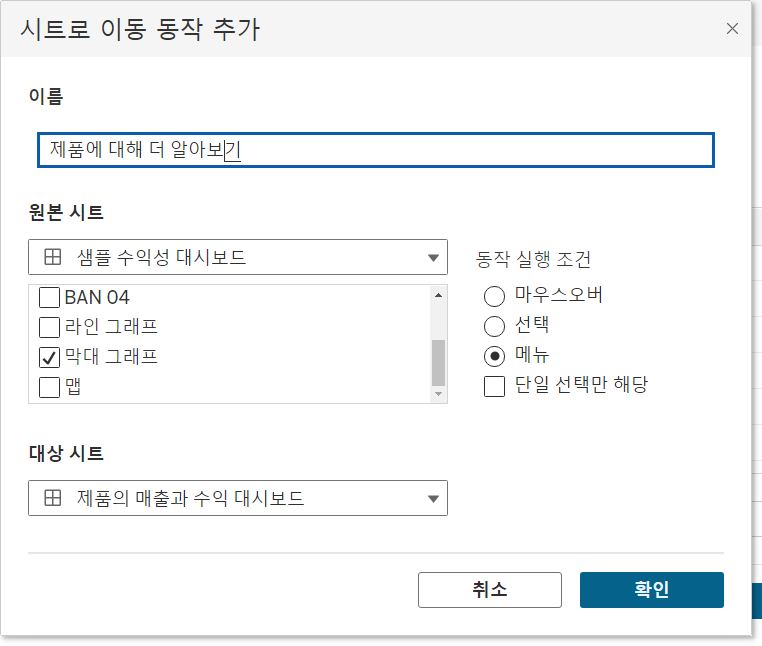
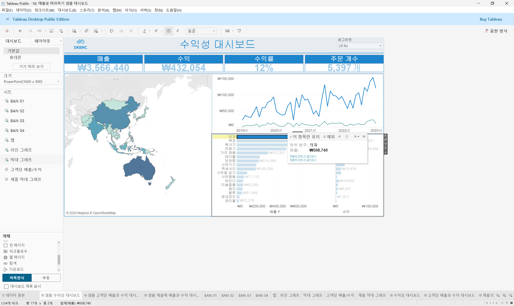
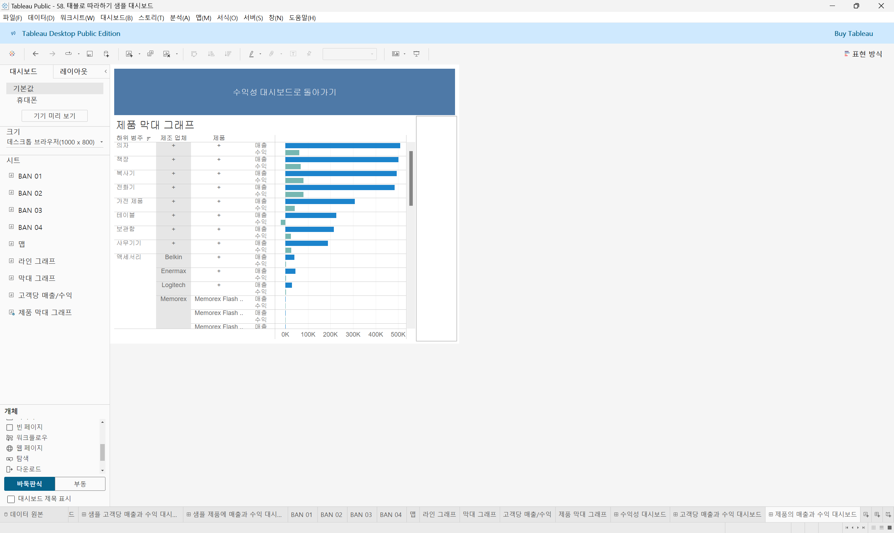

# 7th Study Week

## Study Schedule
 

| 회차 | 강의 범위   | 강의 이수 여부 | 링크                                                                                                     |
|------|-------------|----------------|--------------------------------------------------------------------------------------------------------|
| 1    | 1~7강       | ✅              | [링크](https://www.youtube.com/watch?v=AXkaUrJs-Ko&list=PL87tgIIryGsa5vdz6MsaOEF8PK-YqK3fz&index=84)    |
| 2    | 8~17강      | ✅              | [링크](https://www.youtube.com/watch?v=AXkaUrJs-Ko&list=PL87tgIIryGsa5vdz6MsaOEF8PK-YqK3fz&index=75)    |
| 3    | 18~27강     | ✅              | [링크](https://www.youtube.com/watch?v=AXkaUrJs-Ko&list=PL87tgIIryGsa5vdz6MsaOEF8PK-YqK3fz&index=65)    |
| 4    | 28~37강     | ✅              | [링크](https://www.youtube.com/watch?v=e6J0Ljd6h44&list=PL87tgIIryGsa5vdz6MsaOEF8PK-YqK3fz&index=55)    |
| 5    | 38~47강     | ✅              | [링크](https://www.youtube.com/watch?v=AXkaUrJs-Ko&list=PL87tgIIryGsa5vdz6MsaOEF8PK-YqK3fz&index=45)    |
| 6    | 48~57강     | ✅              | [링크](https://www.youtube.com/watch?v=AXkaUrJs-Ko&list=PL87tgIIryGsa5vdz6MsaOEF8PK-YqK3fz&index=35)    |
| 7    | 58~66강     | ✅             | [링크](https://www.youtube.com/watch?v=AXkaUrJs-Ko&list=PL87tgIIryGsa5vdz6MsaOEF8PK-YqK3fz&index=25)    |
| 8    | 67~77강     | 🍽️             | [링크](https://www.youtube.com/watch?v=AXkaUrJs-Ko&list=PL87tgIIryGsa5vdz6MsaOEF8PK-YqK3fz&index=15)    |
| 9    | 78~85강     | 🍽️             | [링크](https://www.youtube.com/watch?v=AXkaUrJs-Ko&list=PL87tgIIryGsa5vdz6MsaOEF8PK-YqK3fz&index=5)     |
---

 

> **🧞‍♀️ 오늘은 강의보다 실습과 대시보드 직접 만들기가 더 중요하니, 기록보다는 사고하며 강의를 들어주세요.**
> **직접 실습파일을 다운로드하는 번거로움이 있어 assignment > 7th_files에 실습파일을 올려두었습니다. 활용해주세요!**

## 58. 집합값 변경

<!-- 집합값 변경 강의에서 알게 된 점을 적어주세요 -->

- 
- 하위 범주를 선택하면 하위 범주 집합의 유일한 값으로 설정되며 선택을 취소하면 해당 집합에서 모든 값이 제거됨

- 
- 
- 시트로 이동 동작을 이용해 수익성 대시보드에 연결

- 
- 탐색 개체를 이용해 수익성 대시보드로 돌아갈 수 있는 버튼 만들기

## 59강. 스토리패널

<!-- 스토리패널 강의에서 알게 된 점을 적어주세요 -->

- 스토리 워크시트 페이지 : 각 시트를 추가함으로써 스토리 포인트를 생성할 수 있는 공간
- 스토리 포인트 : 스토리 각각의 개별 시트
- 새 스토리 포인트 : 새 스토리 포인트를 추가하기 위한 옵션
    - [빈페이지] : 새 스토리 포인트 추가
    - [복제] : 현재 스토리 포인트를 다음 스토리 포인트의 시작점으로 사용
- 스토리 툴 바 : 변경된 내용을 되돌리기, 스토리 포인트에 대한 업데이트 적용, 삭제, 생성 가능
- 새 이름으로 저장 : 현재까지 작업을 시작지점으로 지정하여 작업을 진행할 수 있음
- 탐색기 : 스토리 포인트를 편집하고 구성할 수 있음. 사용자가 탐색기를 이용해서 스토리 단계 이동이 가능함

## 60. 스토리

<!-- 알게 된 점을 적고, 아래 질문에 답해보세요 :) -->

## 61. 대시보드 탐색

<!-- 대시보드 탐색 강의에서 알게 된 점을 적어주세요 -->

## 62. 태블로 단추

<!-- 태블로 단추 강의에서 알게 된 점을 적어주세요 -->

## 63. 막대그래프 드릴다운

<!-- 막대그래프 드릴다운에 대해 알게 된 점을 적어주세요 -->

## 64. 트리맵 드릴다운

<!-- 트리맵 드릴다운에 대해 알게 된 점을 적어주세요 -->

## 65. 파이 차트 드릴다운

<!-- 파일 차트 드릴다운에 대해 알게 된 점을 적어주세요 -->

## 66. 지도 드릴다운

<!-- 지도 드릴다운에 대해 알게 된 점을 적어주세요 -->

---

## 문제

오늘은 별도의 문제가 없습니다.

다만, 학술제 이후 마지막 과제(11/27~)로서 한 주 동안에는 학술제 주제 관련 데이터(없을 경우, 본인 관심 데이터)를 사용해 나만의 대시보드를 제작할 예정입니다. 또한, 학술제에서 시각화 시 태블로를 사용하기를 권장하는 안내가 나갈 예정입니다.
그 때 열심히 배운 내용을 잘 활용해주세요. 감사합니다 :)
