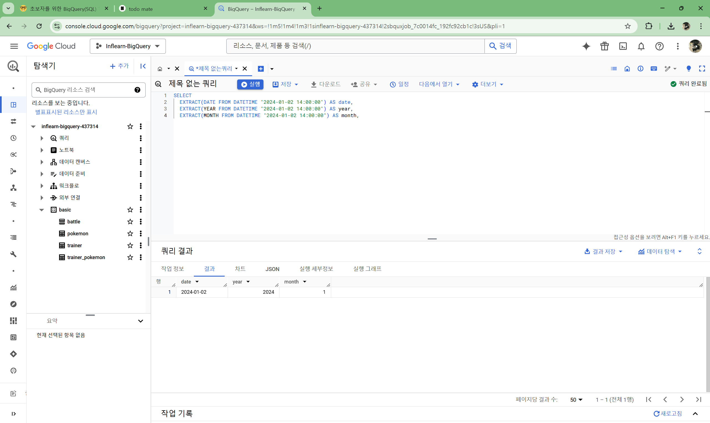
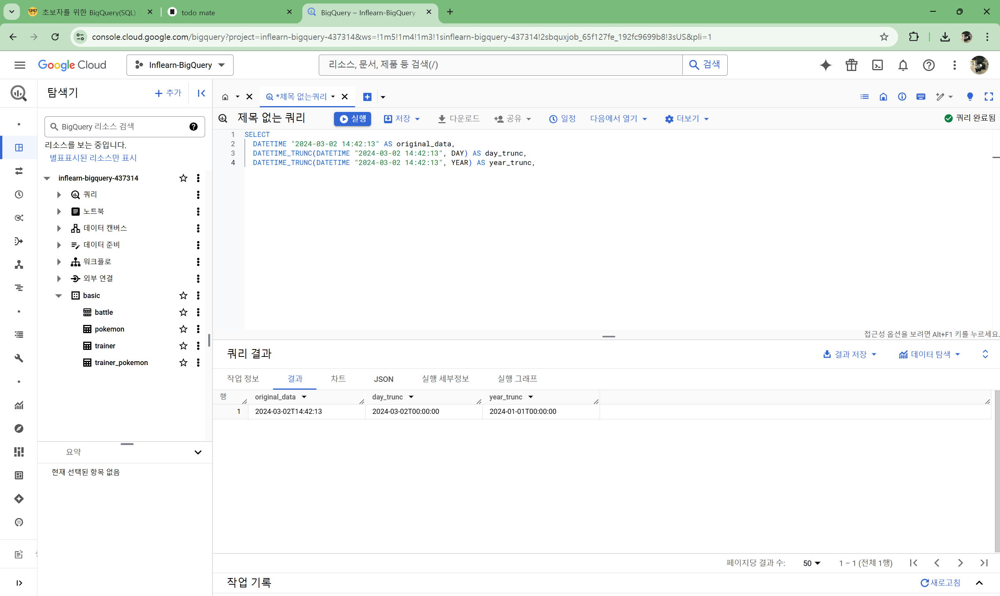
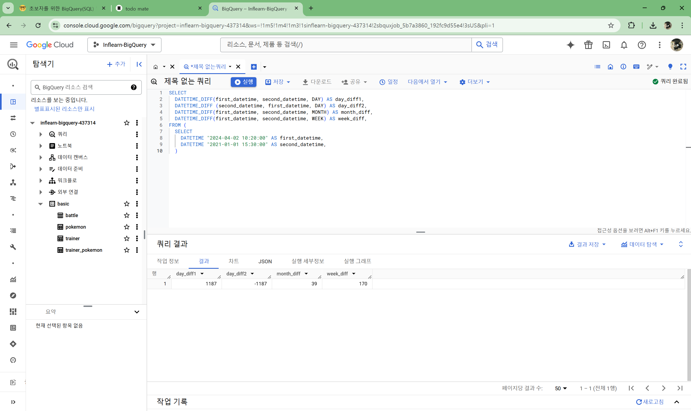
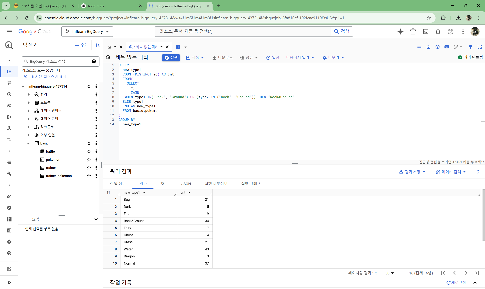

# 4-4. 날짜 및 시간 데이터 이해하기(2)

- CURRENT_DATETIME([time_zone])
    - 현재 DATETIME 출력

- EXTRACT
    - DATETIME에서 특정 부분만 추출하고 싶은 경우
    - 
    - 요일을 추출하고 싶은 경우
    - EXTRACT(DAYOFWEEK FROM datetime_col)

- DATETIME_TRUNC
    - DATE와 HOUR만 남기고 싶은 경우 ⇒ 시간 자르기
    - 

- PARSE_DATETIME
    - 문자열로 저장된 DATETIME을 DATETIME 타입으로 바꾸고 싶은 경우

- FORMAT_DATETIME
    - DATETIME 타입 데이터를 특정 형태의 문자열 데이터로 변환하고 싶은 경우

- LAST_DAY
    - 마지막 날을 알고 싶은 경우 : 자동으로 월의 마지막 값을 계산해서 특정 연산을 할 경우

- DATETIME_DIFF
    - 두 DATETIME의 차이를 알고 싶은 경우
    - 

- 정리! 날짜 및 시간 데이터 타입
    - DATE
    - DATETIME : DATE + TIME. 타임존 정보 X
    - TIMESTAMP : 특정 시점에 도장찍은 값. 타임존 정보 O
    - UTC : 국제적인 표준 시간. 한국은 UTC+9
    - Millisecond : 1/1000ch
    - Microsecond : 1/1000ms

# 4-6. 조건문(CASE WHEN, IF)

- 조건문함수가 사용되는 이유
    - 조건에 따라 다른 값을 표시하고 싶을 때 사용
    - 특정 카테고리를 하나로 합치는 전처리가 필요할 수 있음

1. CASE WHEN
    - 여러 조건이 있을 경우 사용
    - 
    - 조건1, 조건2에 둘 다 해당하면 앞선 순서를 따름 *순서 주의!

2. IF
    - 단일 조건일 경우 유용
    - IF(조건문, True일 때의 값, False일 때의 값) AS 새로운_컬럼_이름

# 4-8. 정리

### 데이터 타입
- 숫자
    - 사칙연산, SAFE_DIVIDE
- 문자
    - CONCAT, SPLIT, REPLACE, TRIM, UPPER
- 시간, 날짜
    - EXTRACT(HOUR FROM datetime), DATETIME_TRUNC, PARSE_DATETIME
- 부울(Bool)
    - 데이터 타입 변경하기
    - 조건문 : 특정 조건이면 변경하기
    - CASE WHEN
    - IF

# 4-9. BigQuery 공식 문서 확인하는 법

- 개발 공식 문서
    - 찾는 방법 : “기술명 + documentation”으로 검색 (ex. BigQuery documentation)
    
- 문자열(STRING) 함수 문법 찾는 방법
    - 공식 문서에서 찾기(CTRL+F)를 사용해 문법쪽 확인