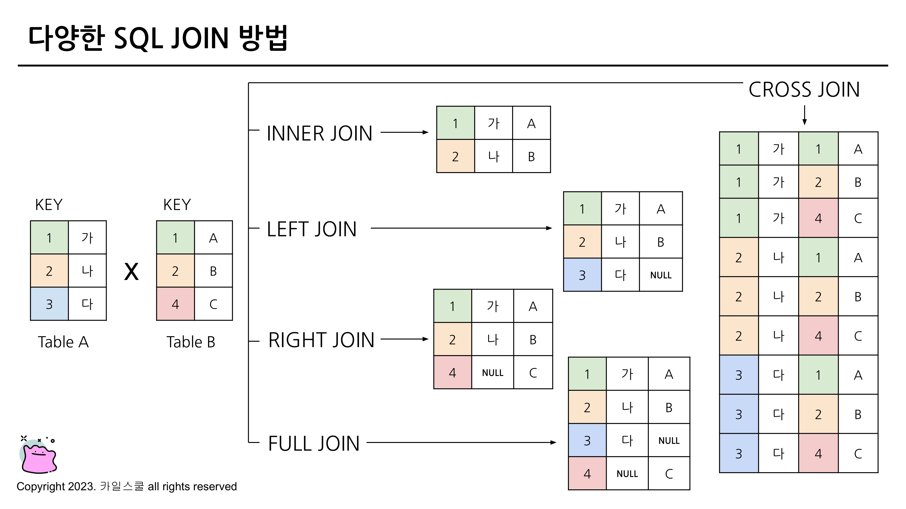
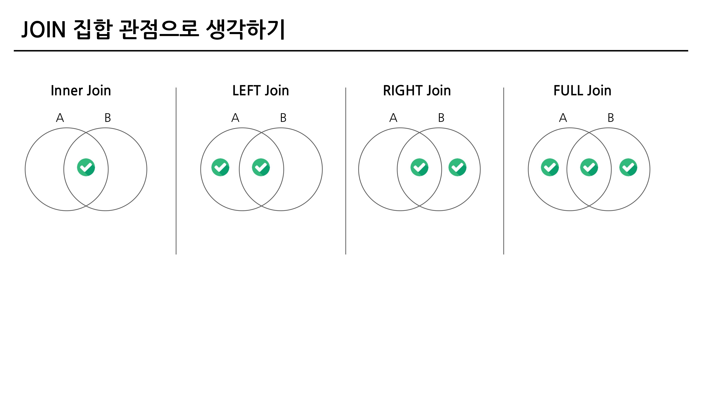
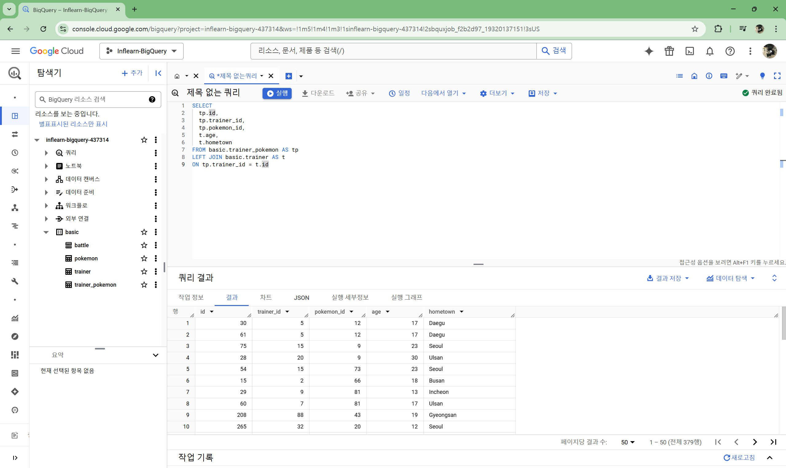
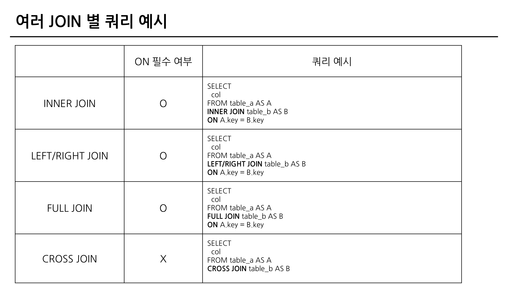

# 5-2. JOIN 이해하기

- "서로 다른 데이터 테이블을 연결하는 것"
- 공통적으로 존재하는 컬럼(=Key)이 있다면, JOIN 할 수 있음

### JOIN을 해야하는 이유 - 데이터 저장되는 형태에 대한 이해
- 관계형 데이터베이스(RDBMS) 설계시 정규화 과정을 거침
- 정규화는 중복을 최소화하게 데이터를 구조화
- 따라서 데이터를 다양한 Table에 저장해서 필요할 때 JOIN해서 사용
- 데이터 분석하는 관점에선 미리JOIN되어 있는 것이 좋을 수 있지만, 개발 관점에선 분리되어 있는 것이 좋음

# 5-3. 다양한 JOIN 방법(LEFT, RIGHT, INNER, CROSS JOIN)

### 다양한 SQL JOIN 방법
- (INNER) JOIN
    - 두 테이블의 공통 요소만 연결
- LEFT/RIGHT (OUTER) JOIN
    - 왼쪽/오른쪽 테이블 기준으로 연결
- FULL (OUTER) JOIN
    - 양쪽 기준으로 연결
- CROSS JOIN
    - 두 테이블의 각각의 요소를 곱하기
- 
- 

# 5-4. JOIN 쿼리 작성하기

### SQL JOIN 쿼리 작성하는 흐름
1. 테이블 확인 : 테이블에 저장된 데이터, 컬럼 확인
2. 기준 테이블 정의 : 가장 많이 참고할 기준(base) 테이블 정의
3. JOIN Key 찾기 : 여러 Table과 연결할 Key(ON) 정리
4. 결과 예상하기 : 결과 테이블을 예상해서 손, 엑셀로 작성(일종의 정답지 역할)
5. 쿼리 작성 / 검증 : 예상한 결과와 동일한 결과가 나오는지 확인

### SQL JOIN 문법
- FROM 하단에 JOIN 할 Table을 작성하고 ON 뒤에 공통된 컬럼(Key)를 작성
- 테이블 이름이 길 수 있기 때문에 별칭(Alias)을 정의해줄 수 있음
- 

# 5-5. JOIN을 처음 공부할 때 헷갈렸던 부분

1) 여러 JOIN 중 어떤 것을 사용해야 할까?
    - 하려고 하는 작업의 목적에 따라 JOIN을 선택해보기
        - 교집합 : INNER
        - 모두 다 조합 : CROSS
        - LEFT or RIGHT : LEFT를 추천. 하나를 계속 활용하는 것을 추천
2) 어떤 Table을 왼쪽에 두고, 어떤 Table이 오른쪽에 가야할까?
    - LEFT JOIN의 경우 기준이 되는 Table을 왼쪽에 두기
    - 기준에는 기준값이 존재하고, 우측에 데이터를 계속 추가
3) 여러 Table을 연결할 수 있는걸까?
    - JOIN의 개수에 한계는 없음
    - 너무 많이 JOIN하고 있는지 확인 (-> 3~5개)
4) 컬럼은 모두 다 선택해야 할까?
    - 컬럼 선택은 데이터를 추출해서 무엇을 하고자 하냐에 따라 다름
    - 사용하지 않을 컬럼은 선택하지 않는 것이 BigQuery에서 비용을 줄일 수 있음
5) NULL이 대체 뭐죠?
    - NULL : 값이 없음, 알 수 없음
    - 0이나 공백과 다르게 값이 아예 없는 것
    - JOIN에선 연결할 값이 없는 경우 나타남

# 5-7. 정리
- JOIN : 여러 TABLE을 연결해야 할 때 사용하는 문법
- Key : 공통적으로 가지고 있는 컬럼
- 