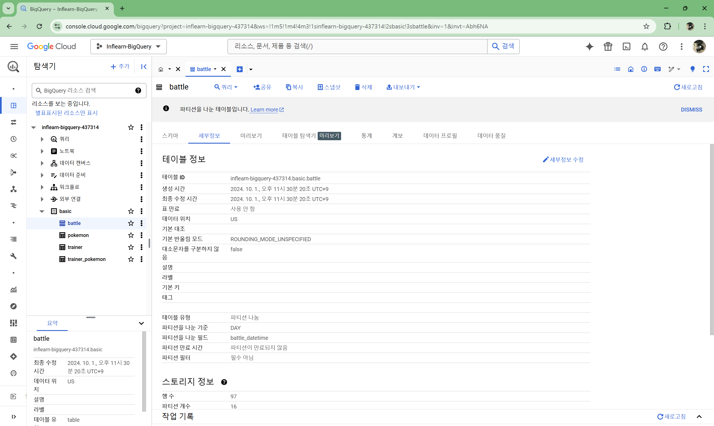
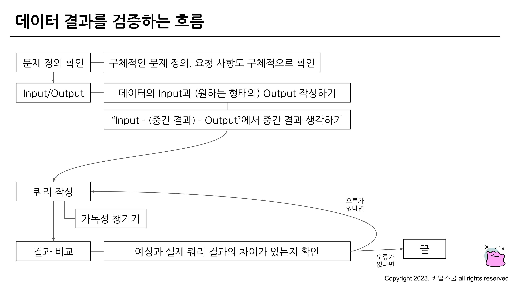
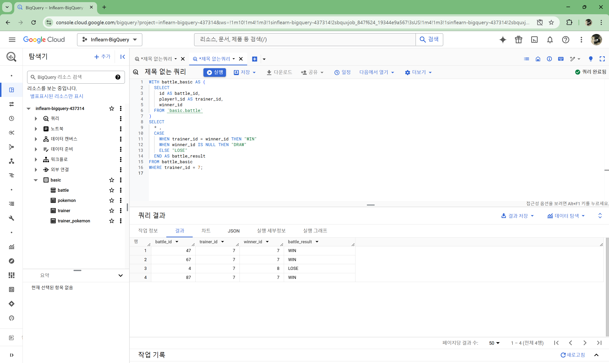

# 6-2

1. 예약어는 대문자로 작성
- SQL에서 문법적인 용도로 사용하고 있는 문자들은 대문자로 작성
- 예약어의 대표적인 예시 : SELECT, FROM, WHERE, 각종 함수

2. 컬럼 이름은 snake_case로 작성
- 컬럼 이름은 CamelCase가 아닌 snake_case로 작성
- 단, 회사의 기준이 CamelCase면 사용. 일관성이 중요

3. 명시적 vs 암시적인 이름
- Alias로 별칭을 지을 때는 명시적인 이름을 적용
- JOIN 할 때 테이블의 이름도 명시적으로 할 수 있다면 명시적으로 진행하기

4. 왼쪽 정렬
- 기본적으로 왼쪽 정렬을 기준으로 작성

5. 예약어나 컬럼은 한 줄에 하나씩 권장
- 컬럼은 바로 주석처리할 수 있는 장점이 있기에 한 줄에 하나씩 작성

6. 쉼표는 컬럼 바로 뒤에
- BigQuery는 마지막 쉼표를 무시해서 뒤에 작성해도 무방

# 6-3

### WITH
- 쿼리를 작성하다 보면 점점 복잡해짐(가독성 하락)
- WITH 문을 사용해 쿼리를 정의해서 재사용 가능
- CTE(Common Table Expression)라고 표현
- SELECT 구문에 이름을 정해주는 것과 유사
- 쿼리 내에서 반복적으로 사용할 수 있음

### PARTITION
- 장점
    1) 쿼리 성능 향상
        - 전체 데이터를 스캔하는 것보다 파티션을 설정한 곳만 스캔하는 것이 더 빠름
    2) 데이터 관리 용이성
        - 특정 일자의 데이터를 모두 변경하거나 삭제해야 하면 파티션을 설정해서 삭제할 수 있음
    3) 비용
        - 파티션에 해당되는 데이터만 스캔해서 비용을 줄일 수 있음
- 

# 6-4

####  데이터 결과 검증(Data Result Validation)의 정의
: SQL 쿼리 후 얻은 결과가 예상과 일치하는지 확인하는 과정
- 목적 : 분석 결과의 정확성, 신뢰성 확보
    - 문제를 잘 정의하고, 미리 작성해보기
    - 도메인 특수성(이런 규칙 등) 잘 파악하기

#### 데이터 결과 검증할 때 자주 활용하는 SQL 쿼리
1) COUNT(*) : 행 수를 확인. 의도한 데이터의 행 개수가 맞는가?
2) NOT NULL : 특정 컬럼에 NULL이 존재하는가? 필수 필드가 비어있지 않는가?
3) DISTINCT : 데이터의 고유값을 확인해 중복 여부 확인
4) IF문, CASE WHEN : 의도와 같다면 TRUE, 아니면 FALSE

# 6-5

# 6-6

- 예시 문제에서 접근한 방식
    1) 전체 데이터 파악
    2) 특정 user_id 선정
    3) 승률 직접 COUNT : 결과 예상
    4) 쿼리 작성
    5) 실제와 비교
    6) 맞다면 특정 유저 조건 제외