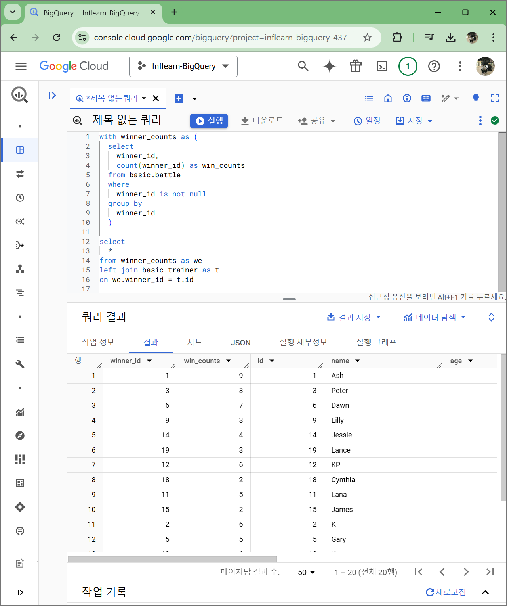
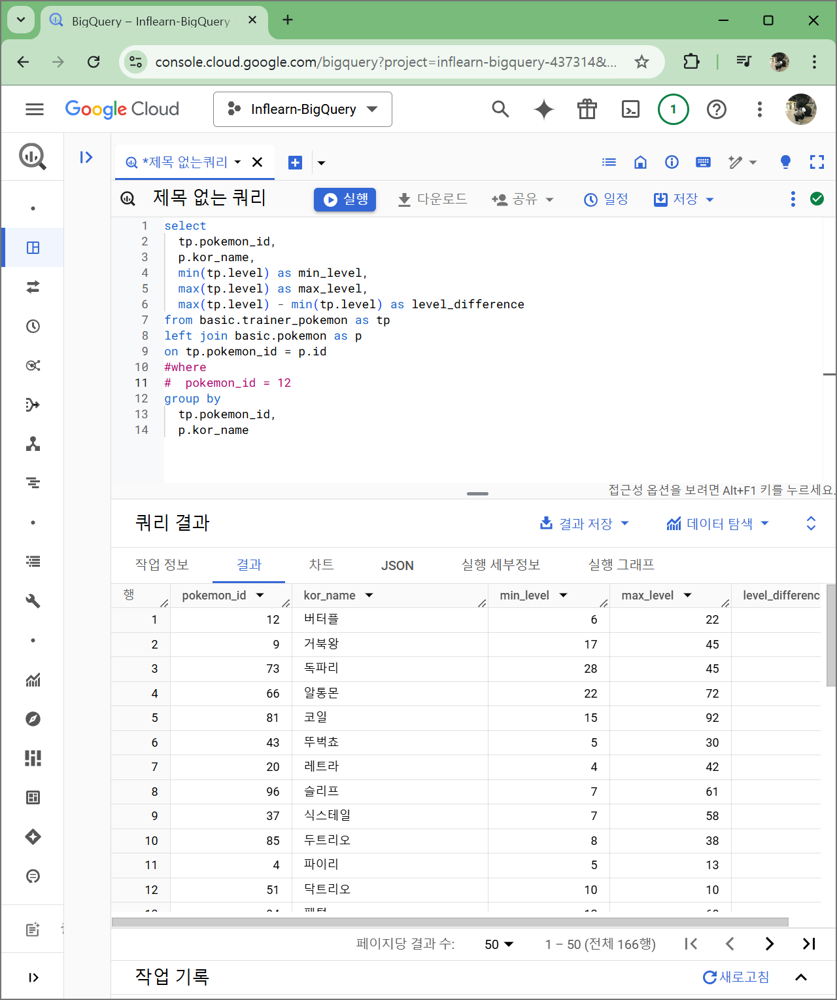

# 8. 초보자를 위한 BigQuery 입문 연습 문제

### Q1

### Q4

### Q6

# 9. 마치며

### 총정리
- 데이터활용과정
- 데이터탐색:조건과추출
- 데이터탐색:요약,집계
- SQL쿼리작성하는흐름
    - 쿼리작성템플릿,생산성도구
    - 오류를디버깅하는방법
- 데이터탐색:변환
    - 데이터타입과타입별함수
    - BigQuery공식문서확인하는방법
- 다양한자료를연결:JOIN
- 데이터결과검증
    - 가독성을챙기기위한SQL스타일가이드

### 쿼리 작성 템플릿
** 쿼리를 작성하는 목표, 확인할 지표 :
** 쿼리 계산 방법 :
** 데이터의 기간 :
** 사용할 테이블 :
** Join KEY :
** 데이터 특징 :

SELECT

FROM\
WHERE

### 앞으로의 과제
- 복잡한 자료형 다루기 : ARRAY, STRUCT
- 복잡한 데이터 가공하기
- 등등...